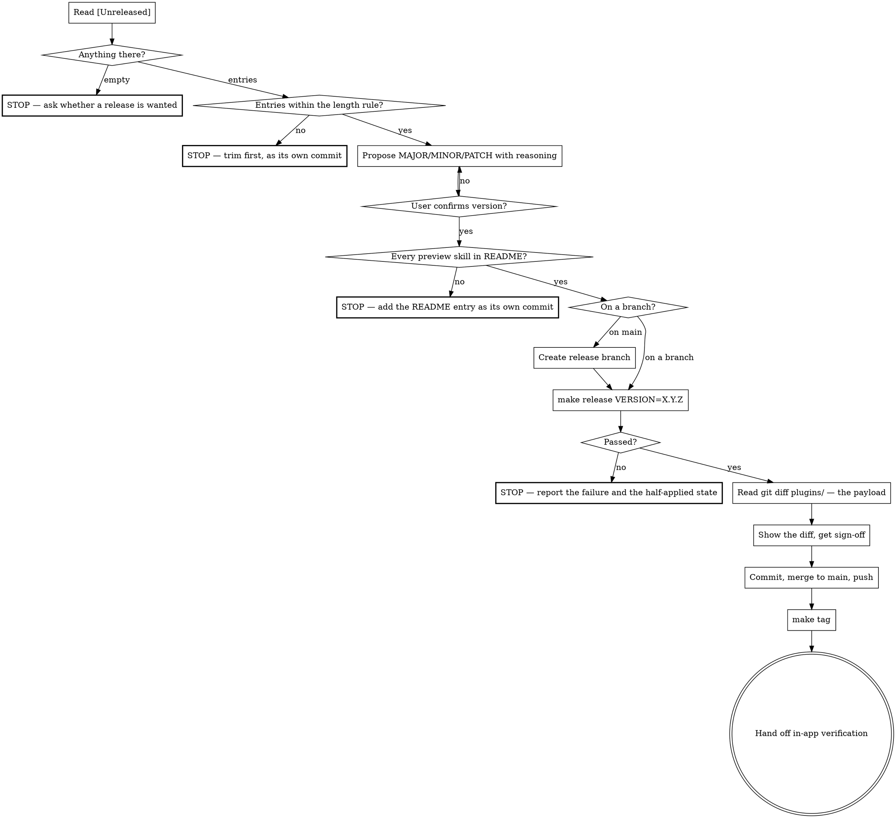

## Start

Announce: **"Preparing a paad release…"**

Read @CLAUDE.md.

`make release` and `make tag` own everything mechanical: the promotion of
`preview/paad` into `plugins/paad`, the changelog roll, the version rewrite across
every manifest and announce line in both trees, the export regeneration, the full
check suite, and the annotated tag. This skill owns the parts a Makefile cannot
decide — which number to bump to, whether a release is wanted at all, and whether
the thing users install actually works afterwards.

**Never hand-edit `plugin.json`, `marketplace.json`, `package.json`, a SKILL.md
announce line, or the changelog's version headings and link refs.** Those are
generated. If the generated result is wrong, fix the generator.

**Never hand-edit `plugins/paad` at all.** It is written only by promotion. A
hand edit there does not survive: `make release` opens with `make promote`, whose
`rsync -a --delete` copies the pre-fix `preview/paad` straight over it. Nothing
catches that — the tree is committed so the dirty guard passes, and the result is
self-consistent so every check passes. The release ships and the changelog
announces a fix that is not in it. Fixes go in `preview/paad`, hotfixes included.



## 1. Read what is actually unreleased

Read the `## [Unreleased]` section of `CHANGELOG.md`.

**If it is empty, stop and ask.** There is nothing to release. Do not invent a
version to bump to, and do not go hunting through `git log` for things that
should have been logged — an unrecorded change is a changelog bug to fix first,
as its own commit, not something to sweep into a release.

## 1.5. Check the entries against the length rule

CLAUDE.md sets it: **1–3 lines per entry, at most 8 for a new skill, ending in a
pointer to `paad-help` or README.** Once this section rolls into a version
heading it is published, and trimming it afterwards means editing released
history. Catch it here.

Read each bullet and ask what it is doing:

| In the entry | Verdict |
|---|---|
| What changed, who it affects, what to do | Keep |
| A pointer to `paad-help` or README | Keep |
| How the feature works internally — phases, agents, gates | Cut |
| Why the design is right, or what was rejected | Cut |
| Testing evidence, run counts, measured before/after | Cut |

The test from CLAUDE.md: **if it explains a mechanism, it is in the wrong file.**
That material is worth keeping — it belongs in the commit message, in README, or
in `paad-help`, all of which already exist. A changelog copy is a third copy that
has to be hand-synced and drifts.

Sanity check the size:

```bash
awk '/^## \[/{if(n)print len" lines  "n; n=$0; len=0; next} {len++} END{print len" lines  "n}' CHANGELOG.md | head -5
```

A section running past ~40 lines for a normal release is the signal. Sections in
this file's history run to 200 lines; those are the mistake, not the precedent.

**If entries are too long, stop and say so.** Trimming is its own commit *before*
the release, exactly like a missing entry is — not a silent edit during it, and
not something to fold into the release commit. Propose the shortened text, get
sign-off, commit it, then start again at step 1.

## 2. Propose the version

Semver against what is in `[Unreleased]`, not against how much work it felt like:

| Change | Bump |
|---|---|
| A new skill, or new user-facing behavior in an existing one | MINOR |
| Wording, digraph, or bug fixes only | PATCH |
| A renamed or removed skill | breaking — say so explicitly |

paad has stayed on `1.x`. A breaking change still gets called out in the
changelog even if the major does not move; raise it and let Ovid decide.

State your reasoning and the proposed number, then **wait for confirmation.**
Do not proceed on a version you picked unilaterally.

Note for the experimental skills (`agentic-dedup`, `test-roadmap`): their
arguments and output may change in any release including a patch, so a breaking
change to one of them does not force a major.

## 2.5. Check README covers everything preview is about to ship

`check-readme` runs against the *shipped* tree, and promotion is what puts a
preview-only skill there. So a skill that has been sitting in `preview/` without a
README entry passes every check until the release promotes it — and then fails
`make test` at the very end of `make release`, with the rsync, the changelog roll
and both trees' version strings already written, and `make release` unable to
re-run against the dirty tree it just made.

`make promote` now runs `check-readme TREE=preview/paad` before its rsync, so
this fails the release *before* anything is written rather than after. Run it up
front anyway — knowing at step 2.5 costs a second, and finding out at step 3
means starting over:

```bash
make check-readme TREE=preview/paad
```

Anything listed, **stop.** Write the README entry as its own commit on this
branch, then start again at step 1. It costs nothing there and merges with the
release, so README never advertises a skill nobody can install. The same goes for
a missing `paad-help` entry, though `check-help` runs per-tree and would already
have caught that one.

## 3. Cut it

Confirm you are on a branch, not `main` — `make release` refuses on `main`, but
say so before running rather than after.

Cut the release branch from an up-to-date `main`. The old rule — release from
the branch that carries the work — is retired, and CLAUDE.md says so: `preview/`
closed the leak it existed to avoid, so work merges to `main` unbumped and
unpromoted and accumulates there until someone decides to ship.

Releasing from an older feature branch is now a hazard rather than a habit.
`make promote` rsyncs *this working tree's* `preview/paad`, so a branch behind
`main` silently omits everything merged since, and every check passes because
the omitted work is not there to fail on. `make release` refuses when
`origin/main` is not an ancestor of `HEAD`; `git fetch origin` first so that
check is comparing against something current.

```bash
make release VERSION=X.Y.Z
```

That single command promotes `preview/paad` over `plugins/paad` and strips the
preview markers, rolls the changelog with today's real date, opens a fresh
`[Unreleased]`, fixes both link refs, rewrites every version string in both trees,
regenerates `kiro_and_antigravity/` and `pi/`, and runs `make test`.

Promotion refuses on a dirty tree, so uncommitted work stops the release before
it mutates anything. That covers uncommitted work only — it is not a general
safety net, and everything below assumes a run that got past it.

**If it fails, stop and report the failure.** Do not hand-patch around it. A
failing check at this point means either the release is not ready or a generator
is wrong, and both need a decision from Ovid.

Report the state along with the failure, because it is not clean. A failure at
`make test` leaves **three** mutations in place, and the first is the one that
matters most:

1. **`plugins/paad` overwritten wholesale** by promotion's rsync — the release's
   actual payload, and the largest of the three.
2. The changelog rolled into a dated section, with a fresh `[Unreleased]`.
3. Every version string bumped, in both trees.

Say that re-running `make release` will not work: it refuses on the now-dirty
tree, and `roll_changelog.py` refuses a second time on a version that already
has a section.

**Do not offer `make export && make test` as the way forward for a failure that
needs a SKILL.md edit.** It cannot work. The fix has to land in `preview/`,
`make promote` then refuses on the dirty tree, and `make export` regenerates
from the *unfixed* `plugins/` — so the only way that advice succeeds is the
hand-edit of `plugins/` this project forbids everywhere else. For that class,
the way out is a reset, not a patch. It is available for a failure that touches
nothing under `preview/` — a stale export, say — where `make export` and a
commit genuinely finish the job.

**The way out is a reset, and `git checkout -- .` alone does not do it.**
Promotion brings across skills that exist only in `preview/`, and those arrive
as *untracked* paths that `git checkout` does not touch — `.gitignore` covers
nothing under `plugins/`, `kiro_and_antigravity/` or `pi/`, so the operator sees
a green `git diff` and concludes the rollback worked while an unreleased skill
sits in the shipped tree, waiting for the next `git add -A`. Use both:

```bash
git checkout -- . && git clean -fd plugins/ kiro_and_antigravity/ pi/
```

Scoping `git clean` to those three is safe because all three are generated-only.
Neither route is the hand-patching this step forbids — that means editing the
generated output to make a check pass.

## 4. Read the payload, then show the work

```bash
git diff plugins/
```

That diff is the release's actual payload — everything `preview/` accumulated
since the last release, arriving in the shipped tree all at once — and this is the
last moment to catch something unintended. Read it before anything else. Say what
promotion did: which skills changed, which are new, and which `--delete` removed
because they left `preview/`.

Then show the diff — at minimum the changelog section boundary and the version
strings. Get sign-off, then commit:

```bash
git commit -a -m "release: paad X.Y.Z"
```

## 5. Merge and tag

Merge the branch into `main` and push. Ovid uses `git-done`; plain
`git checkout main && git merge --no-ff <branch> && git push` works too.

Then, **on `main`, after the merge is pushed:**

```bash
make tag
```

It reads the version from `plugin.json`, refuses if you are not on a synced
`main`, if the tree is dirty, if the changelog has no matching section, or if the
tag already exists — then annotates and pushes.

The tag goes on the merge commit because that is the tree users receive. Never
move a published tag; if the wrong commit got tagged, ask Ovid before doing
anything about it.

## 6. Hand off the verification you cannot do

You cannot run this part — it happens in Ovid's Claude Code session. Tell him to:

1. `/plugin` → **Installed** → **paad** → **Update now**
2. Restart Claude Code
3. Run any skill and confirm the announce line reads `vX.Y.Z`

This is the cheapest way to catch a bump that never made it to `main`.

Step 1 refreshes the marketplace catalog itself before it checks for a new
version. It is the panel action and nothing else — if the plugin never actually
updated, the version check at step 3 reads the *old* version and reports a
release that shipped fine as broken.

Then report what shipped: the version, the tag, the commit it points at, and a
one-line summary of the changelog section.

## What this skill does not do

- **No GitHub Release.** The tag is the record. Do not run `gh release create`
  unless Ovid asks.
- **No `[Unreleased]` housekeeping.** If a change is missing from the changelog,
  that is a separate commit before the release, not a silent addition during it.
- **No version invention.** Step 2 ends in a question, always.
