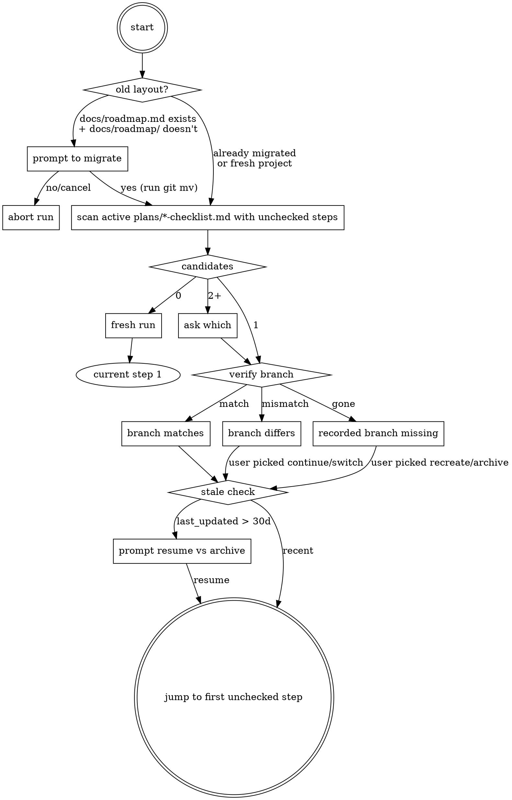

## Start

Announce: **"Checking for in-progress runs and roadmap layout…"**

Read @CLAUDE.md.

## Per-Phase Checklist File

One checklist per `/roadmap` run, created right after step 2a (branch checkout succeeded), updated at the end of every subsequent step. The checklist lives at `docs/roadmap/plans/YYYY-MM-DD-<topic>-checklist.md` — alongside the design and plan files for the same run.

### Filename

`YYYY-MM-DD-<topic>-checklist.md`, where `<topic>` is the existing phase slug rule from §2a of the current SKILL.md (lowercase phase title, drop apostrophes without separator, collapse non-`[a-z0-9]` to hyphens, fall back to `phase-N`). Date is the day step 0 → step 1 fires (start date), so the design / plan / checklist for one run sit alphabetic- ally adjacent in `plans/`.

### Schema

```markdown
---
phase: "Phase 2: agentic-architecture references conversion"
phase_slug: agentic-architecture-references
branch: ovid/agentic-architecture-refs
roadmap: docs/roadmap/roadmap.md
started: 2026-05-02
last_updated: 2026-05-02
design_file: docs/roadmap/plans/2026-05-02-agentic-architecture-references-design.md
plan_file: null
decision_log: null
---

# Phase 2: agentic-architecture references conversion — Run Checklist

## Steps
- [x] 1. Read roadmap
- [x] 2. Identified next unplanned phase
- [x] 2a. Working branch created: `ovid/agentic-architecture-refs`
- [x] 3. Extract phase context
- [x] 4. Brainstorm → design saved
- [ ] 5. Record plan filename in roadmap
- [ ] 6. Pushback review
  - [ ] 6a. Pushback returned all findings
- [ ] 7. CLAUDE.md review
- [ ] 8. Write implementation plan
- [ ] 9. Alignment check
  - [ ] 9a. Alignment returned all findings
- [ ] 10. Write decision log entry
- [ ] 11. Announce completion

## Pushback Findings
(populated during step 6, transcribed by step 10)

### [1] Lens 3 spec contradicts §Key Architecture Decisions
- **Severity:** Critical
- **Category:** Contradiction
- **Summary:** The Lens 3 spec requires X, but §Key Architecture Decisions in CLAUDE.md mandates Y for cross-cutting consistency. The two cannot both hold; one must yield.
- **Status:** open
- **Resolution:** _(pending)_

### [2] Phase scope bundles refactor + new feature
- **Severity:** Important
- **Category:** Scope
- **Summary:** This phase combines the references-package extraction (refactor) with new lens content (feature), violating the one-refactor-OR-one-feature PR rule from CLAUDE.md.
- **Status:** closed
- **Resolution:** fixed-in-design — split into 2a (refactor) + 2b (feature)

## Alignment Findings
(populated during step 9, transcribed by step 10)
```

### Field rules

- `branch` is the working branch name from §2a; resume verifies it matches the current branch.
- `design_file`, `plan_file`, `decision_log` go from `null` to a path the moment each artifact is written.
- `last_updated` is bumped on every write (lets stale-checklist detection work without filesystem mtime).
- **Summary** is a one-paragraph description of the finding, written by pushback (or alignment) at the moment the issue is first raised — while the context is still in head. It is *not* generated at transcription time. This is the only field step 10 carries forward as written prose, so writing it now (not later) is what eliminates the "mentally tracked" failure mode the design exists to fix.
- **Status vocabulary** (closed set): `open | closed`. While `open`, the finding is still being discussed. When `closed`, the `Resolution:` line uses one of the existing decision-log resolution values verbatim: `fixed-in-design`, `fixed-in-plan`, `dismissed-invalid`, `dismissed-out-of-scope`, `accepted-as-is`, `deferred`. Status itself has no decision-log analog (every entry there is closed by definition); step 10's transcription drops the `Status:` line and is otherwise a literal copy.
- **Severity / Category** vocabularies are the existing ones from the pushback and alignment sections of the current SKILL.md.
- **Sub-checkboxes for steps 6 and 9.** Each has a `Na` sub-checkbox (`6a. Pushback returned all findings`, `9a. Alignment returned all findings`) flipped only when the corresponding subagent returns cleanly. The top-level `- [x] N` is checked when **both** Na is checked AND no `Status: open` entries remain in the corresponding findings section. The "no open findings" half is a derived condition computed from the file, not a separate checkbox.

### Update obligations

Every step ends with "update the checklist (frontmatter `last_updated` + the relevant box + any frontmatter path field) before announcing or moving on." No exceptions.

### Rationalization table

| Excuse | Reality |
|---|---|
| "This step is obvious, I'll skip the box" | Resume detection scans boxes, not artifacts. The box is the source of truth. |
| "I'll batch the checklist updates at the end" | A `/clear` between now and the end loses the run. Update before moving on. |
| "I'll keep the open pushback issues in my head" | The next session won't have a head. The checklist *is* the memory. |
| "The artifact exists on disk, the checkbox is redundant" | Both must agree; mismatch means the run is in an unknown state. |
| "Branch mismatch is fine, I know what I'm doing" | The recorded branch is the safety net. Update or override explicitly — never ignore. |

### Verification before ticking

Marking step 4 done requires `design_file` to exist at the recorded path and be non-empty. Step 8 requires `plan_file`. Step 10 requires `decision_log`. This is `verification-before-completion` applied to checklist updates.

### Brainstorming non-resumability

If interrupted mid-step-4, re-run brainstorming. Step 4's box flips only when the design file is written.

## 0. Resume Detection

A new step that runs before everything else. Before reading the roadmap or doing any phase work, the skill checks for an in-progress run that needs to be resumed and verifies the project is on the current directory layout.



### Layout migration

First thing step 0 checks: if `docs/roadmap.md` exists at the repo root AND `docs/roadmap/roadmap.md` does not, the project is on the legacy layout. Prompt:

> Old roadmap layout detected:
>   - `docs/roadmap.md` (will move to `docs/roadmap/roadmap.md`)
>   - `docs/plans/` (will move to `docs/roadmap/plans/`)
>
> Run the migration now? `yes` / `no` / `cancel`

On `yes`, run the `git mv`s and continue to the scan. On `no` or `cancel`, abort the run and tell the user the new skill cannot operate on the legacy layout. Once `docs/roadmap/roadmap.md` exists, this prompt never fires again for the project. Detection is by presence — no marker file needed.

Once layout migration succeeds and resume detection finds no in-progress checklist, fall through to step 1 → step 2; the archive prompt fires from step 2 if applicable.

### Scan scope

The scan reads `docs/roadmap/plans/*-checklist.md` exclusively. It never recurses into `docs/roadmap/archive/` — once a roadmap is archived, its in-progress runs are intentionally abandoned and should not surface as resume candidates.

### Branch verification

| Recorded `branch` vs `git branch --show-current` | Action |
|---|---|
| Match | Silently proceed; announce "Resuming Phase X at step N" |
| Mismatch | Prompt: switch to recorded, continue here (updates `branch` field), or cancel |
| Recorded branch no longer exists locally | Prompt: archive the stale checklist, recreate on current branch, or cancel |

### Multiple candidates

If scan returns two or more checklists with unchecked steps, list them and ask which to resume; offer "none — start fresh" as a fourth option.

### Stale-checklist threshold

If `last_updated` is more than 30 days ago, prompt before resuming. Threshold lives as a one-line constant in the SKILL.md so it is easy to tune.

### Jumping to the right step

The first unchecked `- [ ]` in `## Steps` (treating a top-level step as unchecked if either it or any of its sub-checkboxes is unchecked) is the target. The label after the number identifies which step's prose to load.

For steps 6 and 9, the sub-checkbox `Na` distinguishes two recovery modes:

- **`Na` unchecked** → the subagent never returned a complete findings list (never invoked, errored, or timed out). Wipe the corresponding `## Pushback Findings` (or `## Alignment Findings`) section, re-invoke the subagent from scratch, and start over for that step.
- **`Na` checked, top-level `N` unchecked** → findings list is complete; at least one entry has `Status: open`. Resume the discussion from those open findings; do not re-invoke the subagent.

## 1. Read the Roadmap

Read `docs/roadmap/roadmap.md` in full. Each phase heading (## Phase N: …) may have a `<!-- plan: filename.md -->` comment on the line immediately after the `---` separator that follows that phase's section. This comment marks the phase as already brainstormed.

Example of a completed phase:

```markdown
---

## Phase 2: Goals & Velocity
<!-- plan: 2026-04-01-goals-velocity-design.md -->
```

Example of an incomplete phase (no comment, or no `<!-- plan: … -->` line):

```markdown
---

## Phase 3: Export
```

Tick `- [x] 1. Read roadmap` and bump `last_updated`.

## 2. Identify the Next Unplanned Phase

Scan phases in order (Phase 1, 2, 3, … 7). The first phase whose section does **not** have a `<!-- plan: … -->` comment is the target.

If **all** phases have plan comments, the roadmap is fully planned. Surface the archive prompt:

> All phases of this roadmap have been planned. Archive to `docs/roadmap/archive/<slug>/` and start fresh? `yes` / `no` / `later`

Parse the response (case-insensitive, leniently as the §2a accept-grammar):

- **`yes`** — derive `<slug>` from the roadmap.md H1 title using the existing slug rule. Run `git mv` to move every entry under `docs/roadmap/` (excluding `archive/` itself) into `docs/roadmap/archive/<slug>/`. Then write a fresh stub `docs/roadmap/roadmap.md` (a minimal H1 + empty Phase Structure table — the user fills it in). Announce: "Archived to `docs/roadmap/archive/<slug>/`. Start a new roadmap by editing `docs/roadmap/roadmap.md`." Stop.
- **`no`** — write a marker file `docs/roadmap/.archive-declined` containing the SHA-1 of the H1 title. On future runs, if the marker file exists and matches the current H1 hash, skip the archive prompt entirely. Announce the no-op and stop.
- **`later`** — leave everything in place; do not write a marker. Announce the no-op and stop.

Tick `- [x] 2. Identified next unplanned phase` and bump `last_updated`. *Note:* if step 2 detects "every phase has a `<!-- plan: ... -->` comment," do NOT tick — instead surface the archive prompt described above before continuing.

## 2a. Suggest a Working Branch (if on the primary branch)

### Determine the primary branch name

The "primary branch" is whatever the repository treats as the integration
target — usually `main`, but `master`, `trunk`, `develop`, or any other
name is equally valid. /roadmap must not run on it, so we have to detect
the name first.

Run these checks **in order**, locally, and stop at the first that
succeeds:

1. `git symbolic-ref --short refs/remotes/origin/HEAD 2>/dev/null` —
   succeeds when the repo was cloned from a remote that exposed a
   default branch. Output is `<remote>/<branch>` (typically
   `origin/main`); split on the first `/` and take the right side as
   the primary branch name.
2. `git symbolic-ref --short refs/remotes/upstream/HEAD 2>/dev/null` —
   common in fork workflows. Same parsing.
3. `git show-ref --verify --quiet refs/heads/main` — if the local repo
   has a `main` branch, treat it as primary.
4. `git show-ref --verify --quiet refs/heads/master` — if the local
   repo has a `master` branch (and step 3 did not match), treat it as
   primary.

If all four checks fail, **stop and ask the user**: "Couldn't auto-detect
the primary branch in this repository (no `origin/HEAD` symref, no
`upstream/HEAD`, no local `main` or `master`). Tell me which branch is
primary, or `cancel` to stop." Wait for a branch name; do not guess.

Do **not** use `git remote show origin` to detect the primary branch.
That command hits the network, and a slow or offline remote should never
gate brainstorming. The four checks above are all local.

Call the resulting branch name `<PRIMARY>` for the rest of this section.

### Inspect the current branch

Run `git branch --show-current` and inspect the result. There are three
cases:

- **Detached HEAD** (output is empty): **stop.** Do not proceed. Tell the
  user the working tree is in detached-HEAD state and any commits this
  skill produces would be reachable only via reflog and pruned by the next
  `git gc`. Ask them to either check out a named branch first or
  explicitly confirm they want to land artifacts on a detached commit.
  Do not silently fall through — empty is "not the primary branch", but
  it is also not a safe place to commit.
- **Named branch other than `<PRIMARY>`**: skip the rest of this step.
  The working branch is already chosen.
- **`<PRIMARY>`**: **refuse to brainstorm on the primary branch.** The
  artifacts produced by this skill (design doc, implementation plan,
  decision log) MUST land on a feature branch. The primary branch is
  never a valid working directory for /roadmap output — even a solo
  developer needs the safety of an isolable branch. The only paths out
  of `<PRIMARY>` from here are creating a feature branch (suggested or
  override) or cancelling the run. Continue with the pre-check and
  suggestion below.

### Pre-check the working tree

Before suggesting any branch, run `git status --porcelain`. If the output
is non-empty, `<PRIMARY>` has uncommitted changes that would ride to the
new branch. Stop and surface the dirty paths to the user; ask them to
commit, stash, or explicitly confirm the carry-over before continuing. Do
**not** silently `git checkout -b` over a dirty tree.

### Derive a candidate slug

From the target phase heading, take the title text (everything after the
`Phase N:` or `Phase Na:` prefix), then:

1. Lowercase the title.
2. Drop apostrophes (`'`, `'`, `'`) **without** inserting a separator, so
   `Editor's` becomes `editors`, not `editor-s`.
3. If the trailing word is `implementation`, `impl`, or `feature`, drop it —
   it adds nothing to a branch name.
4. Replace any run of non-`[a-z0-9]` characters with a single hyphen.
5. Strip leading and trailing hyphens.
6. If the result is empty (e.g. the title was only `implementation`, or
   only Unicode/CJK characters that collapsed to nothing), fall back to
   `phase-N` using the phase number — including any sub-letter — from
   the heading. `Phase 12: Implementation` → `phase-12`.
   `Phase 3a: 漢字` → `phase-3a`.

Examples:

| Phase heading                                  | Candidate slug         |
|------------------------------------------------|------------------------|
| `Phase 1: Backend Foundation`                  | `backend-foundation`   |
| `Phase 3a: Movie Data Cleaning`                | `movie-data-cleaning`  |
| `Phase 7: User Authentication implementation`  | `user-authentication`  |
| `Phase 9: Editor's Polish`                     | `editors-polish`       |
| `Phase 12: Implementation`                     | `phase-12`             |

The slug is bare — no `feat/`, no `<username>/` prefix. If the user's
convention adds a prefix, let them apply it via the override path below.

### Present the suggestion and wait

Show the user the candidate name and ask them to accept or override:

> Currently on `<PRIMARY>` (the primary branch). /roadmap will not run
> on the primary branch — it needs a feature branch so the design doc,
> plan, and decision log land off `<PRIMARY>`.
>
> Suggested branch: `<candidate-slug>`. Accept, give me a different
> name, or `cancel` to stop the run.

Parse the response per this explicit grammar (matches are case-insensitive;
a trailing `.`, `!`, or `,` is ignored before matching):

- **Accept** — exactly one of: `yes`, `y`, `yeah`, `yep`, `yup`, `ok`,
  `okay`, `sure`, `lgtm`, `looks good`, `go ahead`, `do it`, `proceed`,
  `accept`, `accepted`. Run `git checkout -b '<candidate-slug>'`. Always
  pass the branch name inside single quotes — never interpolate raw user
  input into the shell command.
- **Cancel** — exactly one of: `cancel`, `abort`. Stop the /roadmap run
  entirely. Do not check out a branch, do not start brainstorming.
- **"Stay on the primary branch" attempts** — any of:
  - `stay`, `stay here`, `no branch` (branch-agnostic phrasings); or
  - `stay on <X>`, `keep <X>`, `on <X>` where `<X>` is `<PRIMARY>` **or**
    any common primary-branch name (`main`, `master`, `trunk`,
    `develop`). Users frequently type the wrong name out of habit, so
    accept these literals regardless of what `<PRIMARY>` is — `keep
    main` on a `master`-primary repo is still a stay-attempt, not a
    branch name.

  The user is trying to keep working on the primary branch, but /roadmap
  refuses. Print: "/roadmap does not run on `<PRIMARY>` (the primary
  branch). Reply with `cancel` to stop, or a branch name to create."
  Re-prompt; do **not** treat the response as a branch name (otherwise
  `stay` silently becomes `git checkout -b 'stay'`, which is not what
  the user meant).
- **Decline (ambiguous, ask)** — exactly one of: `no`, `nope`, `nah`,
  `n`. A bare negative is too ambiguous to interpret as the literal
  branch name `no`. Ask the user to clarify: "Did you mean cancel the
  brainstorming run entirely, or use a specific branch name? Reply
  with `cancel` or a branch name." Do **not** treat the bare negative
  as Override — `git checkout -b 'no'` is almost certainly not what
  the user wants. Do **not** offer staying on `<PRIMARY>`; this skill
  does not run on the primary branch.
- **Override** — anything else. Treat the entire response as a candidate
  branch name and run it through the slug rule above (lowercase, collapse
  non-`[a-z0-9]` to hyphens, strip leading/trailing) **before** passing it
  to git. If the sanitized result equals `<PRIMARY>`, or any common
  primary-branch name (`main`, `master`, `trunk`, `develop`), reject it:
  print "Cannot create a feature branch named `<sanitized>` — that's a
  primary-branch name. Choose a different name, or `cancel`." and
  re-prompt. Otherwise run `git checkout -b '<sanitized-name>'` with the
  sanitized result, single-quoted. If the sanitized result is empty, or
  if the response mixes accept tokens with other text in a way that's
  ambiguous (e.g. `yeah call it foo`), ask the user to clarify rather
  than guess.

### Handle `git checkout -b` failure

After running `git checkout -b '<name>'` (Accept or Override path),
check the exit status. The most common failure is the named branch
already exists (`fatal: a branch named '<name>' already exists`).
Other failures: invalid ref (slug rule did not catch a forbidden
character), refusal to create from a detached HEAD without a starting
commit, or a corrupt index.

On any non-zero exit:

- **"already exists"** — surface the exact message and ask: "Branch
  `<name>` already exists. Switch to it (`git checkout '<name>'`),
  choose a different name, or `cancel` the run?" Wait for the user's
  decision; do not switch silently — the existing branch may carry
  unrelated WIP that the user does not want to land roadmap artifacts
  on. Staying on `<PRIMARY>` is not an option.
- **Any other failure** — surface the full git error and stop. Do not
  fall through to step 3 brainstorming on `<PRIMARY>`; that is the
  very thing §2a was designed to prevent.

Only proceed to step 3 after the branch decision is made *and* the
checkout succeeded.

#### Create the run checklist

After `git checkout -b` succeeds, write a new checklist file to:

```
docs/roadmap/plans/<YYYY-MM-DD>-<phase-slug>-checklist.md
```

where `<YYYY-MM-DD>` is today's date and `<phase-slug>` is the slug
derived from the phase title (per the §Per-Phase Checklist File
filename rule — same rule used for the branch name above; reuse the
slug, do not re-derive).

Populate the frontmatter:

```yaml
---
phase: "<full Phase N: Title text from the roadmap heading>"
phase_slug: <phase-slug>
branch: <branch name created above>
roadmap: docs/roadmap/roadmap.md
started: <YYYY-MM-DD>
last_updated: <YYYY-MM-DD>
design_file: null
plan_file: null
decision_log: null
---
```

Initialize the body with:

- The H1: `# <full phase title> — Run Checklist`
- The `## Steps` block (all 11 step boxes including the `6a` and `9a`
  sub-checkboxes), with steps **1, 2, and 2a pre-checked** (the work
  to reach this point is done):

  ```
  - [x] 1. Read roadmap
  - [x] 2. Identified next unplanned phase
  - [x] 2a. Working branch created: `<branch>`
  - [ ] 3. Extract phase context
  - [ ] 4. Brainstorm → design saved
  - [ ] 5. Record plan filename in roadmap
  - [ ] 6. Pushback review
    - [ ] 6a. Pushback returned all findings
  - [ ] 7. CLAUDE.md review
  - [ ] 8. Write implementation plan
  - [ ] 9. Alignment check
    - [ ] 9a. Alignment returned all findings
  - [ ] 10. Write decision log entry
  - [ ] 11. Announce completion
  ```

- Empty `## Pushback Findings` and `## Alignment Findings` sections,
  each with the placeholder line `(populated during step N,
  transcribed by step 10)`.

## 3. Extract the Phase Context

Collect the full text of the target phase section from the roadmap (everything between its `## Phase N` heading and the next `## Phase` heading or end of file). This is the spec input for brainstorming.

Also note:
- Which earlier phases it depends on (listed under ### Dependencies).
- The current date (for the plan filename).

Tick `- [x] 3. Extract phase context` and bump `last_updated`.

## 4. Brainstorm

Invoke the `superpowers:brainstorming` skill. When the brainstorming skill asks what you're building, provide:

- The phase name and goal from the roadmap.
- The full phase section text as context.
- That the output should be a **design document** saved to `docs/roadmap/plans/`.

Follow the brainstorming skill's process completely. It will explore requirements, ask the user questions, and produce a design document. Also, think of the design from the standpoint of a writer. Is it truly useful for them? If you think it could be more useful, discuss this with the user.

When brainstorming, apply the PR scope rules in CLAUDE.md (§Pull Request Scope) — flag to the user if this phase bundles more than one feature or refactor and should be split before a plan is written.

After the design doc is written, **verify it exists and is non-empty** (`test -s <path>`); if either check fails, surface to the user and stop. Then set `design_file: <path>` in the checklist frontmatter and tick `- [x] 4. Brainstorm → design saved`.

## 5. Record the Plan Filename

After brainstorming produces a document in `docs/roadmap/plans/`, update `docs/roadmap/roadmap.md` in **two places**:

### 5a. Insert the plan comment

Insert a plan comment on the line immediately after the `---` separator that precedes the phase heading:

**Before:**
```markdown
---

## Phase 3a: Export Foundation
```

**After:**
```markdown
---

## Phase 3a: Export Foundation
<!-- plan: 2026-04-01-export-foundation-design.md -->
```

The filename is whatever the brainstorming skill created (it follows the pattern `YYYY-MM-DD-<topic>-design.md`).

### 5b. Update the Phase Structure table statuses

In the **Phase Structure** table near the top of the roadmap, make two updates:

1. **Mark the current phase as "In Progress"** — change its status from `Planned` to `In Progress`.
2. **Mark the previous phase as "Done"** — if the phase immediately before the current one has status `In Progress`, change it to `Done` (it must have been completed if we're moving on to brainstorm the next phase).

The valid statuses are:

- **Planned** — not yet started
- **In Progress** — brainstorming or implementation underway
- **Done** — shipped and merged to the primary branch

After updating roadmap.md, tick `- [x] 5. Record plan filename in roadmap` and bump `last_updated`.

## 6. Pushback Review

Invoke the `paad:pushback` skill against the design document just created in `docs/roadmap/plans/`. If English is the new programming language, pushback is code review for the plan — catch contradictions, feasibility issues, scope problems, and ambiguity before any implementation begins.

After pushback completes, discuss the findings with the user and update the design document to address any valid concerns before moving on.

**Instrumentation for the decision log.** For each issue pushback raises, append a finding entry to the checklist's `## Pushback Findings` section with `Severity` (Critical / Important / Minor — pushback assigns these), `Category` (Contradiction / Feasibility / Scope / Omission / Ambiguity / Security / Other — taken from which check fired), `Summary` (one paragraph written *now* while the context is fresh — this is the prose step 10 will copy verbatim), `Status: open`, and `Resolution: _(pending)_`. When the pushback subagent returns cleanly, tick `6a. Pushback returned all findings`. When discussion closes a finding, flip `Status: closed` and write the resolution using the closed vocabulary (`fixed-in-design`, `fixed-in-plan`, `dismissed-invalid`, `dismissed-out-of-scope`, `accepted-as-is`, `deferred`) followed by a one-sentence detail of what changed or why it was dismissed. Tick top-level step 6 only when **both** 6a is checked AND every finding has `Status: closed`.

If pushback raises zero issues, tick 6a and step 6 immediately — a clean pushback is itself evidence, and the empty `## Pushback Findings` section (with the placeholder line preserved) is what step 10 will transcribe.

**Failure handling.** If the `paad:pushback` invocation itself errors,
times out, or returns malformed output (anything that is not a usable
pushback report), retry **once**. If the retry also fails, **stop**
and surface the failure to the user — name the failure mode and the
last output (or error text). Do **not** record "no issues" or "clean
pushback" in the decision log: that wording is reserved for runs
where the skill returned successfully with zero findings. The
decision log's purpose is evidence; a failed pushback recorded as a
clean pushback corrupts the evidence trail. If pushback fails on
retry, leave the (possibly partial) findings in `## Pushback Findings`
as-is. The 6a sub-checkbox stays unchecked, which signals a future
resume to wipe the section and re-invoke pushback per §0 (resume
detection).

## 7. CLAUDE.md Review

Before announcing completion, evaluate whether `CLAUDE.md` needs updating to reflect this phase.

Re-read `CLAUDE.md` with the final design in mind and check each section for drift:

- **§Key Architecture Decisions** — does the phase introduce a new invariant, source-of-truth rule, or cross-cutting pattern that belongs here? (e.g. a new helper that codifies existing invariants should be referenced so future developers route through it.)
- **§API Design** — new endpoints, new error codes, or a new shape for an error envelope?
- **§Data Model** — new tables, new columns, or a change to soft-delete/UUID conventions?
- **§Testing Philosophy** — a new test layer, fixture convention, or coverage requirement?
- **§Target Project Structure** — a new top-level folder or package?
- **§Accessibility / §Visual Design** — a new a11y primitive or visual token worth documenting at the root level?
- **§Pull Request Scope** — does the phase reveal a new PR-scope hazard worth codifying?

If any section needs updating, discuss the proposed change with the user and fold the `CLAUDE.md` edit into the design document as an explicit deliverable of the phase (a task in the plan, not an afterthought). If no section needs updating, state that explicitly so the check is visible.

Tick `- [x] 7. CLAUDE.md review` after the discussion concludes, regardless of whether CLAUDE.md was edited.

## 8. Write the Implementation Plan

Invoke the `superpowers:writing-plans` skill against the finalized design document. The writing-plans skill will produce a bite-sized TDD task list that turns the design into concrete, reviewable commits.

When invoking writing-plans, provide:

- The path to the finalized design document from step 4.
- The constraints captured during steps 6 and 7 (pushback findings, any CLAUDE.md edits that must land as part of the phase).
- Repository-specific constraints from `CLAUDE.md` (§Testing Philosophy coverage floors, §Pull Request Scope one-refactor / one-feature rule, zero-warnings rule).
- That the plan should be saved alongside the design in `docs/roadmap/plans/` with filename pattern `YYYY-MM-DD-<topic>-plan.md`.

The plan must honor the PR scope rules: a single roadmap phase is a single PR. If the plan would naturally span multiple PRs (for example, a refactor followed by a feature), split at the phase boundary in the roadmap first and re-run this skill against each sub-phase.

After the plan doc is written, **verify it exists and is non-empty** (`test -s <path>`); if either check fails, surface to the user and stop. Then set `plan_file: <path>` in the checklist frontmatter and tick `- [x] 8. Write implementation plan`.

## 9. Alignment Check

Invoke the `paad:alignment` skill against the implementation plan just produced. Alignment catches coverage gaps, scope creep, and design-vs-plan mismatches — it verifies that every requirement in the design is traced to at least one task, every task maps back to a requirement, and every task is expressed in TDD red/green/refactor format.

Pass the alignment skill both documents:

- The design document from step 4 (the source of truth for requirements).
- The implementation plan from step 8 (the breakdown being aligned).

After alignment completes, discuss any findings with the user and update the plan (and occasionally the design) to close the gaps. Do not proceed to announcement until the plan and design are aligned, or the user explicitly accepts any remaining gaps.

**Instrumentation for the decision log.** For each issue alignment raises, append a finding entry to the checklist's `## Alignment Findings` section with `Severity` (Critical / Important / Minor — alignment assigns these), `Category` (one of `missing-coverage`, `out-of-scope`, `design-gap`, `tdd-format`), `Summary` (one paragraph written *now* while the context is fresh — this is the prose step 10 will copy verbatim), `Status: open`, and `Resolution: _(pending)_`. When the alignment subagent returns cleanly, tick `9a. Alignment returned all findings`. When discussion closes a finding, flip `Status: closed` and write the resolution using the closed vocabulary (`fixed-in-design`, `fixed-in-plan`, `dismissed-invalid`, `dismissed-out-of-scope`, `accepted-as-is`, `deferred`) followed by a one-sentence detail of what changed or why it was dismissed. Tick top-level step 9 only when **both** 9a is checked AND every finding has `Status: closed`.

If alignment raises zero issues, tick 9a and step 9 immediately — a clean alignment is itself evidence, and the empty `## Alignment Findings` section (with the placeholder line preserved) is what step 10 will transcribe.

**Failure handling.** Same as step 6: if `paad:alignment` errors,
times out, or returns malformed output, retry **once**, then stop and
surface to the user. Do **not** record "no issues" or "clean
alignment" in the decision log unless the skill returned successfully
with zero findings. If alignment fails on retry, leave the (possibly
partial) findings in `## Alignment Findings` as-is. The 9a
sub-checkbox stays unchecked, which signals a future resume to wipe
the section and re-invoke alignment per §0 (resume detection).

## 10. Write the Decision Log Entry

Write a single Markdown file to `docs/roadmap/decisions/YYYY-MM-DD-<phase-slug>.md` capturing this run.

**Filename slug rule:** lowercase the phase heading, drop apostrophes (no separator inserted), replace any run of non-`[a-z0-9]` characters with a single hyphen, strip leading/trailing hyphens, and fall back to `phase-N` (using the phase number, including any sub-letter, from the heading) if the result would otherwise be empty. `Phase 7: Editor's Polish & Polish` → `phase-7-editors-polish-polish`. Combine with today's date in `YYYY-MM-DD` form.

**Model field:** read from your own system context (the system prompt always identifies the model you are running on, e.g., `claude-opus-4-7`). Use the bare model ID, no version suffixes.

Transcribe `## Pushback Findings` and `## Alignment Findings` from the checklist into the decision log file. Transcription is a literal copy of every finding minus the `Status:` line (decision log entries are always closed by definition). Severity counts in the decision log frontmatter come from counting the checklist's findings — single source of truth eliminates the "mentally tracked counts don't sum" reconciliation hazard the prior version of this skill warned about.

Follow the schema in §Appendix: Decision Log Entry Schema (at the bottom of this skill) exactly — YAML frontmatter, then the body sections.

Then update `docs/roadmap/decisions/INDEX.md` by **prepending** one row to the `## Entries` table (newest entry on top). The row contains: date, phase title, model, pushback C/I/M counts (counted from the checklist's `## Pushback Findings`), alignment C/I/M counts (counted from the checklist's `## Alignment Findings`), and a relative link to the entry file just written.

If a /roadmap run produced zero pushback issues *and* zero alignment issues, still write the entry and the index row — a clean run is evidence too. The body sections are the empty-section single-line form from the §Appendix schema (`Pushback raised no issues.` / `Alignment raised no issues.`).

**Severity-count reconciliation.** Severity counts in frontmatter (`pushback.critical` + `important` + `minor` = `pushback.total`, and likewise for `alignment`) must equal the number of findings of each severity in the corresponding checklist section. If the counts derived from the checklist do not sum to `total`, **stop** and reconcile with the user before writing the entry. Because findings are now written to the checklist as they arise, the most likely cause of a mismatch is a finding whose `Severity` was edited mid-discussion without re-scanning the section, or two checklist entries that should have been merged into one but were left separate. Do **not** adjust counts to satisfy the invariant; the invariant is an integrity check, not a target — fix the checklist (the source of truth) and re-derive.

After the decision log is written, **verify it exists and is non-empty** (`test -s <path>`); if either check fails, surface to the user and stop. Then set `decision_log: <path>` in the checklist frontmatter and tick `- [x] 10. Write decision log entry`.

## 11. Announce Completion

> **Roadmap updated.** Phase N: [Name] brainstormed and planned.
> - Design: `docs/roadmap/plans/<filename>-design.md`
> - Plan: `docs/roadmap/plans/<filename>-plan.md`
> - Decision log: `docs/roadmap/decisions/<filename>.md`
> Next unplanned phase: Phase M: [Name] (or "all phases planned").

Offer to move to implementing the plan (via `superpowers:subagent-driven-development` or `superpowers:executing-plans` in a separate session), or to review the updated roadmap.

After announce, tick `- [x] 11. Announce completion`. The checklist is now fully ticked and serves as the historical record of the run.

## Appendix: Decision Log Entry Schema

The decision log captures, for every /roadmap run, what `paad:pushback` and `paad:alignment` caught and how each finding was resolved. Each entry is one Markdown file with YAML frontmatter and a structured body. The purpose is evidence — a body of receipts that the upstream skills (brainstorming, writing-plans) miss real things even when run by the most capable model.

### File location

- Entries: `docs/roadmap/decisions/YYYY-MM-DD-<phase-slug>.md` (one per /roadmap run)
- Index: `docs/roadmap/decisions/INDEX.md` (one row per entry, newest on top)

If a phase is brainstormed more than once on different days, each run produces its own dated entry — the history is preserved.

### Frontmatter

```yaml
---
date: 2026-04-26
phase: "Phase 3a: Export Foundation"
model: claude-opus-4-7
design_file: docs/roadmap/plans/2026-04-26-export-foundation-design.md
plan_file: docs/roadmap/plans/2026-04-26-export-foundation-plan.md
pushback:
  total: 5
  critical: 1
  important: 2
  minor: 2
alignment:
  total: 3
  critical: 0
  important: 1
  minor: 2
---
```

All fields are required. Severity counts under `pushback` and `alignment` must sum to `total`. For a clean run with no findings, set `total: 0` and omit the severity fields.

**If the per-issue tracking from steps 6 or 9 produces severity
counts that do not sum to `total`** (e.g. an issue was downgraded
mid-discussion and the running tally was not updated), **stop** and
reconcile with the user before writing the entry. Do **not** adjust
counts to satisfy the invariant; the invariant is an integrity check,
not a target. Common causes: a finding presented as Important got
re-categorized as Minor during discussion (decrement Important,
increment Minor); a finding was dismissed as a duplicate of another
already-counted item (decrement the original tier, do not add); the
user split one finding into two (increment the relevant tier). In
each case the reconciliation has to be explicit — silently padding
counts to make `total` match would hide the original transition and
corrupt the year-of-entries view that the index supports.

### Body sections

```markdown
# <Phase title> — Decision Log

## Pushback Findings

### [N] <issue title>
- **Severity:** Critical | Important | Minor
- **Category:** Contradiction | Feasibility | Scope | Omission | Ambiguity | Security | Other
- **Summary:** <one paragraph in your own words>
- **Resolution:** <one of the resolution values below> — <one sentence: what was changed, or why it was dismissed>

(Repeat per issue. If pushback raised no issues, replace this whole section with the single line: "Pushback raised no issues.")

## Alignment Findings

### [N] <issue title>
- **Severity:** Critical | Important | Minor
- **Category:** missing-coverage | out-of-scope | design-gap | tdd-format
- **Summary:** <one paragraph in your own words>
- **Resolution:** <one of the resolution values below> — <one sentence: what was changed, or why it was dismissed>

(Repeat per issue. If alignment raised no issues, replace this whole section with the single line: "Alignment raised no issues.")

## Summary

- Pushback raised N issues; M resulted in design changes, K dismissed as invalid, ... .
- Alignment raised N issues; M resulted in plan changes, ... .
```

### Resolution vocabulary (closed set)

- `fixed-in-design` — the design document was edited to address the issue
- `fixed-in-plan` — the implementation plan was edited to address the issue
- `dismissed-invalid` — the user disagreed; the issue was a false positive
- `dismissed-out-of-scope` — valid concern but explicitly deferred to a future phase
- `accepted-as-is` — valid concern, no change needed (e.g., known limitation that does not need addressing)
- `deferred` — valid concern that needs work but cannot be addressed in this run

### INDEX.md format

```markdown
# Roadmap Decision Log Index

This index lists every /roadmap run in reverse chronological order. Each entry
captures issues found by /pushback (after the design) and /alignment (after the
plan), along with how each was resolved.

## Entries

| Date       | Phase                          | Model              | Pushback (C/I/M) | Alignment (C/I/M) | Entry |
|------------|--------------------------------|--------------------|------------------|-------------------|-------|
| 2026-04-26 | Phase 3a: Export Foundation    | claude-opus-4-7    | 1/2/2            | 0/1/2             | [link](2026-04-26-phase-3a-export-foundation.md) |
```

Prepend new rows to the table so the newest entry is always at the top.

### Slug rule

Lowercase the phase heading, drop apostrophes (`'`, `'`, `'`) without inserting a separator, replace any run of non-`[a-z0-9]` characters with a single hyphen, strip leading and trailing hyphens, and fall back to `phase-N` (using the phase number — including any sub-letter — from the heading) if the result would otherwise be empty. Examples:

- `Phase 3a: Export Foundation` → `phase-3a-export-foundation`
- `Phase 7: Editor's Polish & Polish` → `phase-7-editors-polish-polish`
- `Phase 12: Implementation` → `phase-12-implementation` (filename slug keeps the `implementation` suffix; only the §2a branch slug drops it)

### Why this schema

The single `model` field assumes one model per /roadmap run (true ~99% of the time). Per-issue resolution tracking is what makes this evidence rather than a list of complaints — "pushback caught N important issues, M of which became design changes" is a much stronger argument than "pushback raised N things." Severity counts in the index let a year of entries be skimmed at a glance for patterns. Closed-set vocabularies (categories, resolutions) keep entries comparable across runs and trivially aggregatable by future tooling.

