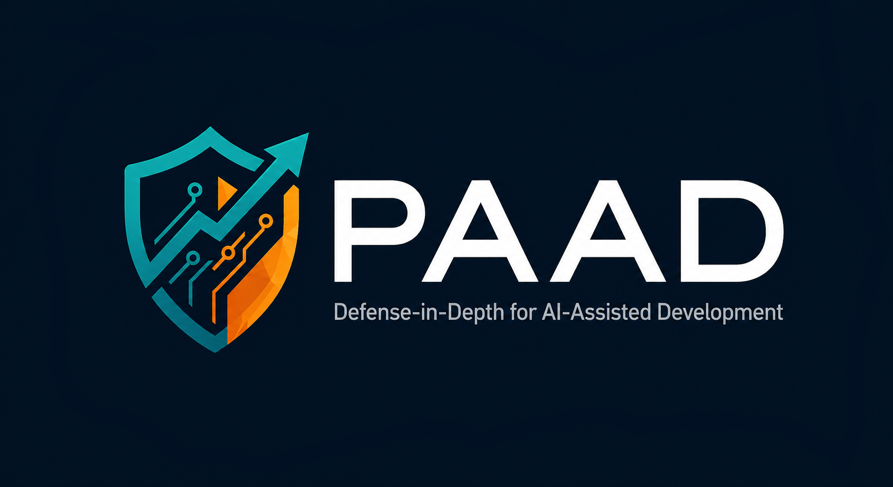
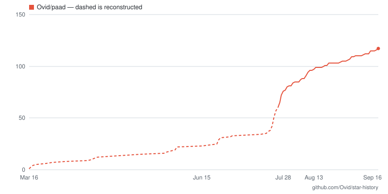

# PAAD — Engineering-driven AI, not AI-driven engineering

<p align="center">
  
</p>

**PAAD** (rhymes with "pad") is a set of skills for AI coding assistants. It
reviews what the AI is about to work on — the spec, the plan, the architecture, the
code — while you can still change it. That's **P**ushback, **A**lignment,
**A**rchitecture, plus the **D**iscipline to actually run them.

## Quick start

In Claude Code:

```
/plugin marketplace add Ovid/paad
/plugin install paad@paad
```

Pick a scope when the details panel opens, then `/reload-plugins`. Run
`/paad-help` to see everything.

Not using Claude Code? One command installs PAAD into 70+ other agents —
Cursor, Codex, GitHub Copilot, Gemini CLI, Cline, Zed, Warp, Amp, OpenCode:

```bash
npx skills@latest add Ovid/paad
```

See [Installation](#installation) for the details, including the experimental
**Pi** package.

### The skills

| Skill | What it does |
|---|---|
| `/pushback [document]` | Argues with your spec before anyone builds it |
| `/alignment [files...]` | Checks that the plan and the spec say the same thing |
| `/agentic-review [base-branch] [path]` | Six specialists review your branch before merge |
| `/agentic-architecture [path...]` | Five specialists find structural debt while it's cheap |
| `/fix-architecture [report]` | Works through those findings one at a time, test-first |
| `/agentic-a11y [path]` | Accessibility audit against WCAG 2.2 AA, by disability category |
| `/vibe [task]` | Small fixes, TDD guardrails still on |
| `/makefile` | Creates or updates a project `Makefile` |
| `/paad-help [skill-name]` | Lists the skills, or explains one |

### Experimental skills

| Skill | What it does |
|---|---|
| `/agentic-dedup [scope]` | Finds duplicated *meaning*, not duplicated text — experimental |
| `/agentic-owasp [scope]` | Reviews code against the OWASP Top 10:2025 — experimental |
| `/rethink [topic]` | Checks whether the premises under a recommendation hold — experimental |
| `/test-roadmap` | Builds a test suite that catches real regressions — experimental |
| `/handoff [save\|resume]` | Hands this session's work to a fresh one, in writing — experimental |

Full descriptions are further down. The rest of this page is why any of it is
worth your tokens.

## "AI slop" is technical debt with better marketing

We have been accumulating technical debt since long before AI showed up, and
we already know how to handle it: review the requirements, review the plan,
review the architecture, review the code. Every one of those is an old,
boring, well-understood engineering skill.

What AI changed is not the nature of the debt. It's the speed it arrives at.

- **Vibe coding** piles up debt fast.
- **Spec-driven development** piles it up slowly.
- Neither piles up zero.

That's the problem and it isn't new. It's just faster than the review
habits most teams have, so the debt lands before anyone looks at it.

The model reads every line of your repository in seconds. It has never once
heard about the outage that put that validation check there.

**PAAD** is how you stay on top of it — the same review layers your team
already believes in, applied at the speed the assistant is working.

## The four letters

Four points where the AI is about to decide something for you:

| Area | What it means |
|------|---------------|
| **P**ushback | Argues with your spec before anyone builds it |
| **A**lignment | Checks that the plan and the spec actually say the same thing |
| **A**rchitecture | Finds the structural debt while it's still cheap to fix |
| **D**iscipline | Yours, not the tool's — running the first three when the deadline says don't |

The first three are reviews you run. The fourth is the one thing in the list
the assistant will never bring for you.

Your team already runs specs, tests, code review, CI, QA, and incident
response — layers that exist because mistakes are cheap to fix early and
expensive to fix late, and because humans are stochastic. AI is stochastic
too. PAAD's argument isn't that AI needs *special* safeguards; it's that AI
needs the *same* safeguards, running fast enough to keep up with it.

It doesn't replace your current AI-assisted development tools; it complements
them. You like [Superpowers](https://github.com/obra/superpowers/)? Use it
with PAAD.

PAAD supports **Claude Code** natively and ships as an experimental **Pi**
package. It also supports **Cursor**, **Kiro**, and **Antigravity**.

## Who's driving

Most organizations adopting AI right now have it backwards. A developer tells
the AI what to do and hopes the AI can take over. The AI is happy to oblige —
it always is — and the developer finds out what it decided when the code
lands.

That's **AI-driven engineering**: the assistant sets the pace, and the
engineers are downstream of decisions they never saw made.

PAAD replaces it with **engineering-driven AI**. Same speed, opposite
direction: you see what the AI is about to do while you can still change it,
and you make the calls.

| | AI-driven engineering | Engineering-driven AI |
|---|---|---|
| The spec | Whatever you typed, unchallenged | `pushback` argues with it before anyone builds it |
| The plan | Assumed to match the spec | `alignment` checks both directions |
| The code | A green CI run | `agentic-review` puts six specialists on the PR |
| The structure | Discovered later, expensively | `agentic-architecture` finds it while it's cheap |
| The decisions | The model's | Yours, on the record |

You stay in the driver's seat. That is the point, and it's also the cost: PAAD
gives you visibility and control, not autopilot.

### What PAAD can't fix

An engineer has to drive this — including knowing when the tool is wrong.

- **PAAD reports; you decide.** A finding is an argument, not a verdict — see
  [The AI sees all of your code and none of your context](#the-ai-sees-all-of-your-code-and-none-of-your-context).
- **It's non-deterministic**, like the assistant it's checking. Run it twice
  on the same branch and you'll get overlapping, not identical, results. Run
  the important ones more than once.
- **A report you ignore is worse than no report.** `agentic-architecture` on a
  codebase nobody has time to change just produces a document that makes
  everyone feel bad.
- **It can't fix a problem that isn't technical.** No skill in here rescues a
  project that's short on time, short on staff, or aimed at the wrong thing.
- **It's not a replacement for human review.** It's a much stronger automated
  backstop, which is a different job.

If you want the assistant to think for you, PAAD is the wrong tool. It exists
for engineers who want to stay responsible for the result and need help
keeping up.

## The AI sees all of your code and none of your context

The model reads your repository faster and more patiently than any human will.
That part is real, and it's why PAAD works at all.

But the expensive decisions in software rarely turn on what's in the
repository. They turn on what isn't.

| The model sees | The engineer knows |
|---|---|
| Every line, in seconds | Which lines are load-bearing, and why |
| That the retry logic is duplicated | That the gateway already retries, so this layer is the bug |
| That a validation check looks redundant | That it was added after the outage nobody wrote up |
| That the design is internally consistent | That next quarter's volume breaks it |
| That two modules should be merged | That they belong to two teams and three release trains |
| That the data handling is convoluted | That the partner feed is malformed and the fix is a phone call |

None of the facts in the right-hand column are in the codebase. Most were never
written down anywhere. They live in the people who were there — which is what
experience actually is, once you stop treating it as a personality trait.

**The failure mode isn't silence. It's confidence.** An assistant missing the
right-hand column doesn't stop and say it lacks context. It produces a
thorough, well-reasoned, entirely plausible recommendation about the half it
can see. It will tidy the retry logic instead of deleting it. It will remove
the check that prevented the outage. It will hand you a tasteful list of
improvements to an architecture that should be thrown away.

That advice is not obviously wrong. It's the same shape as the good advice,
which is exactly why it survives review by anyone who doesn't already know
better.

### Why this matters to whoever is paying for it

The argument for keeping engineers in charge is usually made on feelings —
trust, craft, morale. Here it's simpler than that, and it's measurable.

**Seniority isn't nostalgia. It's an input the model doesn't have.** The
engineer who remembers the outage is not being sentimental; they are supplying
a fact that is absent from every file the AI just read. Remove them from the
decision and you haven't made the process leaner, you've deleted critical
input and added confident output.

Which produces the line worth remembering when the reports look clean:
**"the AI found no problems" is not the same as "there are no problems."** It
means the AI found no problems *in what it could see*. Whether that's
reassuring depends entirely on how much of the decision lived outside the
repository — and only a person can answer that.

This is why PAAD reports instead of deciding, and why every skill in it ends
with a human choice rather than a merge. Not because the AI is untrustworthy in
some abstract way, but because it's working from a partial input and the
engineer is holding the rest. **Engineering-driven AI is the arrangement where
those two halves actually meet.** AI-driven engineering is the one where the
half that was written down wins by default.

## Why people are using PAAD

The strongest early adoption has come from four skills:

- **`pushback`**, which critically reviews specs before implementation
- **`alignment`**, which checks whether the planned work actually matches the
  spec and design
- **`agentic-review`**, which performs a deeper pre-merge review than the
  lightweight AI review tools many developers are used to
- **`agentic-architecture`**, which allows you to find and fix the tech debt
  you're accruing over time

One user described `pushback` this way:

> “I'm using it for every non-trivial change, and so far, I think I've argued with 2 of maybe 40 recommendations. It has improved EVERY SINGLE spec I've fed it so far.”

If English is the new programming language, `pushback` is the code review.
In practice, `pushback` consistently improves specifications, and `alignment`
catches gaps between the intended work and the implementation plan before
those gaps become expensive.

`agentic-review` serves a different but equally important role: it reviews a
working branch with multiple specialists looking for logic errors, edge cases,
security issues, and integration problems before merge. In practice, it
catches substantially more than the shallow, single-pass AI reviews now common
in tools like GitHub Copilot. It is not a replacement for human review, but it
is a much stronger automated backstop. Running it more than once is valuable.

The other skills are also valuable, especially for architecture analysis,
accessibility review, and smaller task execution with guardrails. But
`pushback`, `alignment`, and `agentic-review` currently form the core workflow
that delivers the most consistent day-to-day value.

## What it costs you

PAAD is built to be honest about risk. If your spec is weak, your plan is
misaligned, an architectural decision is fragile, or a change introduces
problems, you hear about it early and plainly. It's for people who want the
speed and still want to be able to defend the result.

That honesty has a price, and it's tokens. A single feature will cost more
because you're paying to review the spec, review the plan, and review the code
on top of writing it. The bet is that this is cheaper than shipping the wrong
thing and rebuilding it — a good bet for software you'll maintain for years, a
bad one for a prototype you'll throw away on Friday. Spend the review on the
code you'll still be living with next year.

## Workflow

There's a lot to take in with PAAD, [so I've written an article to explain how
to write production-quality code with
it](https://curtispoe.org/articles/watching-claude-sonnet-outperform-opus).

If you are new to PAAD, start with `/paad-help` to see the available skills and when to use them.

A typical workflow looks like this:

1. Write your spec.
2. Run `pushback` to critically review the spec before implementation.
3. Create your final implementation plan from the spec.
4. Run `alignment` to verify that requirements, design, and planned work are
   aligned with decisions.
5. Implement the change.
6. Run `agentic-review` on the working branch before merging (often more than
   once).

Not sure if the AI is presenting you with the best options? Run `rethink` to
check whether the premises behind a recommendation actually hold.

Depending on the type of work, I also use (see below for full descriptions):

1. `agentic-architecture` to identify structural issues before they spread
2. `agentic-a11y` for UI changes and accessibility-sensitive work
3. `vibe` for small fixes that still benefit from guardrails

In practice, `pushback` and `alignment` are often worth running more than
once. They are especially useful when a spec evolves or when the
implementation plan changes during execution.

## Installation

### Claude Code

#### Install the plugin

Add the marketplace:

```bash
/plugin marketplace add Ovid/paad
```

Install the plugin:

```bash
/plugin install paad@paad
```

That opens the plugin's details rather than installing straight away — you pick
a scope there: **Install for you (user scope)**, **Install for all collaborators
on this repository (project scope)**, or **Install for you, in this repo only
(local scope)**. Then run `/reload-plugins` to activate the skills in the
session you're in. Claude Code prompts you to do that as well, so you aren't
relying on this README to know it.

If you're not using Claude Code, see other examples below.

#### Updating the plugin

New skills and fixes do **not** arrive on their own. Claude Code disables
auto-update for third-party marketplaces by default, and PAAD is one, so you
pull updates yourself.

Open `/plugin`, go to the **Installed** tab, select **paad**, and choose
**Update now**. Then run `/reload-plugins` to load the new version.

That single action already refreshes the marketplace catalog from GitHub before
it looks for a new version.

To confirm which version you're on, run any skill — every skill announces its
own name and version on invocation (`Running paad:vibe v<version>`). Compare
that against the version in
[`plugins/paad/.claude-plugin/plugin.json`](plugins/paad/.claude-plugin/plugin.json).
If a skill documented here is missing entirely, you're on an older version —
run through the update steps above.

### Every other agent — `npx skills`

One command, and it covers 70+ agents:

```bash
npx skills@latest add Ovid/paad
```

It opens a picker. Everything under **Universal (`.agents/skills`)** — Amp,
Antigravity, Cline, Codex, Cursor, Gemini CLI, GitHub Copilot, OpenCode, Warp,
Zed and others — is always included. The list below that is opt-in and holds
another fifty-odd, Claude Code among them.

```bash
npx skills@latest add Ovid/paad --list                 # list the skills, install nothing
npx skills@latest add Ovid/paad --skill pushback       # install one skill
npx skills@latest add Ovid/paad -a cursor -a codex -y  # skip the pickers
npx skills@latest add Ovid/paad --copy                 # real copies instead of symlinks
```

One thing worth knowing before you run it.

**Skills refer to each other by slash command** — `/agentic-architecture`,
`/pushback`. If your assistant does not take slash commands, ask for the skill
by name instead: "run the pushback skill". The name is always the same; only
the way you invoke it differs.

### Pi — experimental

Pi support is **not settled**. The package layout, the skills it exposes, and
the extension it depends on may change — or the packaging may be withdrawn — in
**any** release, including a patch release. The Claude Code plugin is the
supported path; if Pi is your daily driver, pin your version and please [file
what breaks](https://github.com/Ovid/paad/issues).

Install PAAD directly from Git:

```bash
pi install git:github.com/Ovid/paad
```

To try a local checkout without installing it permanently:

```bash
pi -e .
```

Invoke a skill with `/skill:<name>` or by name.

#### The multi-agent skills need two more pieces

`agentic-review`, `agentic-architecture`, `agentic-a11y`, and `agentic-dedup`
fan out to subagents. Pi has no subagent support of its own, and Pi's package
manifest has no way to declare agents, so neither piece can ship inside the
package. Without both of them installed, those four skills still *run* — the
orchestrator simply does every lens itself, in one context, holding the full
toolset. You get no parallelism, no context isolation, and **no read-only
guarantee on code the skill is only supposed to read**. Nothing errors and
nothing warns you.

**1. A subagent extension.** Pi ships one as an
[example](https://github.com/earendil-works/pi/tree/main/packages/coding-agent/examples/extensions/subagent),
not as an installable package — it is a clone-and-symlink into `~/.pi/agent/`,
not `pi install`. Follow that example's own README.

**2. The read-only analyst.** This repo generates a Pi copy of the analyst
agent the Claude Code plugin dispatches. Copy it in:

```bash
cp pi/agents/paad-analyst.md ~/.pi/agent/agents/
```

It restricts the agent to `read, grep, find, ls, bash`, which is what keeps an
analysis subagent from editing your code to test whether a finding was real.

**`rethink` is degraded on Pi.** The Claude Code analyst also holds `WebSearch`
and `WebFetch`, and Pi has no web tool to map those onto — its built-ins are
`read`, `bash`, `edit`, `write`, `grep`, `find`, and `ls`. So on Pi the analyst
cannot reach a primary source outside the repository. `rethink` still runs and
still verifies everything the repository can settle, but a premise that needs a
vendor's documentation, a standard, or a changelog will come back `Ungrounded`
rather than checked. That is the correct answer given the tools, not a failure —
but it is a narrower skill than the Claude Code one.

Two known rough edges even with both installed. The skills name their subagent
type in Claude Code's syntax (`subagent_type: paad:paad-analyst`), which is not
how Pi's example extension dispatches — you may have to nudge the assistant
toward the `paad-analyst` agent by name. And that extension caps parallel work
at 8 tasks, while `agentic-review` asks for 12 dispatches on diffs over 500
lines; the skill has a documented two-pass fallback for exactly this case, so
say yes to it rather than accepting a half-coverage review.

### Copying from `kiro_and_antigravity/` — deprecated

**Prefer `npx skills@latest add Ovid/paad`.** The instructions below still work
and are not being removed this release, but they are no longer the recommended
route.

They stay for one reason: this tree has the Claude-Code-only sections stripped
and the `subagent_type:` fragments removed, which `npx skills` does not do. If
that matters more to you than a one-line install, keep copying.

**These copies write reports to `.reviews/`, not `paad/`.** That is deliberate
and unchanged — every other install route uses `paad/`. Your existing reports
do not follow you across, so if you switch, see
[Migrating to `npx skills`](#migrating-to-npx-skills) below.

#### Cursor

PAAD skills use the same `SKILL.md` format that [Cursor
skills](https://cursor.com/docs/skills) expect.

All skills (bash/zsh):

```bash
cp -r kiro_and_antigravity/skills/.kiro/skills/* .cursor/skills/
```

All skills (Windows):

```powershell
xcopy kiro_and_antigravity\skills\.kiro\skills\* .cursor\skills\ /E /I
```

One skill (for example, `pushback`):

```bash
cp -r kiro_and_antigravity/skills/.kiro/skills/pushback .cursor/skills/
```

#### Kiro

All skills (bash/zsh):

```bash
cp -r kiro_and_antigravity/skills/.kiro/skills/* .kiro/skills/
```

All skills (Windows):

```powershell
xcopy kiro_and_antigravity\skills\.kiro\skills\* .kiro\skills\ /E /I
```

One skill (for example, `pushback`):

```bash
cp -r kiro_and_antigravity/skills/.kiro/skills/pushback .kiro/skills/
```

#### Antigravity

Antigravity skills function as wrappers that reference Kiro skill files, so
you need both:

All skills (bash/zsh):

```bash
cp -r kiro_and_antigravity/skills/.kiro/skills/* .kiro/skills/
cp -r kiro_and_antigravity/skills/.agent/skills/* .agent/skills/
```

All skills (Windows):

```powershell
xcopy kiro_and_antigravity\skills\.kiro\skills\* .kiro\skills\ /E /I
xcopy kiro_and_antigravity\skills\.agent\skills\* .agent\skills\ /E /I
```

One skill (for example, `pushback`):

```bash
cp -r kiro_and_antigravity/skills/.kiro/skills/pushback .kiro/skills/
cp -r kiro_and_antigravity/skills/.agent/skills/pushback .agent/skills/
```

#### Migrating to `npx skills`

Three steps, in this order. **Skip any line whose directory you do not have.**

**1. Ignore the OWASP reports before anything writes to `paad/`.** They can
contain unfixed, exploitable findings, and nothing else in the migration puts
them behind a `.gitignore` entry:

```bash
echo 'paad/owasp-reviews/' >> .gitignore
```

If you gitignored `.reviews/`, delete that entry rather than repointing it at
`paad/`. Only the OWASP reports are meant to stay out of git — the code-review
backlog in particular is committed on purpose, and is what lets a review resume
from what has already landed on a fresh clone.

**2. Install with `npx`, then delete the copies.** Two loadable copies of a
skill is the failure this migration exists to avoid, and the stale one still
writes to `.reviews/`:

```bash
rm -rf .cursor/skills/{agentic-a11y,agentic-architecture,agentic-dedup,agentic-owasp,agentic-review,alignment,fix-architecture,handoff,pushback,rethink,test-roadmap,vibe}
rm -rf .kiro/skills/{agentic-a11y,agentic-architecture,agentic-dedup,agentic-owasp,agentic-review,alignment,fix-architecture,handoff,pushback,rethink,test-roadmap,vibe}
rm -rf .agent/skills/{agentic-a11y,agentic-architecture,agentic-dedup,agentic-owasp,agentic-review,alignment,fix-architecture,handoff,pushback,rethink,test-roadmap,vibe}
```

**3. Move your existing reports so the skills can still find them.** Each line
creates its destination and moves the *contents* in. `mv .reviews/code
paad/code-reviews` looks equivalent and is not: when the destination already
exists — which it will if you have also used another install route — POSIX
`mv` puts the reports one directory deeper and exits 0, so nothing tells you
the skills can no longer see them.

```bash
mkdir -p paad/architecture-reviews && mv .reviews/architecture/*  paad/architecture-reviews/
mkdir -p paad/code-reviews         && mv .reviews/code/*          paad/code-reviews/
mkdir -p paad/pushback-reviews     && mv .reviews/pushback/*      paad/pushback-reviews/
mkdir -p paad/alignment-reviews    && mv .reviews/alignment/*     paad/alignment-reviews/
mkdir -p paad/a11y-reviews         && mv .reviews/a11y-reviews/*  paad/a11y-reviews/
mkdir -p paad/dedup-reviews        && mv .reviews/dedup-reviews/* paad/dedup-reviews/
mkdir -p paad/owasp-reviews        && mv .reviews/owasp-reviews/* paad/owasp-reviews/
mkdir -p paad/test-roadmap         && mv .reviews/test-roadmap/*  paad/test-roadmap/
rmdir .reviews/* .reviews
```

If a destination already had files in it, check for name collisions by hand —
`mv` overwrites silently.

Skipping the move is not fatal, but it is not free either: `fix-architecture`
will report that no architecture review exists, `test-roadmap` will build a
fresh roadmap rather than resume the one you were partway through, and the
`agentic-review` backlog is orphaned, so every out-of-scope bug it had already
logged comes back under a new ID.

### Using skills outside Claude Code

However you installed them, skills are recognized automatically by your
assistant. You can simply ask the assistant to
perform the task, such as:

* “Run a pushback review on this spec”
* “Check whether this plan aligns with the requirements”
* “Analyze the architecture of the backend code”

The assistant will follow the procedures defined in the skill files.

---

## Skill reference

### Pushback

#### `/pushback [document]`

If English is the new programming language, `pushback` is the code review.

AI assistants rarely tell you that your spec has problems. `pushback` does. It
critically reviews specs, PRDs, and design plans before work begins so you do
not build on flawed assumptions — and it works the same way on any document
that makes claims about the code, such as an agent steering file (`CLAUDE.md`,
`AGENTS.md`) or a generated analysis report.

* **Arguments:** `/pushback path/to/spec.md` (specific file) or
  `/pushback` (auto-detect from conversation history, common file locations,
  agent steering files, or generated reports)
* **Source control reality check** — scans recent git history for commits that
  conflict with what the spec assumes, presented before other analysis
* **Scope shape check** — flags unrelated features bundled together and
  oversized specs; suggests splits only when each piece delivers independent
  value
* **6 analysis categories** — contradictions, feasibility, scope imbalance,
  omissions, ambiguity, and security concerns
* **Severity-ordered review** — presents the most consequential issues first,
  one at a time, with concrete options and recommendations
* **Flexible output** — update the spec in place or write a separate report to
  `paad/pushback-reviews/`

---

### Alignment

#### `/alignment [files...]`

AI assistants drift off-scope. `alignment` catches that by checking whether
requirements, design documents, and implementation plans actually match before
code gets written.

* **Arguments:** `/alignment` (auto-detect) or `/alignment
  requirements.md plan.md` (specific files) or `/alignment docs/specs/
  docs/plans/` (directories)
* **Auto-detection** — scans `.kiro/`, `specs/` (spec-kit), `docs/plans/`,
  `docs/specs/`, and common filenames; classifies documents as intent
  (requirements) versus action (tasks)
* **Source control reality check** — scans recent git history for conflicts
  with what the documents assume
* **3 alignment checks** — requirements coverage, scope compliance, and design
  alignment (when design docs exist)
* **Dependency-ordered issues** — surfaces root causes before downstream
  symptoms, one issue at a time
* **Mandatory TDD rewrite** — once aligned, rewrites tasks in
  red/green/refactor format for better implementation outcomes
* **Flexible output** — update documents in place or write a separate report
  to `paad/alignment-reviews/`

---

### Architecture

#### `/agentic-architecture [path...]`

AI can build quickly on weak foundations. `agentic-architecture` identifies
those structural problems before they compound. Five specialists review the
codebase from different angles so issues do not hide behind a single
reviewer’s blind spots. This skill is diagnostic only; it does not propose
fixes.

* **Arguments:** `/agentic-architecture` (full repo) or
  `/agentic-architecture src/` (scoped) or `/agentic-architecture
  packages/api/ packages/shared/` (multiple directories)
* **Parallel analysis** — five specialists run simultaneously, followed by a
  verification phase that filters false positives by reading code and checking
  git history
* **14 strength categories** — including modular boundaries, cohesion,
  coupling, error handling, observability, security, and testability
* **34 flaw and risk types** — including god objects, tight coupling, circular
  dependencies, leaky abstractions, dead code, missing tests, and hard-coded
  secrets
* **Coverage checklist** — ensures every category is assessed
* **Hotspots** — identifies the files and directories most worth reviewing
* **Report** — written to `paad/architecture-reviews/`

#### `/fix-architecture [report]`

Architecture analysis tells you what is wrong. `fix-architecture` helps you
resolve those findings one at a time with a test-first workflow. Each fix is
validated, tested, tracked, and committed so the work can continue across
multiple sessions.

* **Arguments:** `/fix-architecture` (find most recent report) or
  `/fix-architecture path/to/report.md` (specific report)
* **Pre-flight checks** — branch protection, report staleness detection, test
  infrastructure verification, and baseline test run
* **Developer conversation** — confirms solo versus team workflow, batch size,
  auto-commit versus manual commit, flaw triage strategy, and plan
  confirmation
* **Test-first fixes** — validates that each flaw still exists, writes
  safety-net tests where needed, proposes options with tradeoffs, and executes
  using red/green/refactor
* **Status tracking** — records outcomes in the report: Fixed, Won't fix,
  Partially fixed, Skipped, Fixed (pre-existing), Attempted/reverted
* **Flaw dependency detection** — flags when fixing one flaw resolves others
* **Iterative workflow** — designed to run across multiple sessions against
  the same report

Requires a feature branch (not `main` or `master`) and an existing
architecture report.

**Why sequential?** Architecture fixes happen one at a time rather than in
parallel. Fixing one structural flaw often resolves others, and that
dependency can only be discovered sequentially. Worktree-based parallelism
avoids file collisions, but merging multiple structural refactors back
together is a reliable way to introduce new bugs.

---

### Discipline

Code quality rarely degrades in one dramatic change. More often, it slips
through a series of small decisions that each seem reasonable in isolation.

#### `/agentic-review [base-branch] [path]`

Discipline means reviewing before merging, every time. `agentic-review` uses
multiple specialist agents to examine your branch for logic errors, edge
cases, security issues, and integration problems that lightweight AI review
tools often miss.

Where typical AI review features tend to provide shallow, opportunistic
feedback, `agentic-review` is designed as a deliberate pre-merge quality gate:
parallel analysis, finding verification, deduplication, and severity ranking.

* **Arguments:** `/agentic-review` (diff against `main`) or
  `/agentic-review develop` (diff against `develop`) or
  `/agentic-review main src/auth/` (scoped to a directory)
* **Parallel review** — six specialists examine your branch simultaneously
  (Logic & Correctness, Error Handling & Edge Cases, Contract & Integration,
  Concurrency & State, Security, Spec Compliance), then findings are verified
  against actual code and deduplicated
* **Severity ranking** — Critical / Important / Suggestion
* **Spec Compliance** — pulls intent from PR description, plan/design docs,
  recent commits, or branch name; flags missing features, deviations, and
  out-of-scope additions (replaces the older Plan Alignment agent)
* **Out-of-scope handling** — pre-existing bugs persist to
  `paad/code-reviews/backlog.md`; out-of-scope additions are flagged for
  per-PR decision (keep / split / revert) without backlog persistence
* **Report** — written to `paad/code-reviews/`

Requires a feature branch (not `main` or `master`) with committed changes.

#### `/agentic-a11y [path]`

Discipline also means accessibility is not treated as an afterthought.
`agentic-a11y` scans your codebase for meaningful accessibility barriers and
organizes them by who they affect. **Important**: this skill will help
substantially, but human accessibility review of your application is still
required. Accessibility is important, but hard.

Supports **web, iOS, Android, React Native, Flutter, desktop, CLI, and
games**. Evaluates against WCAG 2.2 AA, applied through WCAG2ICT for non-web
platforms, with AAA noted as bonus recommendations.

* **Arguments:** `/agentic-a11y` (full repo) or `/agentic-a11y
  src/components/` (scoped to a directory or file)
* **Automatic platform detection** — identifies the project’s platform and
  adapts checks accordingly
* **Specialists by disability category** — dedicated reviewers for screen
  reader usage, visual and color contrast, keyboard and motor interaction,
  cognitive load, and multimedia
* **Platform-specific agent** (conditional) — dispatched for
  framework-specific pitfalls such as React, Vue, SwiftUI, Jetpack Compose,
  Flutter, Unity, and others
* **Verification phase** — confirms that barriers are real and not already
  handled by the framework, platform, or component library
* **WCAG conformance checklist** plus platform-specific guidance from sources
  such as Apple HIG, Material Design, and Xbox Accessibility Guidelines
* **Impact summary by user group** — explains how the codebase affects each
  disability category
* **Quick wins** — identifies the five highest-impact, lowest-effort
  improvements
* **Report** — written to `paad/a11y-reviews/`

---

### Workflow

#### `/makefile`

Creates or updates a project `Makefile` with standard targets such as `help`,
`all`, `test`, `cover`, `lint`, and `format`. It detects your stack
automatically and never modifies an existing target without asking first.

Note: this skill might be removed in the future, or moved to a different
namespace. Let me know if you rely on it.

#### `/vibe [task description]`

Speed without recklessness. `vibe` supports smaller fixes and quick changes
while keeping TDD guardrails in place.

* **Arguments:** `/vibe` (prompt for the task)
* **Pre-flight checks** before writing code:

  * test infrastructure exists; if not, warn and ask how to proceed
  * scope check; if the change spans four or more files or crosses modules,
    warn that it may not be a good vibe task
  * architecture smell detection; if a simple task requires too much work,
    investigate deeper issues first
  * reusable component search; look for existing utilities before building
    from scratch
* **Mandatory red/green/refactor** — write a failing test, write the minimal
  code to pass, then refactor; if the test passes or fails unexpectedly, stop
  and reassess
* **Post-fix summary** — suggests relevant next steps such as `agentic-review`
  for security-sensitive changes, `agentic-a11y` for UI changes, or
  architecture review if the fix was harder than expected

#### `/paad-help [skill-name]`

Shows help for all PAAD skills or detailed help for one skill.

* **Arguments:** `/paad-help` (overview of all skills) or `/paad-help vibe`
  (detailed help for one skill)

---

### Experimental skills

These skills are shipped so they get real use, but they are **not settled**.
Their arguments, output paths, and behavior may change — or the skill may be
withdrawn — in **any** release, including a patch release. The semver promise
the other skills carry does not apply to them. If you build a workflow on one,
pin your plugin version, and please [file what
breaks](https://github.com/Ovid/paad/issues).

#### `/agentic-dedup [scope]` — experimental

Duplication that a clone detector finds is the easy kind. The expensive kind
is two pieces of code that *mean* the same thing while looking nothing alike —
a validator and a schema that accept the same values, a `for` loop and a
stream pipeline that compute the same total, a permission check reimplemented
through a different helper chain. Those drift apart silently, and the bug
surfaces when one side is fixed and the other is not.

`agentic-dedup` hunts for shared meaning rather than shared text, and reports only what survives verification.

* **Arguments:** `/agentic-dedup` (whole repo) or `/agentic-dedup
  src/auth/` (scoped) or `/agentic-dedup --changed main` (seeded from the
  branch diff) or `/agentic-dedup --type-constraints` (schemas, type
  aliases, validators, DB constraints) or `/agentic-dedup --domain
  "payments"` (scoped to a domain term)
* **Six discovery strategies** — name and concept search, behavioral
  fingerprints, type and constraint equivalence, control-flow normalization,
  tests read as behavioral specs, and a search for an existing canonical
  utility that the duplicates should have been calling
* **Five specialists in parallel** — Semantic Equivalence, Type & Constraint
  Equivalence, Domain Boundary & Intent, Divergence Risk, and Refactoring
  Safety
* **Skeptical verification** — findings based on name similarity, field-shape
  similarity, or visual structure are rejected, as is anything where the
  duplication is an intentional bounded-context boundary and sharing would be
  the riskier change
* **Relationship, not just a verdict** — the type and constraint table states
  whether two constraints are exact, overlapping, subset, superset, or already
  drifting
* **Rejected candidates are recorded** — so the next run does not spend
  context rediscovering the same false positives
* **Report** — written to `paad/dedup-reviews/`, with a persistent `INDEX.md`
  across runs

It never refactors anything. The report is the deliverable.

#### `/agentic-owasp [scope]` — experimental

> **Note**: this skill is experimental and may change in any release, including
> a patch release. If you build a workflow on it, pin your plugin version.
> Further, **it is not a replacement for static security tools or human review.** It
> is a deeper automated backstop that can catch issues those tools miss, but it
> is not a guarantee of security. 
>
> At present, static security tools are still the best way to catch many
> security issues.

Most security review output is pattern matching wearing a suit. A tool greps for
string concatenation near a SQL call and reports injection, without ever
checking that the ORM two lines up parameterizes by default, that the value
interpolated is an enum, or that the route is behind an admin middleware chain.
The developer reads twenty findings, confirms the first three are wrong, and
stops reading. The twenty-first was real.

`agentic-owasp` reviews code against the [OWASP Top
10:2025](https://owasp.org/Top10/2025/) and puts every candidate finding through
an exploitability gate before it reaches the page. A finding has to name an
attacker-controlled source with a line number, trace the call path to the
dangerous operation hop by hop, and say which controls sit in that path and why
they do not hold. Findings that cannot do all three become hardening notes or
get rejected with the reason recorded — so the next run does not spend context
rediscovering them.

* **Arguments:** `/agentic-owasp` (whole repo) or `/agentic-owasp src/api/`
  (scoped) or `/agentic-owasp --changed main` (seeded from the branch diff) or
  `/agentic-owasp --category A01` (one category, or `A01,A05,A07`) or
  `/agentic-owasp --deps` (dependencies, lockfiles, and CI/CD only)
* **Breadth costs depth, and it costs it silently** — a wide pass does not return
  a shallower version of a narrow one, it returns a *different* one. Measured on
  a real framework: pointed at a single module, the review found its flagship
  weakness in three runs out of three; a full-repository pass over 133 files read
  that same module, filed a piece of the weakness as a hardening note, and
  shipped without it. The wide run reported *more* findings overall, which is
  exactly what hides the trade. So past roughly forty source files the skill
  stops and asks: narrow to the untrusted-input surface, split into separate
  subsystem passes, or take the wide pass with the dilution written into the
  report. Prefer several scoped runs to one sweep
* **Six specialists, all ten categories, none orphaned** — Access Control &
  Authentication (A01, A07), Injection & Untrusted Input (A05), Cryptography &
  Data Protection (A04), Configuration & Supply Chain (A02, A03), Design,
  Integrity & Failure Modes (A06, A08, A10), and Logging, Alerting & Detection
  (A09). The 2025 list is the current one: supply chain and mishandled
  exceptional conditions are new categories, and logging is now about
  *alerting*, not just recording
* **A seventh specialist organized by mechanism, not by consequence** — an OWASP
  category names what a weakness *does*, so a hole in the seam between two
  components that are each individually correct belongs to no category and is
  owned by none of the six. The Mechanism & Round-Trip specialist hunts two
  patterns instead: paired APIs that disagree on a round trip — what one renders,
  the other parses back as something else — and facts the codebase stores twice,
  where the security decision reads the copy the attacker writes. It files what
  it finds under the category of the impact
* **A library's callers are applications you cannot see** — "no caller in this
  repository passes request data into that parameter" is true of every library
  and rejects nothing. When the subject is a library or framework and its own
  documentation shows the vulnerable call, the documented API is the source, and
  the doc reference stands in for the in-repo one. Documentation that teaches
  the unsafe call ships the defect to every downstream user
* **Framework defaults are read first** — what the ORM, template engine, and
  middleware already do decides which findings are real. Where a framework
  protects by default, the finding is the opt-out, and the report names the line
  it is on
* **A coverage table that admits what nobody looked at** — all ten categories,
  each marked assessed or not. "No findings in A04" and "nobody checked A04" are
  different sentences, and a report that blurs them leaves you worse off than
  before you ran it
* **Severity that means something** — Critical is reachable-and-unauthenticated,
  not "looks scary". Hardening notes live in their own section so they cannot be
  mistaken for exploitable findings. Whether a finding was actually executed is
  a separate `unproven` field and never lowers its severity: a traced smuggling
  path is "High, unproven", not Medium, because a hedged rank is a claim about
  impact you have not earned and the downgraded row is the one nobody fixes
* **A verifier that tries to break the findings** — it defaults to refuted when
  uncertain, and it clears a control by enumerating every caller that reaches
  the value without passing through it, not by reading where the control lives.
  A sanitizer on the serialization path says nothing about the sibling accessor
  that skips it
* **Chains that cross category boundaries survive the split** — specialists
  covering ten categories means a weakness assembled from a default in one
  category and a leak in another arrives as two harmless-looking halves that
  each fail the exploitability gate alone. Specialists report what they see
  outside their own categories as fragments rather than dropping it, and the
  verifier — the only component holding all seven outputs — composes before it
  rejects. A chain link is supposed to look harmless on its own
* **Every fragment reaches the page, not just a count of them** — the pool is the
  run's working set, and "63 fragments pooled" is not a record of it. Once the
  session ends, a fragment that exists only as a number is gone, and nobody can
  tell afterwards whether a sink was seen and dropped or never looked at. The
  report lists each one with its `path:line`, the sentence the specialist wrote,
  and where it ended up — composed into a finding, left without a counterpart, or
  never traced. That is also what makes a run's conclusions checkable later
  instead of taken on trust
* **Reads by default; asks before it runs anything** — no specialist and no
  verifier starts the application, connects to a database, or sends a request to
  any host. Where a sink is reachable in-process, it offers a proof script per
  finding that exits 0 while the weakness is open, and lays out both sides
  before you decide. The offer is ordered by severity, not by whichever proof
  looks easiest — a run that proves its footnotes and leaves its Criticals
  "reasoned from source" aimed the tool at the cheapest question. It never
  executes without a yes, declining costs you nothing but the `unproven` mark,
  and every unproven finding says why it went unproven. Testing a *deployed* system is a different
  job with a different authorization scope, and out of scope in every mode
* **It tells you what it did not find** — every run ends by saying the report is
  not a complete list of the weaknesses and is not evidence the rest is secure.
  Zero findings means one reviewer looked once, inside ten categories, at one
  scope. Business logic, race conditions, and tenant isolation are outside the
  Top 10 and were never in scope. A clean report read as an all-clear leaves you
  worse off than never having run it. The same closing block says why committing
  the report is a bad bet even once the findings are closed — history is
  permanent, the report ages into a false clearance for code that has moved, and
  the severity table outlives every caveat attached to it
* **Credentials are reported by location, never by value** — a secret pasted
  into a report file is a second copy of the leak, and rotation goes to the top
  of the remediation order because it is the one item that cannot wait
* **Report** — written to `paad/owasp-reviews/`, with a persistent `INDEX.md`
  across runs

It never fixes anything. The report is the deliverable.

#### `/handoff [save|resume]` — experimental

Claude Code already has `/compact`, and for most of what you want it is
enough. The gap `handoff` fills is narrow and specific: `/compact`'s summary is
written by the machine, lands without being read, and lives inside the
transcript where you cannot edit it. `handoff` writes the same kind of state to
a file you can open, correct, and hand to a genuinely fresh session.

That makes the review the point, not a courtesy. A handoff nobody reads is a
worse `/compact` — same summary, more ceremony — and the skill says so out loud
rather than letting it slide.

The thing it guards against isn't forgetfulness. An agent writing a handoff
unaided keeps the expensive material well: the approaches already tried and
abandoned, the reasons behind them, the constraint you mentioned once an hour
ago. What it gets wrong is the cheap material — a test's file path, which
changes are really in the last commit, a line number, who said the sentence
it's quoting. Those are settleable with a tool in seconds, and they arrive in
exactly the same confident voice as everything it got right. A fresh session
has no memory to catch them with.

* **Arguments:** `/handoff` (infers from whether the session has history) or
  `/handoff save` or `/handoff resume`
* **Verifies before it writes** — commit, branch, dirty state, file paths, line
  numbers, test names, and whether the suite actually passes are checked with
  tools, not recalled. What can't be settled is marked inferred instead of
  asserted
* **Weighted toward what a fresh session can't reconstruct** — decisions and
  their reasons, approaches ruled out and how far they got, constraints that
  exist nowhere on disk. No architecture tour, no session narrative, nothing
  `git diff` already shows
* **Asks for the review that matters** — names the two or three claims it is
  least sure of, rather than a general disclaimer you'd skim
* **Checks for drift on the way back in** — compares the recorded commit
  against HEAD, confirms the files it named still exist, and reports mismatches
  before acting on anything
* **Never deletes the handoff** — it's untracked, so git can't restore it. The
  next save overwrites it
* **Artifact** — `handoff.md` in the working directory, which it suggests you
  add to `.gitignore`

#### `/rethink [what to re-examine]` — experimental

`pushback` argues with a spec. `rethink` argues with an answer — including one
of `pushback`'s. When options have been laid out and one has been chosen, it
goes and checks whether the premises under that choice actually hold.

The distinction it exists for: a recommendation can be correct *and* unsound.
The premises may hold and yet have been taken on faith from a source nobody
tested. That answer is right today and will stay right until the day it isn't,
with no one watching. `rethink` reports that case as its own verdict rather
than waving the recommendation through.

* **Arguments:** `/rethink` (the most recent option set) or
  `/rethink the caching approach` (when several decisions are live)
* **Premise extraction** — writes out everything the recommendation depends on,
  including the unstated assumptions, sorted into checkable now, checkable by
  experiment, and not checkable at all
* **Primary sources only** — verifies against the software, not its
  documentation; a claim sourced from a doc is checked against the thing the
  doc describes
* **Five verdicts** — Sound, Lucky (holds but unchecked), Wrong reason (false
  premise, surviving conclusion), Premise false, and Ungrounded (with the
  cheapest experiment that would settle it)
* **Evidence per premise** — every claim names what was checked to reach it
* **Plain-terms walkthrough** — you probably ran this because you weren't sure
  about the options, so it re-presents them without jargon or internal names,
  with pros *and* cons for each, and says what verification changed about where
  each one stands
* **A recommendation, with its reason** — and where the call also turns on
  something it can't see (a deadline, headcount, an unshipped roadmap) it gives
  you both halves: the option the evidence supports, plus the specific missing
  input and what it would flip the answer to. It goes silent only when the
  evidence supports no default at all
* **No option list** — deliberately unlike `pushback`. It proposes an
  alternative only when verification exposed a real defect, and then exactly
  one, tied to that defect
* **Writes nothing** — no report, no edits. The conversation is the deliverable

#### `/test-roadmap` — experimental

PAAD is risky to use with codebases without a strong test suite. This skill
builds that suite for you.

High coverage numbers lie. A line can be "covered" by a test that asserts
nothing — green forever, catching nothing. So when you finally refactor the
scary part of a legacy codebase, the suite stays quiet and the regression
ships anyway.

`test-roadmap` builds the suite that does *not* stay quiet. It pins your
code's **current** behavior, deliberately including the buggy parts, so that
the day you start changing things the tests break loudly and tell you exactly
what you changed.

**Run it once to get a roadmap. Then keep running it — one phase of tests per
run — until the roadmap is done.**

That is the whole usage model, and it is the one thing people get wrong: they
run `/test-roadmap`, get a plan, and stop with zero tests written. The
command does something different every time you invoke it, because it looks
for `paad/test-roadmap/test-roadmap.md` and routes on whether it exists:

| Invocation | What it does |
| --- | --- |
| **1st run** — no roadmap yet | Detects your stack, grades the tests you already have, and writes a phased plan to `paad/test-roadmap/test-roadmap.md`. **Writes no tests.** |
| **2nd run** | Writes Phase 1's tests, proves they catch the bug they claim to, commits them, marks the phase done. |
| **3rd run** | Phase 2. |
| **…** | …one phase per run… |
| **Final run** | The last phase lands and the skill tells you the roadmap is finished. Then you stop. |

So a 14-phase roadmap takes 15 invocations. Each run ends by telling you where
you are (`Phase 8 of 14 — 7 done, 6 to go`) and whether to run it again. One
phase per run is deliberate: each phase gets written, verified against a
deliberately injected bug, and committed on its own, with a clean context.

Sessions don't need to be consecutive, or even the same session — the roadmap
file is the memory, so you can pick it up tomorrow, on a fresh clone, after a
squash merge, and it resumes from what has already landed.

* **Arguments:** `/test-roadmap` (no arguments — the presence of the
  roadmap file selects build mode or execute mode)
* **Every phase names the bug it would catch** — a phase that cannot answer
  *"what breakage makes these tests go red?"* is coverage theater, and gets
  rewritten or dropped
* **It proves each test actually works** — before a phase counts as done, it
  injects the very bug the phase claims to catch and confirms the test goes
  red; a passing command and a covered line are never accepted as proof
* **Bug injection is disposable** — it happens in a throwaway `git worktree`,
  never in your working tree, database, or config
* **It grades the tests you already have** — existing tests are classified
  against a catalog of test theater (assertion-free, tautological,
  snapshot-only, over-mocked, happy-path-only) before anything new is planned
* **It will not call a phase done while the run is noisy** — your whole suite
  runs normally and again under coverage; it fixes what is its own to fix and
  surfaces the rest, and never edits your code to quiet a warning
* **You finish with a bug list you did not start with** — contradictions found
  while pinning behavior are logged with the test that proves them. It never
  fixes them; that is your call
* **Resumable** — across unrelated commits, squash merges, fresh clones, and
  sessions that remember nothing about the last one

Requires a git checkout and a working branch. Started on `main` (or `master`,
or `trunk`), it stops and offers to create a branch first, so your primary
branch never fills up with half-built tests.

**This is the only PAAD skill that writes and commits code.** Every other
skill reports, advises, or edits documents; this one adds tests and commits
them, one commit per phase, onto the branch you are on.

## Invoking skills

The headings above spell each skill with a leading slash — `/pushback`,
`/agentic-review` — because that's the shortest thing that works. You often
don't need to type it at all.

Claude Code recognizes these skills by name in an ordinary sentence, so "run
pushback on this spec" or "review the architecture of this module" reaches the
right one. When you'd rather be explicit, the bare slash command does it:
`/pushback on the options you just gave me`.

The fully-qualified `/paad:pushback` form exists for one job — disambiguation.
When a name is already taken, the `paad:` prefix says which one you mean.
Nothing in PAAD currently collides, so until you install a plugin that shares a
name, you can ignore it. The help skill is called `paad-help` rather than `help`
for exactly this reason: `/help` is Claude Code's own built-in.

## Local Development

Test the plugin locally without installing it:

```bash
claude --plugin-dir ./plugins/paad
```

Then invoke skills with `/paad-help` to see available commands, or try
`/vibe`, `/pushback`, and the rest directly.

After making changes, run `/reload-plugins` inside Claude Code to pick up
updates without restarting.

### Testing

Run all checks with:

```bash
make test
```

This validates the marketplace and Claude plugin structure, then runs
consistency checks such as package version sync, digraph presence, help and
README coverage, and frontmatter validation. Use `make help` to see all
available targets.

Individual checks can also be run separately:

```bash
make check-versions     # package.json ↔ marketplace.json ↔ plugin.json version sync
make check-digraphs     # every skill (except paad-help) has a digraph
make check-help         # every skill is documented in paad-help
make check-readme       # every skill is documented in README.md
make check-frontmatter  # SKILL.md frontmatter is valid, folder name matches
make check-references   # references/ dispatches resolve; no orphaned reference files
make validate           # claude plugin validate on marketplace + plugins
```

## Contributing

1. Fork the repository and create a feature branch.
2. Make your changes. See `CLAUDE.md` for conventions on adding or modifying skills.
3. Run `make test` to verify everything passes.
4. Open a pull request.

Key rules from `CLAUDE.md`:

* Every skill except `paad-help` must include a Graphviz digraph covering its
  decision points
* Skill folder names must match the `name` field in `SKILL.md` frontmatter
* Use `make bump-version VERSION=X.Y.Z` to keep all versioned files in sync
* Update `README.md`, `paad-help`, and `CLAUDE.md` when adding or changing
  skills

## Star History

<a href="https://github.com/Ovid/star-history">
  <picture>
    <source media="(prefers-color-scheme: dark)"  srcset=".github/star-history/dark.svg">
    <source media="(prefers-color-scheme: light)" srcset=".github/star-history/light.svg">
    
  </picture>
</a>

## License

MIT
