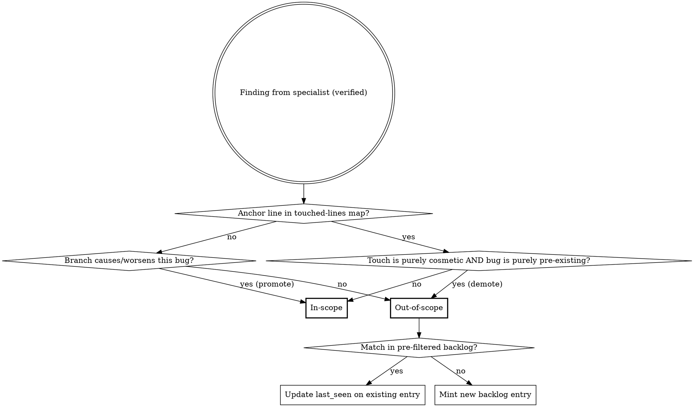

# `/paad:agentic-review` Scope Constraint — Implementation Plan

> **For Claude:** REQUIRED SUB-SKILL: Use superpowers:executing-plans to implement this plan task-by-task.

**Goal:** Update `plugins/paad/skills/agentic-review/SKILL.md` to classify findings as in-scope vs out-of-scope, persist out-of-scope findings to a project-wide backlog, and update all derived artifacts (help text, version numbers).

**Architecture:** Single-file SKILL.md prose update plus matching changes to `plugins/paad/skills/help/SKILL.md`, `plugins/paad/.claude-plugin/plugin.json`, and `.claude-plugin/marketplace.json`. The classification mechanism is hybrid blame (touched-lines map) + LLM reasoning (promotion/demotion), with backlog dedup pre-filtered by manifest path.

**Tech Stack:** Markdown prose, JSON (plugin manifests), `claude plugin validate` for structural checks. No code — verification is grep + read-back.

**Source design:** `docs/plans/2026-04-26-agentic-review-scope-design.md`

---

## Notes for the executor

1. **TDD adaptation.** Each task's "verification" is a grep against the modified file confirming a unique phrase from the new content is present (or absent, when removing). Run `claude plugin validate ./plugins/paad` as a structural check after any task that changes file structure.
2. **One commit per task.** This is critical — if any task introduces a bug, we want clean revertability.
3. **Order matters.** Tasks 1–8 build the SKILL.md changes section by section in document order. Task 9 updates the digraph; do not skip it (CLAUDE.md mandates it). Tasks 10–11 update derived files. Do not start Task 11 (version bump) until everything else passes.
4. **Editing technique.** Use `Edit` tool with `old_string` containing enough surrounding context to make the match unique. Read the file before each edit if the prior task changed nearby content.
5. **Worktree (optional).** This work is being done on the current branch where the design was committed. If you'd prefer isolation, use the `superpowers:using-git-worktrees` skill before Task 1.

---

## Task 1: Replace the existing Mechanism section

**Files:**
- Modify: `plugins/paad/skills/agentic-review/SKILL.md` — currently has no `## Mechanism` / `## Definitions` section. We'll add both sections after the introductory paragraph (around lines 6–10) and before `## Arguments`.

**Step 1: Read the current SKILL.md header region**

Read lines 1–25 of `plugins/paad/skills/agentic-review/SKILL.md` so you know exactly where to insert.

**Step 2: Insert Definitions and Mechanism sections after the intro paragraph**

Insert after the existing line `**This is a technique skill.** Follow the phases in order. Do not skip verification.` and before `## Arguments`:

```markdown

## Definitions

**In-scope** for the current branch means: this branch's changes either *caused* the bug or *worsened* it (made it more likely to fire, expanded its blast radius, removed a guard that was masking it, added a new caller into broken code, etc.). Pre-existing bugs that the branch does not reach differently are **out-of-scope**, even when they live in files the branch touches.

## Mechanism

Classification is **hybrid blame + reasoning**:

1. **Blame default.** Every finding's `file:line` is checked against a pre-computed touched-lines map (see Phase 1). If the line falls within a touched range → tentatively **in-scope**. Otherwise → tentatively **out-of-scope**.
2. **Reasoning promotion.** For tentatively out-of-scope findings only, the verifier asks: "Does this branch's diff cause this bug to fire when it didn't before, or measurably increase its probability/blast radius?" If yes → promote to **in-scope**. If the bug is purely pre-existing and the branch doesn't reach it differently → confirmed **out-of-scope**.
3. **Cosmetic-touch demotion.** A finding on touched lines defaults to in-scope, but the verifier may demote to out-of-scope when **both** of the following hold: (a) the branch's edits to those specific lines are purely cosmetic (whitespace, comment additions, line splits, identifier renames that don't change semantics), and (b) the bug itself is purely pre-existing — the cosmetic touch did not introduce, expose, or alter the bug's behavior. If either condition fails (semantic edit on the line, or the touch interacts with the bug), the finding stays in-scope.

Out-of-scope findings are **semantically deduped** by the verifier against a **file-filtered slice** of `paad/code-reviews/backlog.md`. Before invoking the verifier, the orchestrator pre-filters the backlog to entries whose `File (at first sighting)` path matches a file in the current review's manifest (changed + adjacent). Match → emit an update directive (`{id, last_seen}`). No match → mint a new entry with a stable 8-char hex ID hashed from `file + symbol + bug-class + first-seen-iso-date`.

Backlog **lifecycle is explicit-removal only** — agentic-review never auto-resolves entries. Downstream agents (or the user) delete the entry when the item is addressed. `git log` on the file is the audit trail.

```

**Step 3: Verify the insert landed correctly**

Run: `grep -n "^## Definitions\|^## Mechanism\|Cosmetic-touch demotion" plugins/paad/skills/agentic-review/SKILL.md`

Expected: three matches, in order, before the `## Arguments` line.

**Step 4: Commit**

```bash
git add plugins/paad/skills/agentic-review/SKILL.md
git commit -m "agentic-review: add Definitions and Mechanism sections"
```

---

## Task 2: Extend Phase 1 with touched-lines map construction

**Files:**
- Modify: `plugins/paad/skills/agentic-review/SKILL.md` — Phase 1 section, after step 9 ("Build manifest..."). The current Phase 1 ends with a "Steering file caveat" note; insert the new step before that note.

**Step 1: Read the current Phase 1 section**

Read the Phase 1 section (around lines 48–66 in the original; line numbers shifted by Task 1) so you have the exact "Build manifest" and "Steering file caveat" wording.

**Step 2: Add a new numbered step (10) and a sub-section "Touched-lines map"**

Append after the current step 9 ("Build manifest...") and before "**Steering file caveat:**":

```markdown
10. **Build the touched-lines map.** From `git diff <base>...HEAD`, produce `{file → [line ranges]}` covering every line the branch added or modified. Construction rules:
    - **Keys are current-HEAD paths.** Files are recorded under the path they have at HEAD, not at base.
    - **Renamed files** are keyed by the new path; line ranges cover lines modified in the new file. The old path is not retained.
    - **Newly added files** include all lines (1..end) — every line is touched.
    - **Pure deletions** contribute no entries (no current line exists to anchor a finding to).
    - **Path filter:** when a path filter argument is supplied (e.g., `/paad:agentic-review main src/auth/`), the touched-lines map is filtered to that scope, matching the manifest.

Findings are classified by their **anchor line** only (the `file:line` reported by the specialist). Multi-line bugs whose anchor line happens to be untouched are caught by reasoning-promotion in Phase 3, not by an expanded blame check.
```

**Step 3: Verify**

Run: `grep -n "Build the touched-lines map\|anchor line" plugins/paad/skills/agentic-review/SKILL.md`

Expected: at least two matches, in Phase 1.

**Step 4: Commit**

```bash
git add plugins/paad/skills/agentic-review/SKILL.md
git commit -m "agentic-review: add touched-lines map to Phase 1"
```

---

## Task 3: Append model attribution to specialist prompts

**Files:**
- Modify: `plugins/paad/skills/agentic-review/SKILL.md` — Phase 2 specialist prompt template.

**Step 1: Locate the agent prompt template**

The current text reads:

> Each specialist agent prompt must include:
> - The full diff
> - Contents of files in their review scope
> - Steering file contents with the staleness caveat
> - Instruction: "You are a specialist reviewer focused on [LENS]. Find bugs, not style issues. For each finding report: file:line, what's wrong, why it matters, suggested fix, and your confidence (0-100). Only report findings with confidence >= 60."

**Step 2: Modify the instruction line to require model attribution**

Use Edit to change the existing instruction line by appending: ` Also include "model: <name of the model you are running as>" in every finding.`

The new instruction line should read:

> - Instruction: "You are a specialist reviewer focused on [LENS]. Find bugs, not style issues. For each finding report: file:line, what's wrong, why it matters, suggested fix, and your confidence (0-100). Only report findings with confidence >= 60. Also include `model: <name of the model you are running as>` in every finding."

**Step 3: Verify**

Run: `grep -n "model: <name of the model" plugins/paad/skills/agentic-review/SKILL.md`

Expected: one match in Phase 2.

**Step 4: Commit**

```bash
git add plugins/paad/skills/agentic-review/SKILL.md
git commit -m "agentic-review: require specialists to attribute findings to their model"
```

---

## Task 4: Expand Phase 3 with classification and backlog dedup

**Files:**
- Modify: `plugins/paad/skills/agentic-review/SKILL.md` — Phase 3 (Verification) section.

**Step 1: Read the current Phase 3 section**

The current Phase 3 has a numbered list (1–6) describing verifier responsibilities, plus a "Verifier prompt must include:" instruction line.

**Step 2: Replace the numbered list with the expanded version**

Replace the current numbered list (1–6) with:

```markdown
1. For each finding, reads the actual current code at the referenced file:line
2. Confirms the bug exists and isn't handled elsewhere
3. Drops false positives and findings below 60% confidence
4. Assigns severity: **Critical** / **Important** / **Suggestion**
5. Deduplicates findings flagged by multiple specialists (note which specialists agreed)
6. **Classifies** each surviving finding as `in-scope` or `out-of-scope` using the rules in the Mechanism section. Inputs required: the touched-lines map (from Phase 1) and the diff. Apply blame default → reasoning promotion → cosmetic-touch demotion in that order.
7. **Backlog dedup** for out-of-scope findings only. Inputs required: a **pre-filtered slice** of `paad/code-reviews/backlog.md` containing only entries whose `File (at first sighting)` path matches a file in the manifest. For each out-of-scope finding:
   - **Match** → emit `{id, last_seen, branch, sha}` update directive.
   - **No match** → mint a new entry with a fresh 8-char hex ID hashed from `file + symbol + bug-class + first-seen-iso-date`.

Verifier output is two lists: in-scope findings (with severity) and out-of-scope findings (with severity, backlog ID, and `new` vs `re-seen` flag).
```

**Step 3: Update the "Verifier prompt must include" line**

Change the existing line:

> **Verifier prompt must include:** "You are verifying bug reports. For each finding, read the actual code and confirm the bug exists. Be skeptical — reject anything you cannot confirm by reading the code. A finding reported by multiple specialists is more likely real."

To:

> **Verifier prompt must include:** "You are verifying bug reports. For each finding, read the actual code and confirm the bug exists. Be skeptical — reject anything you cannot confirm by reading the code. A finding reported by multiple specialists is more likely real. Then classify each surviving finding as in-scope or out-of-scope per the Definitions and Mechanism sections, and for out-of-scope findings, dedup against the provided backlog slice."

**Step 4: Verify**

Run: `grep -n "Backlog dedup\|out-of-scope per the Definitions" plugins/paad/skills/agentic-review/SKILL.md`

Expected: at least two matches in Phase 3.

Then run: `claude plugin validate ./plugins/paad` — expected: validates cleanly.

**Step 5: Commit**

```bash
git add plugins/paad/skills/agentic-review/SKILL.md
git commit -m "agentic-review: extend Phase 3 verifier with classification and backlog dedup"
```

---

## Task 5: Add Out of Scope section to the Phase 4 report template

**Files:**
- Modify: `plugins/paad/skills/agentic-review/SKILL.md` — Phase 4 report template.

**Step 1: Read the current Phase 4 template**

The current template is fenced with ```markdown ... ``` and contains sections: Executive Summary, Critical Issues, Important Issues, Suggestions, Plan Alignment, Review Metadata.

**Step 2: Insert the Out of Scope section between Suggestions and Plan Alignment**

Insert (preserving the surrounding ```markdown code fence) after `## Suggestions` block ("One-line entries only. Omit section if none.") and before `## Plan Alignment`:

```markdown

## Out of Scope

> **Handoff instructions for any agent processing this report:** The findings below are
> pre-existing bugs that this branch did not cause or worsen. Do **not** assume they
> should be fixed on this branch, and do **not** assume they should be skipped.
> Instead, present them to the user **batched by tier**: one ask for all out-of-scope
> Critical findings, one ask for all Important, one for Suggestions. For each tier, the
> user decides which (if any) to address. When you fix an out-of-scope finding, remove
> its entry from `paad/code-reviews/backlog.md` by ID.

### Out-of-Scope Critical
### [OOSC1] <title> — backlog id: `<id>`
- **File:** `path/to/file:line`
- **Bug:** What's wrong
- **Impact:** Why it matters
- **Suggested fix:** Concrete recommendation
- **Confidence:** High/Medium
- **Found by:** <specialist> (`<model>`)
- **Backlog status:** new | re-seen (first logged YYYY-MM-DD)

(Repeat for each, or "None found.")

### Out-of-Scope Important
(Same shape — IDs OOSI1, OOSI2, ...)

### Out-of-Scope Suggestions
(One-line entries; each carries a backlog id — IDs OOSS1, OOSS2, ...)
```

**Step 3: Update existing in-scope finding entries to include `Found by` model attribution**

In the existing Critical and Important issue templates, change `- **Found by:** <specialist name(s)>` to `- **Found by:** <specialist> (\`<model>\`)`.

**Step 4: Update the Review Metadata section**

Add two lines to the existing Review Metadata block in the template (after `**Filtered out:** N - M`):

```markdown
- **Out-of-scope findings:** N (Critical: a, Important: b, Suggestion: c)
- **Backlog:** X new entries added, Y re-confirmed (see `paad/code-reviews/backlog.md`)
```

**Step 5: Add empty-section behavior to the Phase 4 prose**

After the existing line `Create the paad/code-reviews/ directory if it doesn't exist.` and before `**Report template:**`, add this paragraph:

```markdown
**Empty-section rules:**

- If there are zero out-of-scope findings of any tier, omit the entire `## Out of Scope` section *and* the handoff block. Review Metadata still records `Out-of-scope findings: 0`.
- If there are zero in-scope findings of a tier but out-of-scope findings exist, write each empty in-scope tier section as `None found.` (existing convention) and write the Out of Scope section normally.

**Failure handling:**

- If writing `paad/code-reviews/backlog.md` fails for any reason (permissions, disk, malformed existing file), surface the error to the user and write the per-review report anyway. The report is the authoritative deliverable; the backlog is a convenience layer.
```

**Step 6: Verify**

Run: `grep -n "Out-of-Scope Critical\|backlog id\|Backlog:.*re-confirmed\|Empty-section rules\|Failure handling" plugins/paad/skills/agentic-review/SKILL.md`

Expected: at least five matches.

**Step 7: Commit**

```bash
git add plugins/paad/skills/agentic-review/SKILL.md
git commit -m "agentic-review: add Out of Scope section and empty/failure handling to Phase 4"
```

---

## Task 6: Add the backlog file format spec section

**Files:**
- Modify: `plugins/paad/skills/agentic-review/SKILL.md` — add a new section after Phase 4 and before Common Mistakes.

**Step 1: Insert new section "## The Backlog File"**

Insert after the Phase 4 closing prose (the line about creating `paad/code-reviews/` if it doesn't exist) and before `## Common Mistakes`:

```markdown

## The Backlog File

`paad/code-reviews/backlog.md` is project-wide, append-only, and uses **explicit removal only** — agentic-review never auto-resolves entries. Created on first run if absent.

**Fixed header (preserved across all updates):**

```markdown
# Out-of-Scope Findings Backlog

> **These items were flagged by `/paad:agentic-review` as out of scope for the branch
> on which they were found.** They may be stale, may already have been fixed by other
> means, may no longer apply after refactors, or may simply have been judged not worth
> addressing. Verify each entry against the current code before acting on it. Entries
> are removed only when explicitly addressed — no automatic cleanup.

---
```

**Per-entry shape:**

```markdown
## `<id>` — <one-line title>
- **File (at first sighting):** `path/to/file:line`
- **Symbol:** `<function or class name>`
- **Bug class:** Logic | Error Handling | Contract | Concurrency | Security | Plan
- **Description:** ...
- **Suggested fix:** ...
- **Confidence:** High | Medium
- **Found by:** <specialist> (`<model>`)
- **First seen:** YYYY-MM-DD on branch `<branch>` at `<short-sha>`
- **Last seen:** YYYY-MM-DD on branch `<branch>` at `<short-sha>`
- **Severity:** Critical | Important | Suggestion
```

**Update rule on re-discovery:** rewrite only the `Last seen` line. Everything else is immutable so the entry remains a stable historical record.

**Removal rule:** delete the entire `## <id> — <title>` block. No tombstones, no archive.

**ID format:** 8-char hex of `sha1(file + symbol + bug-class + first-seen-iso-date)`.

**Soft size warning:** when the active backlog crosses **200 entries**, surface a warning in the post-review message so accumulation stays visible.
```

**Step 2: Verify**

Run: `grep -n "^## The Backlog File\|Update rule on re-discovery\|Soft size warning" plugins/paad/skills/agentic-review/SKILL.md`

Expected: three matches.

**Step 3: Commit**

```bash
git add plugins/paad/skills/agentic-review/SKILL.md
git commit -m "agentic-review: document backlog file format and lifecycle"
```

---

## Task 7: Update the Post-Review section

**Files:**
- Modify: `plugins/paad/skills/agentic-review/SKILL.md` — Post-Review section.

**Step 1: Read the current Post-Review section**

The current section has a 3-step numbered list (Tell user report location; Tell user about receiving-code-review; Don't auto-fix).

**Step 2: Replace the entire Post-Review section body**

Replace the existing 3 numbered steps with this 6-step list:

```markdown
1. Report path and counts: `Critical: N (in-scope) / X (out-of-scope), Important: …, Suggestion: …`.
2. Backlog state: `Backlog: X new entries added, Y re-confirmed, Z total active.`
3. **Security disclosure warning** (only when this run added one or more `Bug class: Security` entries to the backlog): list the count, the affected files, and tell the user: *"`paad/code-reviews/backlog.md` is committed to this repository by default. If this repo is public or shared outside your team, decide whether to commit these security entries before pushing — you can `.gitignore` the file or remove specific entries."*
4. **Backlog-size soft warning** (only when total active entries ≥ 200): *"Backlog has N active entries — consider triaging stale items."*
5. Tell the user: "To address in-scope findings, review each issue in the report and fix them with per-fix commits. If you have the [superpowers](https://github.com/obra/superpowers/) plugin installed, you can use the `receiving-code-review` skill and point it at this report for a guided workflow. For out-of-scope findings, the report includes batched-ask handoff instructions; any agent following them will prompt you tier-by-tier and remove backlog entries by ID as items are fixed."
6. Do **not** auto-fix anything. The report is the deliverable.
```

**Step 3: Verify**

Run: `grep -n "Security disclosure warning\|Backlog-size soft warning" plugins/paad/skills/agentic-review/SKILL.md`

Expected: two matches.

**Step 4: Commit**

```bash
git add plugins/paad/skills/agentic-review/SKILL.md
git commit -m "agentic-review: expand Post-Review with security and backlog-size warnings"
```

---

## Task 8: Add new rows to the Common Mistakes table

**Files:**
- Modify: `plugins/paad/skills/agentic-review/SKILL.md` — Common Mistakes table.

**Step 1: Append two rows to the existing table**

The current table ends with a row about "Ignoring test infrastructure". After that row (before the closing of the table), add:

```markdown
| Treating out-of-scope findings as fixable on this branch | They are pre-existing — surface them, batch the ask, and let the user decide per tier |
| Dropping out-of-scope findings on the floor | They go in the report's Out of Scope section AND in `backlog.md` — never silently discarded |
```

**Step 2: Verify**

Run: `grep -n "Treating out-of-scope findings\|Dropping out-of-scope findings" plugins/paad/skills/agentic-review/SKILL.md`

Expected: two matches.

**Step 3: Commit**

```bash
git add plugins/paad/skills/agentic-review/SKILL.md
git commit -m "agentic-review: add scope-related entries to Common Mistakes"
```

---

## Task 9: Update the Pre-flight digraph and add a Classification digraph

**Files:**
- Modify: `plugins/paad/skills/agentic-review/SKILL.md` — the existing ```dot block in Pre-flight, plus a new ```dot block in the Mechanism section.

**Why:** CLAUDE.md mandates that the digraph match the prose; we've added a new decision flow (in-scope vs out-of-scope classification) that the existing digraph doesn't capture.

**Step 1: Leave the Pre-flight digraph unchanged**

The existing pre-flight digraph still matches the pre-flight prose. No change needed there. The Mechanism section is where the new flow lives.

**Step 2: Add a Classification digraph at the end of the Mechanism section**

Insert at the end of `## Mechanism` (after the explicit-removal lifecycle paragraph):

````markdown


````

**Step 3: Verify**

Run: `grep -nc "^digraph " plugins/paad/skills/agentic-review/SKILL.md`

Expected: 2 (the pre-existing pre-flight digraph + the new classification one).

Then read the new digraph and confirm every label is also a node — no dangling references.

Then run: `claude plugin validate ./plugins/paad` — expected: validates cleanly.

**Step 4: Commit**

```bash
git add plugins/paad/skills/agentic-review/SKILL.md
git commit -m "agentic-review: add classification digraph for in-scope/out-of-scope flow"
```

---

## Task 10: Update the help skill text for agentic-review

**Files:**
- Modify: `plugins/paad/skills/help/SKILL.md` — the `### agentic-review` section (currently around lines 161–194).

**Why:** CLAUDE.md says: *"When changing a skill's behavior, arguments, or output, review `plugins/paad/skills/help/SKILL.md` and update the corresponding help text to match."* We changed output (new section, new file, new post-review messages).

**Step 1: Replace the "What it does" section under `### agentic-review`**

The current "What it does" list ends at step 5 ("Writes a report with: Issues ranked: Critical / Important / Suggestion; Each finding: file:line, bug, impact, suggested fix, confidence"). Replace step 5 and add step 6:

```
  5. Classifies each finding as in-scope (this branch caused/worsened it)
     or out-of-scope (pre-existing) using blame + reasoning + cosmetic-touch
     demotion. Out-of-scope findings persist to a project-wide backlog.
  6. Writes a report with:
     - In-scope issues ranked: Critical / Important / Suggestion
     - Out-of-scope issues batched by tier with handoff instructions
     - Each finding: file:line, bug, impact, suggested fix, confidence,
       and the model that found it
     - Backlog updates surfaced in metadata
```

Also update the `Output:` line to mention both files:

```
Output:   paad/code-reviews/<branch>-<timestamp>.md (per-review)
          paad/code-reviews/backlog.md (project-wide, persistent)
```

**Step 2: Verify**

Run: `grep -n "Classifies each finding as in-scope\|backlog.md (project-wide" plugins/paad/skills/help/SKILL.md`

Expected: two matches.

**Step 3: Commit**

```bash
git add plugins/paad/skills/help/SKILL.md
git commit -m "help: update agentic-review section to reflect scope classification"
```

---

## Task 11: Bump versions and run final validation

**Files:**
- Modify: `plugins/paad/.claude-plugin/plugin.json` — bump `version` from `1.11.1` to `1.12.0` (minor bump — new behavior, backwards-compatible report additions).
- Modify: `.claude-plugin/marketplace.json` — bump the plugin entry's `version` from `1.11.1` to `1.12.0` to match.

**Step 1: Bump plugin.json**

Use Edit to change `"version": "1.11.1"` → `"version": "1.12.0"` in `plugins/paad/.claude-plugin/plugin.json`.

**Step 2: Bump marketplace.json**

Use Edit to change `"version": "1.11.1"` → `"version": "1.12.0"` in the plugin entry of `.claude-plugin/marketplace.json` (the one inside the `plugins` array — leave the top-level marketplace metadata version alone).

**Step 3: Final validation**

Run both:
- `claude plugin validate .`
- `claude plugin validate ./plugins/paad`

Expected: both validate cleanly.

**Step 4: Read SKILL.md end-to-end**

Read `plugins/paad/skills/agentic-review/SKILL.md` from top to bottom and confirm:
- Definitions section comes before Arguments
- Mechanism section follows Definitions
- Phase 1 has the touched-lines map step
- Phase 2 prompt mentions model attribution
- Phase 3 has classification + backlog dedup steps
- Phase 4 has the Out of Scope section
- The Backlog File section exists between Phase 4 and Common Mistakes
- Post-Review has 6 steps
- Common Mistakes has the two new rows
- The classification digraph exists in the Mechanism section
- No leftover references to "fixed verbatim" in the Out of Scope handoff prose
- No leftover references to one-by-one Critical asks

**Step 5: Commit**

```bash
git add plugins/paad/.claude-plugin/plugin.json .claude-plugin/marketplace.json
git commit -m "release: bump paad to 1.12.0 (agentic-review scope classification)"
```

---

## Done criteria

- [ ] All 11 tasks committed.
- [ ] `claude plugin validate ./plugins/paad` passes.
- [ ] `claude plugin validate .` passes.
- [ ] SKILL.md reads coherently end-to-end.
- [ ] Help skill text matches new behavior.
- [ ] plugin.json and marketplace.json both at 1.12.0.

## Out of scope for this implementation

These are explicitly *not* implemented here (per the design doc's "Out-of-scope for this design" section):

- Auto-resolve / stale archive of backlog entries
- Cross-branch dedup of in-scope findings
- One-by-one ask for Critical out-of-scope (we do uniform batched ask)
- Verifier-driven backlog garbage collection
- Atomic backlog writes / crash safety
- Re-classifying severity on re-discovery
- Default-by-policy security handling (e.g., automatic `.gitignore`)
