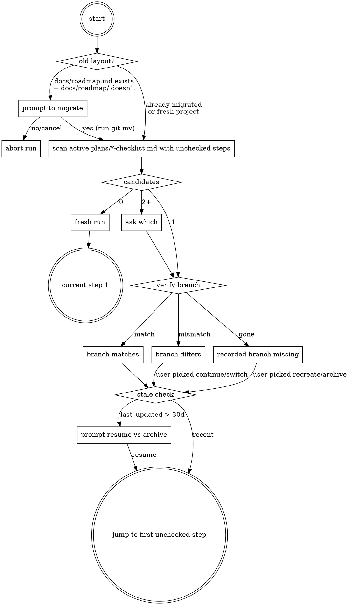

# Roadmap Resume Checklists — Design

**Date:** 2026-05-02
**Skill affected:** `/roadmap` (`.claude/skills/roadmap/SKILL.md`)
**Status:** Design — not yet implemented

## Context

`/roadmap` is an 11-step workflow that turns one phase of `docs/roadmap.md`
into a design doc, an implementation plan, and a decision log. A single run
threads through brainstorming, pushback, a CLAUDE.md review, plan writing,
and an alignment check — all of which involve user discussion that can be
interrupted by a `/clear`, a session crash, an end-of-day stop, or a context
switch to a different project.

Today, mid-run state is invisible:

- The roadmap only flips (via the `<!-- plan: filename.md -->` comment) when
  step 5 runs. Anything before that leaves no trace.
- Pushback (step 6) and alignment (step 9) raise issues that the skill
  currently asks the agent to "mentally track" before transcribing into the
  decision log at step 10. That memory does not survive a `/clear`.
- The skill has no concept of "the current run." Resume = re-derive
  everything from disk + recall.

The user runs `/roadmap` across multiple projects. Per-project state is
fine; cross-project state is not wanted.

## Goals

1. **Instant resume.** Re-running `/roadmap` should locate the in-progress
   run within one filesystem scan and announce where it left off.
2. **Track little steps.** Pushback and alignment findings — including
   their open/closed state and resolution — must persist to disk, not
   memory.
3. **Directory hygiene.** Roadmap-related artifacts (the roadmap itself,
   plans, decisions, archived bundles) live under one directory.
4. **Lifecycle support.** When a roadmap completes, the user is prompted
   to archive it so the canonical `roadmap.md` slot becomes available for
   the next one.
5. **Bulletproof under rationalization.** The new step 0 and the
   checklist-update obligations must hold up against the agent's normal
   "this step is obvious, I'll skip it" failure modes.

## Non-goals

- **Mid-brainstorm resume.** Brainstorming itself (step 4) is question-by-
  question; if interrupted before the design file is written, re-run from
  scratch. The Q&A pace is cheap; trying to record partial brainstorm state
  in the checklist would leak brainstorming internals.
- **Cross-project state.** No global registry. Each project's checklist
  state lives in that project's `docs/roadmap/`.
- **Concurrent runs.** No lock file. If the user accidentally runs
  `/roadmap` twice in two terminals, step 0 will surface the conflict
  through the existing "multiple checklists found" prompt.
- **Multiple concurrent roadmaps in one project.** A single canonical
  `roadmap.md` per project. If a project later needs parallel roadmaps
  (e.g. marketing + technical), revisit then.

## Design

### 1. Directory restructure

All roadmap-related artifacts move under `docs/roadmap/`:

```
docs/roadmap/
  roadmap.md                 # canonical active roadmap (always this name)
  plans/                     # per-phase artifacts
    YYYY-MM-DD-<topic>-design.md
    YYYY-MM-DD-<topic>-plan.md
    YYYY-MM-DD-<topic>-checklist.md       # NEW
  decisions/                 # per-run decision log entries
    YYYY-MM-DD-<phase-slug>.md
    INDEX.md
  archive/                   # archived roadmaps (full bundles)
    <slug>/
      roadmap.md
      plans/
      decisions/
```

The `docs/roadmap-decisions/` location named by the existing skill prose
collapses into `docs/roadmap/decisions/`.

The `<!-- plan: foo.md -->` comments in `roadmap.md` already use bare
filenames; they keep resolving correctly under `docs/roadmap/plans/` with
no edits.

### 2. Per-phase checklist file

One checklist per `/roadmap` run, created right after step 2a (branch
checkout succeeded), updated at the end of every subsequent step.

**Filename:** `YYYY-MM-DD-<topic>-checklist.md`, where `<topic>` is the
existing phase slug rule from §2a of the current SKILL.md (lowercase phase
title, drop apostrophes without separator, collapse non-`[a-z0-9]` to
hyphens, fall back to `phase-N`). Date is the day step 0 → step 1 fires
(start date), so the design / plan / checklist for one run sit alphabetic-
ally adjacent in `plans/`.

**Schema:**

```markdown
---
phase: "Phase 2: agentic-architecture references conversion"
phase_slug: agentic-architecture-references
branch: ovid/agentic-architecture-refs
roadmap: docs/roadmap/roadmap.md
started: 2026-05-02
last_updated: 2026-05-02
design_file: docs/roadmap/plans/2026-05-02-agentic-architecture-references-design.md
plan_file: null
decision_log: null
---

# Phase 2: agentic-architecture references conversion — Run Checklist

## Steps
- [x] 1. Read roadmap
- [x] 2. Identified next unplanned phase
- [x] 2a. Working branch created: `ovid/agentic-architecture-refs`
- [x] 3. Extract phase context
- [x] 4. Brainstorm → design saved
- [ ] 5. Record plan filename in roadmap
- [ ] 6. Pushback review
  - [ ] 6a. Pushback returned all findings
- [ ] 7. CLAUDE.md review
- [ ] 8. Write implementation plan
- [ ] 9. Alignment check
  - [ ] 9a. Alignment returned all findings
- [ ] 10. Write decision log entry
- [ ] 11. Announce completion

## Pushback Findings
(populated during step 6, transcribed by step 10)

### [1] Lens 3 spec contradicts §Key Architecture Decisions
- **Severity:** Critical
- **Category:** Contradiction
- **Summary:** The Lens 3 spec requires X, but §Key Architecture Decisions in CLAUDE.md mandates Y for cross-cutting consistency. The two cannot both hold; one must yield.
- **Status:** open
- **Resolution:** _(pending)_

### [2] Phase scope bundles refactor + new feature
- **Severity:** Important
- **Category:** Scope
- **Summary:** This phase combines the references-package extraction (refactor) with new lens content (feature), violating the one-refactor-OR-one-feature PR rule from CLAUDE.md.
- **Status:** closed
- **Resolution:** fixed-in-design — split into 2a (refactor) + 2b (feature)

## Alignment Findings
(populated during step 9, transcribed by step 10)
```

**Field rules:**

- `branch` is the working branch name from §2a; resume verifies it matches
  the current branch.
- `design_file`, `plan_file`, `decision_log` go from `null` to a path the
  moment each artifact is written.
- `last_updated` is bumped on every write (lets stale-checklist detection
  work without filesystem mtime).
- **Summary** is a one-paragraph description of the finding, written by
  pushback (or alignment) at the moment the issue is first raised — while
  the context is still in head. It is *not* generated at transcription
  time. This is the only field step 10 carries forward as written prose,
  so writing it now (not later) is what eliminates the "mentally tracked"
  failure mode the design exists to fix.
- **Status vocabulary** (closed set): `open | closed`. While `open`, the
  finding is still being discussed. When `closed`, the `Resolution:` line
  uses one of the existing decision-log resolution values verbatim:
  `fixed-in-design`, `fixed-in-plan`, `dismissed-invalid`,
  `dismissed-out-of-scope`, `accepted-as-is`, `deferred`. Status itself
  has no decision-log analog (every entry there is closed by definition);
  step 10's transcription drops the `Status:` line and is otherwise a
  literal copy.
- **Severity / Category** vocabularies are the existing ones from the
  pushback and alignment sections of the current SKILL.md.
- **Sub-checkboxes for steps 6 and 9.** Each has a `Na` sub-checkbox
  (`6a. Pushback returned all findings`, `9a. Alignment returned all
  findings`) flipped only when the corresponding subagent returns
  cleanly. The top-level `- [x] N` is checked when **both** Na is
  checked AND no `Status: open` entries remain in the corresponding
  findings section. The "no open findings" half is a derived condition
  computed from the file, not a separate checkbox.

### 3. Resume detection (new step 0)

A new step that runs before everything else.



**Layout migration (first thing step 0 checks):** if `docs/roadmap.md`
exists at the repo root AND `docs/roadmap/roadmap.md` does not, the
project is on the legacy layout. Prompt:

> Old roadmap layout detected:
>   - `docs/roadmap.md` (will move to `docs/roadmap/roadmap.md`)
>   - `docs/plans/` (will move to `docs/roadmap/plans/`)
>
> Run the migration now? `yes` / `no` / `cancel`

On `yes`, run the `git mv`s and continue to the scan. On `no` or
`cancel`, abort the run and tell the user the new skill cannot operate
on the legacy layout. Once `docs/roadmap/roadmap.md` exists, this prompt
never fires again for the project. Detection is by presence — no marker
file needed.

**Scan scope:** the scan reads `docs/roadmap/plans/*-checklist.md`
exclusively. It never recurses into `docs/roadmap/archive/` — once a
roadmap is archived, its in-progress runs are intentionally abandoned
and should not surface as resume candidates.

**Branch verification:**

| Recorded `branch` vs `git branch --show-current` | Action |
|---|---|
| Match | Silently proceed; announce "Resuming Phase X at step N" |
| Mismatch | Prompt: switch to recorded, continue here (updates `branch` field), or cancel |
| Recorded branch no longer exists locally | Prompt: archive the stale checklist, recreate on current branch, or cancel |

**Multiple candidates:** if scan returns two or more checklists with
unchecked steps, list them and ask which to resume; offer "none — start
fresh" as a fourth option.

**Stale-checklist threshold:** if `last_updated` is more than 30 days
ago, prompt before resuming. Threshold lives as a one-line constant in
the SKILL.md so it is easy to tune.

**Jumping to the right step:** the first unchecked `- [ ]` in `## Steps`
(treating a top-level step as unchecked if either it or any of its
sub-checkboxes is unchecked) is the target. The label after the number
identifies which step's prose to load.

For steps 6 and 9, the sub-checkbox `Na` distinguishes two recovery
modes:

- **`Na` unchecked** → the subagent never returned a complete findings
  list (never invoked, errored, or timed out). Wipe the corresponding
  `## Pushback Findings` (or `## Alignment Findings`) section, re-invoke
  the subagent from scratch, and start over for that step.
- **`Na` checked, top-level `N` unchecked** → findings list is complete;
  at least one entry has `Status: open`. Resume the discussion from
  those open findings; do not re-invoke the subagent.

### 4. Lifecycle: archive on completion

**Trigger:** the existing skill's step 2 already detects "every phase
has a `<!-- plan: ... -->` comment" — today it produces the no-op message
*"All roadmap phases have been brainstormed. Nothing to do."* That is
the trigger. When the condition is true, replace the no-op with the
archive prompt.

**Why "all planned" and not "all Done":** the existing step 5b only
flips the *previous* phase to `Done` when starting brainstorming on the
next phase. The last phase in a roadmap is therefore never auto-marked
`Done` by `/roadmap`; reaching "all Done" requires the user to manually
edit the table and re-run `/roadmap` purely to see the prompt — a
footgun that would mean the prompt rarely fires. "Every phase has a
plan comment" is a signal `/roadmap` actually owns and writes itself
(at step 5a). The Phase Structure table's `Done` column remains useful
as human-visible status, but the archive trigger is decoupled from it.

**Prompt:**

> All phases of this roadmap have been planned. Archive to
> `docs/roadmap/archive/<slug>/` and start fresh? `yes` / `no` / `later`

- **`yes`**: `git mv` the contents of `docs/roadmap/` (excluding
  `archive/` itself) into `docs/roadmap/archive/<slug>/`. Slug derived
  from the roadmap's H1 title using the existing slug rule. Then drop a
  fresh `roadmap.md` template (a stub the user fills in for the next
  initiative).
- **`no`**: suppress the prompt until the active roadmap changes (a
  marker — e.g., a `.archive-declined` sibling file in `docs/roadmap/`
  with the H1 title's hash — lets subsequent runs see "archive
  previously declined for this roadmap" and skip).
- **`later`**: leave everything in place; re-prompt on the next run.

### 5. Skill compliance additions

The new behavior is only useful if the agent actually does it. Add to
`SKILL.md`:

**A "Checklist update obligations" block** stating: every step ends with
"update the checklist (frontmatter `last_updated` + the relevant box +
any frontmatter path field) before announcing or moving on." No
exceptions.

**A rationalization table:**

| Excuse | Reality |
|---|---|
| "This step is obvious, I'll skip the box" | Resume detection scans boxes, not artifacts. The box is the source of truth. |
| "I'll batch the checklist updates at the end" | A `/clear` between now and the end loses the run. Update before moving on. |
| "I'll keep the open pushback issues in my head" | The next session won't have a head. The checklist *is* the memory. |
| "The artifact exists on disk, the checkbox is redundant" | Both must agree; mismatch means the run is in an unknown state. |
| "Branch mismatch is fine, I know what I'm doing" | The recorded branch is the safety net. Update or override explicitly — never ignore. |

**Verification before ticking:** marking step 4 done requires `design_file`
to exist at the recorded path and be non-empty. Step 8 requires
`plan_file`. Step 10 requires `decision_log`. This is
`verification-before-completion` applied to checklist updates.

**Brainstorming non-resumability** stated explicitly: if interrupted
mid-step-4, re-run brainstorming. Step 4's box flips only when the design
file is written.

### 6. Step-by-step changes to the existing SKILL.md

Concrete edits the implementation phase will make:

- **New step 0**: Resume detection (per §3 above).
- **Step 2a**: After successful branch checkout, create the checklist
  file with frontmatter populated and steps 1, 2, 2a checked.
- **Steps 1, 2, 3**: Each ends with "tick the corresponding step box and
  bump `last_updated`."
- **Step 4**: After brainstorming writes the design doc, set
  `design_file` in frontmatter and tick step 4.
- **Step 5**: After updating `roadmap.md`, tick step 5.
- **Step 6**: Replace "mentally track each issue" with: for each issue
  pushback raises, append a finding entry to the checklist's
  `## Pushback Findings` section with `Severity`, `Category`, `Summary`
  (one paragraph written *now* while the context is fresh — this is the
  prose step 10 will copy verbatim), `Status: open`, and
  `Resolution: _(pending)_`. When the pushback subagent returns cleanly,
  tick `6a. Pushback returned all findings`. When discussion closes a
  finding, flip `Status: closed` and write the resolution using the
  closed vocabulary. Tick top-level step 6 only when **both** 6a is
  checked AND every finding has `Status: closed`.
- **Step 7**: Tick after the CLAUDE.md review discussion concludes.
- **Step 8**: After plan written, set `plan_file` and tick step 8.
- **Step 9**: Same pattern as step 6, against `## Alignment Findings`
  and the `9a. Alignment returned all findings` sub-checkbox.
- **Step 10**: Transcribe `## Pushback Findings` and `## Alignment
  Findings` from the checklist into the decision log file. Transcription
  is a literal copy of every finding minus the `Status:` line (decision
  log entries are always closed by definition). Severity counts in the
  decision log frontmatter come from counting the checklist's findings
  — single source of truth eliminates the "mentally tracked counts
  don't sum" reconciliation hazard the current skill warns about. Set
  `decision_log` and tick step 10.
- **Step 11**: After announce, tick step 11. The checklist is now fully
  ticked and serves as the historical record of the run.

## Migration

For the paad repo specifically:

```
git mv docs/roadmap.md            docs/roadmap/roadmap.md
git mv docs/plans/                docs/roadmap/plans/
# docs/roadmap-decisions/ does not exist yet; nothing to move
```

This design document itself stays in `docs/plans/` (the pre-migration
location) because it precedes the migration. The first new design doc
written by the updated skill lands in `docs/roadmap/plans/`.

The skill's hard-coded path `docs/roadmap.md` becomes
`docs/roadmap/roadmap.md` everywhere it is referenced (one prose change).

For other projects using `/roadmap`: step 0's first action is the
"Layout migration" check described in §3 — if `docs/roadmap.md` exists
at the repo root AND `docs/roadmap/roadmap.md` does not, the skill
prompts the user, runs the `git mv`s on acceptance, and then proceeds
to resume detection. Detection is by presence; once
`docs/roadmap/roadmap.md` exists, the prompt never fires again for that
project. The user does not need to edit any config or run any
out-of-band commands.

## Open questions / future work

- **Roadmap template for `archive on yes` flow.** What does the fresh
  `roadmap.md` look like after archiving? A minimal H1 + Phase Structure
  table with one row, or empty? Implementation can pick.
- **`docs/plans/2026-05-01-pr1-spec-compliance-extraction-plan.md`** in the
  current paad repo — this is a plan with no matching design doc (it
  predates the convention). Migration should not require one-to-one
  pairing. Implementation should preserve orphan files unchanged.

## Implementation notes (for the plan phase)

Per `superpowers:writing-skills`, the SKILL.md changes follow
RED-GREEN-REFACTOR:

1. **RED:** Run pressure scenarios with subagents against the *current*
   skill: simulate `/clear` mid-step-6, observe the agent lose the open
   pushback findings.
2. **GREEN:** Add step 0, the checklist file creation, and the per-step
   update obligations. Re-run the scenarios; verify the agent recovers.
3. **REFACTOR:** Identify new rationalizations from testing
   ("the checkbox is redundant," "I'll batch updates"), add them to the
   rationalization table, re-test until the agent complies under
   pressure.

**PR scope decision:** the work bundles a directory restructure (refactor)
with the resume-checklist mechanism and the archive lifecycle (two new
features). Strict CLAUDE.md PR scope (one refactor OR one feature per
PR) would suggest 2–3 PRs. The user has explicitly opted for a **single
PR** because this is blocking other work; the override is a deliberate
trade-off (faster ship, larger review surface) and should be noted in
the PR description so reviewers know the size is intentional.
