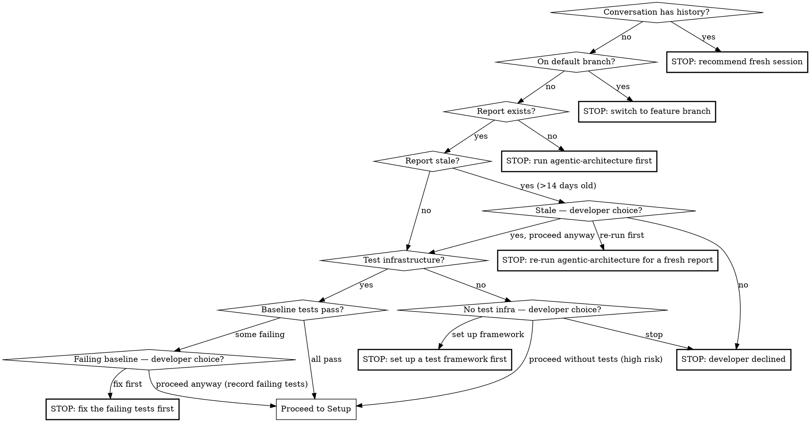
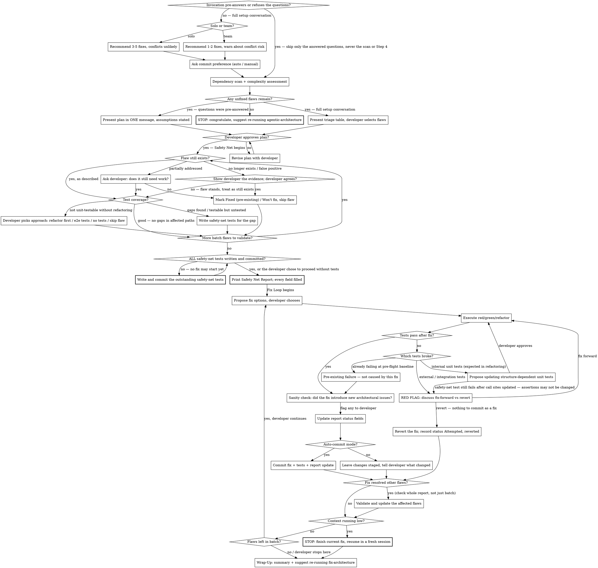

**On invocation:** announce "Running paad:fix-architecture v1.30.2" before anything else.

# Fix Architecture

Guided, iterative fixing of architectural flaws identified by `/agentic-architecture`. Loads an existing architecture report, walks the developer through selecting and prioritizing flaws, then fixes them one at a time with a test-first workflow. Updates the report with status tracking so the skill can be re-run across multiple sessions.

**This is a technique skill.** Follow the phases (Setup → Safety Net → Fix Loop → Wrap-Up) in order. Do not skip validation or testing steps.

**Pre-flight:**



**Session flow** — Setup → Safety Net → Fix Loop → Wrap-Up. The Safety Net gate is non-negotiable: no fix may begin until every safety-net test for the whole batch is written and committed.



## Setup: Developer Conversation

A setup conversation before any code is touched. **One question per message. Ask, wait for the answer, then ask the next.** Do not combine multiple questions into one message — it is frustrating and overwhelming.

### When the developer pre-answers or refuses the questions

An invocation like `/fix-architecture report.md — fix F-02 and F-11, don't ask me a bunch of questions, just go` answers some of the steps below and declines the rest. Honour that, within limits.

**You may skip** any question the developer has already answered. Re-asking it is the same friction the one-question-per-message rule exists to prevent.

**You may not skip Step 3's dependency scan and complexity assessment, or Step 4.** Those are not questions — they are work that produces information the developer does not have: naming two flaws is not the same as knowing that fixing one resolves the other.

So: run the scan, then present the plan in **one** message with every assumption stated explicitly — "assuming solo and auto-commit; F-02 before F-11, because fixing F-02 likely resolves F-11" — and wait for a single confirmation. One message, one answer. That is the floor, not zero.

**Silence is not a go-ahead, and being told to skip the questions is not approval of a plan the developer has not seen.** If they reply "yes, go" to that one message, you have your approval and Setup is complete.

### Step 1: Team Context

> "Are you working solo or on a team? This affects how many fixes I'll recommend per session."

- **Solo** → recommend larger batches (3-5 fixes), note that conflicts are unlikely
- **Team** → recommend 1-2 fixes per session, warn about conflict risk with other developers' work

### Step 2: Commit Preference

> "When I complete a fix, should I commit automatically, or would you prefer to review and commit yourself?"

Two modes:
- **Auto-commit** — skill commits after each successful fix (one commit per fix, including tests and report update)
- **Manual commit** — skill leaves changes staged, tells the developer what was changed

Both modes govern **fix** commits only. The Safety Net phase always commits its tests, in either mode — that commit is what lets a fix be reverted without taking the tests with it. Say so when the developer picks manual: "I'll leave fixes staged for you. The safety-net tests still get their own commit up front, so reverting a fix can't destroy them."

### Step 3: Flaw Triage

Present flaws from the report, excluding any already marked as Fixed or Won't Fix. Before presenting, do two things:

**Dependency scan** — cross-reference flaws to find relationships:
- File paths — flaws in the same file(s) are likely related
- Categories — e.g., god object (F-02) + low cohesion (F-11) on the same class
- Present related flaws as groups: "F-02 and F-11 both affect `UserService.ts` — fixing F-02 first will likely resolve F-11"

**Complexity assessment** — for each flaw, do a lightweight scan of the affected code to estimate fix complexity (Low / Medium / High):
- **Low complexity:** localized change (1-2 files), few references, no cross-cutting concerns
- **Medium complexity:** multiple files, moderate references, or requires coordination across a few modules
- **High complexity:** cross-cutting change, many references, touches core abstractions, or requires significant refactoring

Present flaws in a table showing both **Impact** (from the report) and **Complexity** (from your scan). Only include complexity categories that have flaws in them — skip empty categories.

Then ask (adapting the options to reflect the actual impact and complexity of the remaining flaws — do NOT label flaws as "high impact" if they are Medium or Low in the report):

> "What would you like to focus on?
> 1. Highest-impact flaws first (<list F-IDs with their actual impact levels>)
> 2. Lowest-complexity flaws first (<list F-IDs you assessed as low complexity>)
> 3. Specific flaws (pick by F-ID)
> 4. Something else"

**Do not describe fix approaches or verification steps in the triage — that's the Fix Loop.** The triage assesses scope (how many files, how localized) and complexity to help the developer choose, not how the fix will work.

Based on the developer's answer and team context, recommend a batch size and let them select specific flaws.

If no unfixed flaws remain (all are marked Fixed or Won't Fix), congratulate the developer and suggest re-running `/agentic-architecture` for a fresh analysis to find any new issues. Stop.

### Step 4: Plan Confirmation

Summarize the full plan:
- Selected flaws in fix order (ordered by: dependencies first — flaws that unblock others; then by impact — High before Medium before Low; then by complexity — simpler first within the same impact level. The developer can override this order.)
- Known dependencies between them
- Testing note: "I'll validate all flaws and write ALL safety-net tests in the Safety Net phase before any code is changed. No exceptions — one refactor can break code another flaw's tests would have caught."
- Batch size
- Commit mode

Get explicit go-ahead before touching any code.

## Safety Net: Validate and Write Upfront Tests

**Non-negotiable rule: ALL safety-net tests must be written and committed before ANY fixes are applied. No exceptions.** Changes can have unexpected action at a distance — tests must exist before any refactoring begins, even for a single fix. This phase must complete fully before the Fix Loop begins.

The tests this phase credits as the safety net — written here or existing — are **frozen** for the rest of the session: once the Fix Loop starts, their assertions and expected values may not be changed, relaxed, skipped, or deleted. See "Editing tests during the Fix Loop". A safety net you are free to rewrite until the suite goes green is not a safety net.

1. For each flaw in the batch, run Validate the Flaw and Assess Test Coverage
2. Write all needed safety-net tests
3. Commit all safety-net tests together (before any fix commits) — **in both commit modes.** Manual-commit mode applies to fix commits, not to this one: staged tests are destroyed by a later revert along with the fix.
4. Print the Safety Net Report (below) and show it to the developer
5. Only then proceed to the Fix Loop (starting at Propose Fix Options for each flaw)

### Safety Net Report

Every other check in this phase is self-attested, so a hollow Safety Net looks identical to a real one. This report makes the difference visible as blanks.

Print it before the first fix, filling in every field:

```
Safety Net Report

Baseline:  <exact command run>
           <pass/fail/skip counts>
           Pre-existing failures: <verbatim test names, or "none">
           Not runnable: <what could not be run, or "nothing">

Per flaw:
  <F-ID>   Coverage: <written | existing | none — developer approved>
           Cases:    <named test cases — the ones you wrote, or the existing
                      ones you are crediting as coverage>
           Proof:    <command that ran those cases, and its result>
           Commit:   <SHA of the safety-net commit, or "n/a — existing tests">
```

Rules for filling it in:

- **Never leave a field blank or write "see above".** A field you cannot fill is a gap in the safety net, and the developer needs to see it before the first fix, not after a revert.
- **`Cases:` must name cases, not files.** "`test/services/user.test.ts`" is not an answer; "`describes user split across services`, `rejects empty role`" is.
- **`Proof:` requires you to have actually run them this session.** A green CI badge, a suite you ran before writing the tests, and "these obviously pass" are all not proof.
- **If the whole batch comes back `Coverage: existing` and you wrote no tests at all**, say so explicitly and get the developer's confirmation before entering the Fix Loop. A Safety Net phase that produces zero tests is a claim that needs a witness.

## Fix Loop

For each flaw in the confirmed batch, execute this sequence:

**The Setup rule applies here too: ask, wait for the answer, then act.** Every approval point below is a stop, not an announcement — presenting an approach and beginning work on it in the same turn is not "getting confirmation".

Two things that are *not* approval for a fix approach:

- **The batch approval from Setup Step 4.** That approved *which flaws* are in scope. It never approved how any of them gets fixed, how it gets tested, or whether it proceeds without tests.
- **Only one option existing.** A single viable approach still needs a yes — it is the developer's last look before code moves, and the point where they can say the only sensible thing is still not worth doing.

### Validate the Flaw

Read targeted sections around the referenced file:line (not entire files — conserve context window). Check `git log` on affected files since the report date. Determine outcome:

| Outcome | Action |
|---------|--------|
| Still exists as described | Proceed to Assess Test Coverage |
| Partially addressed | Explain what changed, ask developer if it still needs work |
| No longer exists | Show the developer the evidence that it's gone — the commit that removed it, and the current state of the cited code — and get their agreement before marking "Fixed (pre-existing)" with date and commit SHA |
| False positive / wrong | Explain why, ask developer. If agreed, mark "Won't fix — false positive" |

If uncertain about any flaw, ask the developer specifically rather than guessing.

**Targeted reading does not mean grep-only.** If the cited line numbers have drifted, or the symbol isn't found where the report says it is, the file has changed enough that you must read the surrounding structure before concluding the flaw is gone. A rename is not a fix, and neither is a move.

**Why "No longer exists" needs a witness.** It writes a *terminal* status, and terminal statuses are permanently excluded from later sessions ("Present flaws from the report, excluding any already marked as Fixed or Won't Fix") — so a flaw wrongly marked here goes invisible to every future run, with a commit SHA next to it making the record look audited. If you cannot identify the commit that actually resolved the flaw, say so rather than picking a plausible one from `git log`.

### Assess Test Coverage

Check whether the affected code has existing tests. Three outcomes:

**Good coverage exists** → "good" means you have **named the specific test cases** that exercise each path the fix will change, **run them**, and seen them pass. A test file sitting next to the affected code is not coverage, and skipped or `xfail`ed cases count for nothing. If you cannot name a case for an affected path, that path has a gap. If gaps are identified during assessment — even if overall coverage looks strong — fill them with safety-net tests before proceeding. Do not dismiss gaps as "edge cases" and proceed anyway.

**Testable but untested** → write tests for existing behavior first, then red/green/refactor the fix. Flag this as higher risk: "This code has no tests. I'll write tests for the current behavior first so we have a safety net." In auto-commit mode, commit the safety-net tests separately before applying the fix, so they can be preserved independently if the fix is reverted.

**Not unit-testable without refactoring** → analyze the code and present feasible, specific testing approaches with tradeoffs. The skill must assess *how* to write tests concretely, not offer abstract categories:

1. Refactor for testability first, then fix (safest, more work)
2. Write end-to-end/integration tests covering the affected paths — explain specifically how (e.g., "test via the `/api/orders` endpoint which exercises this validation path")
3. Fix without tests (risky)
4. Skip this flaw for now

If only one testing approach is feasible, present it with explanation of why alternatives aren't viable. Developer chooses — **stop and wait for their answer.** This fork matters more than the others: option 3 is *fix without tests*, so proceeding on your own decides to refactor a structural flaw with no safety net on the developer's behalf.

### Propose Fix Options

If multiple fix approaches exist, present as a numbered list:
- Recommended option first, with reasoning
- Each option includes: what changes, files affected, tradeoffs (complexity, risk, scope)

If only one reasonable approach, present it and get confirmation. **Stop and wait** — in both cases. Do not begin editing in the same turn you present the options, and do not treat a single viable approach as needing no answer.

### Execute the Fix

Follow red/green/refactor:
1. **Red** — write/update tests that fail against the current code (for the desired behavior)
2. **Green** — make the minimal code change to pass tests
3. **Refactor** — clean up if warranted
4. **Verify** — re-run the **full** test suite, using the same command recorded in the pre-flight baseline, and state that command and its result. A scoped run cannot detect damage at a distance, which is the damage structural changes cause. Do not proceed to Update the Report on a partial run, and do not defer the full run to Wrap-Up — the "context running low" stop fires first, and the deferred run never happens.

### Handle Test Failures

If tests fail after the fix:

1. Analyze *which* tests failed and *why*
2. Cross-reference against the pre-flight baseline — if a test was already failing before the session, it's not caused by this fix
3. **Internal unit tests breaking because structure changed** → expected during refactoring, propose updating them. Note the limits in "Editing tests during the Fix Loop" below — they are strictest for safety-net tests.
4. **External/integration tests breaking** → red flag, discuss with developer whether to fix forward or revert
5. Developer decides how to proceed — **stop and wait for their decision.** Do not fix forward, revert, or update a test on your own reading of which failure this is.

#### Editing tests during the Fix Loop

Step 3 licenses updating tests that broke because the structure moved. That license has a hard boundary, and it is at its hardest for the tests the Safety Net phase credited as the safety net — written or existing.

**A safety-net test may be edited only to follow the code it already tested:** import paths, call sites, object construction, fixture wiring, type or module names. Mechanical adaptation to the new shape, nothing more.

**A safety-net test may not have its assertions, expected values, or cases changed, relaxed, skipped, or deleted.** Not to "match the new design", not because the assertion "no longer maps onto the decomposition", not because the old expectation "was testing an implementation detail". Only the developer may authorize otherwise, at the red-flag stop, and only when the flaw itself is the behaviour being asserted — a swallowed error, a non-idempotent call, a hard-coded secret. Never on your own reading.

The Safety Net phase is only worth anything if it is *not* reversible: every guarantee dissolves if the same agent may edit those tests until the suite is green. A genuine behaviour break and a mechanical call-shape break look identical from inside the loop — both present as "this test doesn't fit the new structure."

So apply this rule: **if a safety-net test still fails after its call sites are updated, that is a behaviour change, not a structural one.** Stop treating it as step 3 and route it to step 4 — red flag, discuss fix-forward versus revert with the developer. The test is reporting exactly the regression it was written to catch.

Show the developer a before/after diff of any safety-net test you touch, however mechanical the edit looks. If you find yourself explaining why an assertion change is really just a structural adjustment, that explanation is the finding — surface it instead of applying it.

After the fix passes, do a brief sanity check: does the change introduce any obvious new architectural issues (e.g., splitting a god object but creating tight coupling between the new modules)? If so, flag it to the developer. This is not a full re-analysis — just a common-sense review of the code just written.

### Update the Report

Add status fields inline to the flaw entry in the architecture report:

```markdown

### [F-ID] <Flaw label>
- **Category:** ...
- **Impact:** ...
- **Explanation:** ...
- **Evidence:** ...
- **Found by:** ...
- **Status:** Fixed
- **Status reason:** Extracted PaymentLogic and NotificationLogic into separate services
- **Status date:** <YYYY-MM-DD HH:MM UTC>
- **Status commit:** <commit-sha>
```

If status fields don't exist on the entry (report was generated before this skill existed), add them.

Do this before committing, so auto-commit mode can include the report update in the same commit. **Status commit** is the one field that can only be filled once the commit exists — record it immediately after committing (`git commit --amend` in auto-commit mode, or leave it for the developer in manual mode).

### Commit

If auto-commit mode: one commit per fix (including tests and report update), using this commit message format:

```
fix(architecture): [F-ID] <short description>

Resolves architectural flaw F-ID (<flaw label>) identified in
<report-filename>.

<brief description of what changed>
```

Note: safety-net tests are committed in the Safety Net phase (before any fixes) so they survive if a fix is reverted. That commit already happened regardless of commit mode — nothing here re-commits it.

If manual mode: leave the **fix** changes staged, tell the developer what changed.

### Check Flaw Dependencies

Before moving to the next flaw, check if the fix just applied addresses or affects other flaws in the report (not just the current batch — a fix might resolve flaws the developer didn't select):

> "Fixing F-03 appears to have also resolved F-07 (low cohesion). Let me verify..."

Validate and update accordingly.

### Continue or Stop

> "F-03 is done. N flaws remaining in this batch. Continue with F-05, or stop here?"

If context usage is approaching limits, recommend stopping after the current fix and continuing in a fresh session. Do not attempt a fix that may not fit in remaining context.

## Wrap-Up: Post-Session

After the developer stops or the batch is complete:

1. Print summary:
   - Number of flaws fixed, skipped, won't-fixed this session
   - Remaining unfixed flaws in the report
   - **Every artifact this session wrote or updated**, one line per path, each
     marked new or updated — the report always, since its status fields are the
     record of what happened here and developers routinely miss that it changed.
     Source files are the fixes the developer just watched you apply and a
     structural fix can touch dozens, so give them as a count with a pointer to
     the diff rather than a list that buries the report:

     ```
     Files written or updated:
       updated  .reviews/architecture/architecture-2026-07-14-09-10-05.md
       12 source files changed across 3 modules (see git diff)
     ```
2. Suggest: "Run `/fix-architecture` again in a fresh session to continue fixing remaining flaws."

## Status Values

| Status | Requires reason? | When used |
|--------|-----------------|-----------|
| Not yet fixed | No | Default for untouched flaws (no status fields added) |
| Fixed | Yes | Fix applied and tests pass |
| Won't fix | Yes | Developer decided not to fix (with rationale) |
| Partially fixed | Yes | Some aspect addressed, more work needed |
| Skipped | Yes | Deferred to a future session |
| Fixed (pre-existing) | Yes | Was already fixed before this session |
| Attempted, reverted | Yes | Fix was tried but reverted after discussion |

## Common Mistakes

These patterns produce bad architecture fix sessions. Avoid them:

| Mistake | What to do instead |
|---------|-------------------|
| Fixing without validating first | Always check if the flaw still exists (Validate the Flaw) — code may have changed since the report |
| Skipping tests | Always assess test coverage (Assess Test Coverage) and write safety-net tests before changing untested code |
| Fixing on the default branch | Architecture fixes go on feature branches — never main/master/trunk |
| Ignoring flaw dependencies | Check whether fixing one flaw resolves others (Check Flaw Dependencies) — avoid duplicate work |
| Large batches on team repos | Team members' concurrent work creates conflict risk — recommend 1-2 fixes per session |
| Continuing when context is low | Stop after the current fix and suggest a fresh session rather than starting a fix that won't fit |
| Auto-deciding without developer input | Every consequential decision (what to fix, how to test, which approach) requires developer approval |
| Writing tests alongside fixes | ALL safety-net tests must be written in the Safety Net phase before ANY fixes in the Fix Loop — changes can have action at a distance, even a single fix |
| Calling coverage "good" despite identified gaps | If gaps are found during assessment, fill them — don't dismiss gaps as "edge cases" and proceed |
| Asking multiple questions at once | One question per message in Setup — ask, wait for the answer, then ask the next |
| Reading entire files | Read targeted sections around the referenced lines to conserve context |
| Proposing abstract test strategies | Assess *how* to write tests concretely — name the specific endpoints, functions, or paths |
