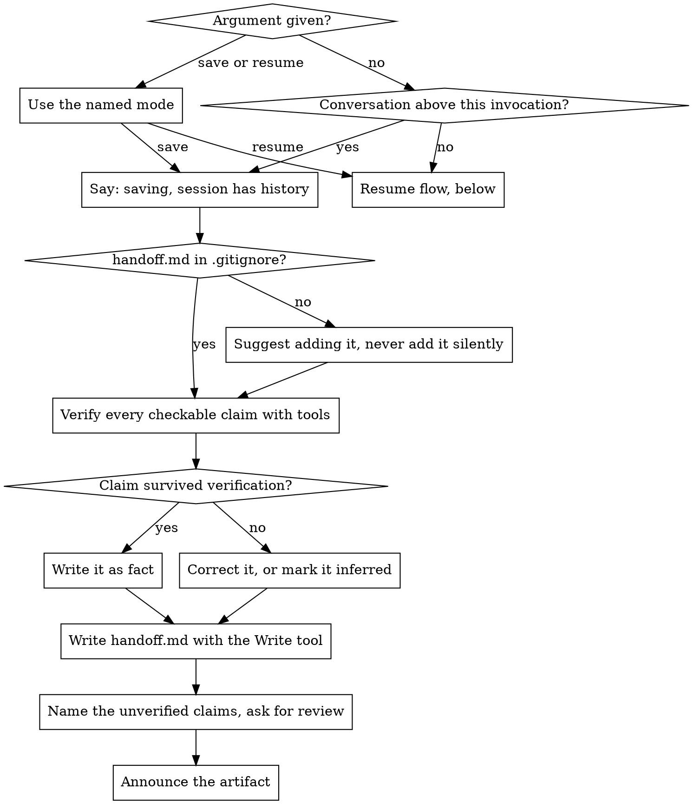
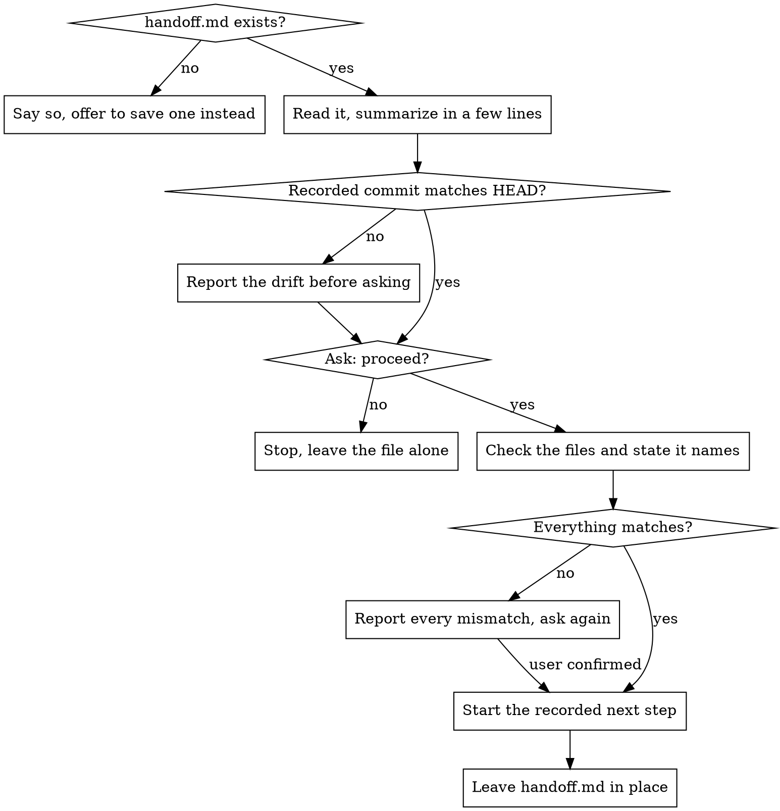

**On invocation:** announce "Running paad:handoff v1.30.1" before anything else.

# Handoff

**Experimental.** Arguments, file format, and behavior may change — or this skill may be withdrawn — in any release, including a patch release. The semver promise the settled skills carry does not apply here. If you build a workflow on it, pin your plugin version and [file what breaks](https://github.com/Ovid/paad/issues).

Writes a `handoff.md` that lets a **fresh** session continue this one's work, and reads it back on the other side.

**Claude Code already solves most of this, and knowing which part it doesn't is the whole point.** `/compact` summarizes and keeps working, but the summary it carries is machine-authored, lands unreviewed, and lives inside the transcript where you cannot edit it. `--continue` and `--resume` restore the full prior conversation, which re-pays the context cost you were trying to escape. `/clear` gives a genuinely empty session and carries nothing forward. `handoff` is worth running for exactly one reason: **the carried state is a file a human can read and correct before anything is built on it.** A handoff nobody reviews is a worse `/compact` — same summary, more ceremony. Say so rather than letting the review get skipped.

**The failure mode is not omission.** Left to itself, a competent agent writing a handoff keeps the expensive material well: the approaches that were tried and abandoned, the reasons behind them, constraints the user stated once in passing. What it gets wrong is the cheap material — a test's file path, which changes are in the last commit, a line number, who said a quoted sentence. Those are the claims a tool could have settled in seconds, and they arrive in exactly the same confident register as the parts that are right. A fresh session has no memory to catch them with. **So verify what is checkable before writing it down, and mark what is not.**

**Mode selection and saving:**



**Resuming:**



## Saving

### 1. Check `.gitignore`

If `handoff.md` is not ignored, say so and suggest adding it. **Suggest — do not edit `.gitignore` yourself.** It is a tracked file and the user may have reasons.

### 2. Verify before you write

This is the step that makes the skill worth running. Every claim below is checkable with a tool in seconds, and every one of them is a claim agents get wrong from memory:

| Claim | Settle it with |
|---|---|
| Current commit, branch, dirty state | `git rev-parse --short HEAD`, `git status --short` |
| What is actually *in* the last commit | `git show --stat HEAD` — not the commit message, which lies |
| A file path | Read it, or `ls` it |
| A line number | Read the file and look |
| A test's name or file | Grep for it |
| Whether the suite passes, and what fails | Run it |
| A quoted sentence and who said it | Find it in the conversation, or do not quote it |

If a claim cannot be settled, it does not become a fact. Either drop it or mark it inferred.

### 3. Write the file

Use the **Write tool**, never a shell redirect. Claude Code snapshots files its own file tools touch; a `bash > handoff.md` has no recovery copy anywhere, and neither does git, since the file is ignored.

```markdown
# Handoff — <one-line task name>

Written <date time> · branch `<branch>` · commit `<short sha>`
Uncommitted: <one line — what is dirty, what is staged>

## Goal
What we are trying to achieve, and what "done" looks like.

## Decisions
Chose X over Y, because Z. One line each.

## Ruled out
What was tried, how it failed, and how far it got. One line each.

## Constraints
Things the user said that exist nowhere on disk. Quote them.

## Next step
The single immediate action, with the file and line to start at.

## Verify
The command that says whether it worked.

## Unverified
Anything above that could not be checked, marked as inferred.
Delete this section if it is empty — do not pad it.
```

**"Ruled out" is the section that earns the file.** Everything else is recoverable — a fresh session can read the code, run `git log`, work out the goal. What it cannot recover is that forty minutes already went into proving an approach doesn't work. Without that line, it spends them again.

**Write down what a fresh session cannot reconstruct, and nothing else.** No architecture tour, no narrative of how the session went, no restating what `git diff` already shows. Those feel thorough and are pure padding, and padding is not harmless here: it makes the file long enough that the review gets skimmed, and the review is the only reason this skill beats `/compact`.

### 4. Ask for the review that matters

Do not close with a general disclaimer. "Please review, AI can make mistakes" is true of everything and therefore aims at nothing — it gets skimmed, and inference reads exactly like recall.

Name the specific claims you are least sure of and say what depends on them:

> Two things to check before you rely on this. I inferred the next step from what we were doing rather than from anything you said outright, and I could not confirm the second constraint is still live — it came from early in the session. Everything downstream is built on both.

If everything in the file was verified, say that instead, plainly. An honest "all of this was checked against the repo" is a better prompt to read it than a manufactured doubt.

### 5. Announce the artifact

End with the file you touched. Say it even though the user asked for it and watched it happen — a handoff sitting unnoticed in the working directory is the same as no handoff:

```
Files written or updated:
  new      handoff.md
```

On a resume, the same block covers whatever the recorded next step changed. Source and test files need only a count and a pointer — `4 source files changed in src/dbsync/ (see git diff)` — but `handoff.md` itself is named every time.

## Resuming

1. **Read `handoff.md`.** If there isn't one, say so and offer to save one instead.
2. **Summarize it in a few lines** — the goal, where it stopped, the next step. Short. The file is right there if the user wants the rest.
3. **Check for drift.** Compare the recorded commit against HEAD. If they differ, say so before asking anything.
4. **Ask whether to proceed.** Wait for an answer.
5. **Verify the handoff's claims** before acting on them: the files it names exist, the state it describes is the state on disk, the failing tests it predicts are the ones failing. A fresh session has no independent memory — if it does not check, nothing does.
6. **Report every mismatch and ask again.** A stale handoff is more dangerous than no handoff, because it is specific and confident.
7. **Then start the recorded next step.**

**Never delete `handoff.md`.** Not after reading it, not on success. It is the only written record of the reasoning, and it is untracked, so git cannot bring it back. If the resume goes sideways the user needs to re-read what it actually said. The next save overwrites it; that is the whole lifecycle.

## Common Mistakes

| Mistake | What to do instead |
|---------|-------------------|
| Writing file paths, line numbers, or test names from memory | These are the errors. Check each one with a tool first — it costs seconds. |
| Quoting the user's constraint and attributing it to a name | The conversation may never state who said it. Quote the sentence; do not invent the speaker. |
| Trusting the last commit's *message* for what it contains | `git show --stat HEAD`. Messages describe intent, not content. |
| Including an architecture tour or a file-by-file layout | Recoverable by opening the repo. It buys nothing and costs the review. |
| Narrating how the session unfolded | The next session needs the conclusions, not the journey. |
| Stating inferred and verified claims in the same register | Mark the inferred ones. Uniform confidence is what hides the errors. |
| Filing a claim under "Unverified" instead of checking it | That section is for what a tool genuinely cannot settle. If `git show --stat HEAD` or one grep would answer it, run it. An Unverified list longer than a few lines, in a repo you can read, means verification got skipped and relabelled. |
| Closing with "review this, AI makes mistakes" | Name the two or three claims that actually need checking. |
| Deleting the handoff after resuming | It is untracked; git cannot restore it. Let the next save overwrite it. |
| Resuming straight into the work without checking the tree | The handoff may be describing a state that no longer exists. |
| Writing the file with `echo` or `>` | Use the Write tool. A shell redirect leaves no recovery copy. |
| Running this to compact the current session | That is `/compact`. This skill exists to produce a file for a *different* session. |

## Red Flags — stop and check

- You are about to write a line number you did not just read
- You are about to write "the tests pass" without having run them
- You are attributing a quote to a person the conversation never named
- Your handoff has a section describing the codebase's structure
- Every sentence in your draft is equally confident
- You are about to close with a generic request to review it
- You are about to `rm handoff.md`
- Your "Unverified" section is longer than your "Decisions" section, and you can read the repo
- The file is long enough that you would not read it yourself

**All of these mean: go check, cut it, or mark it inferred.**
