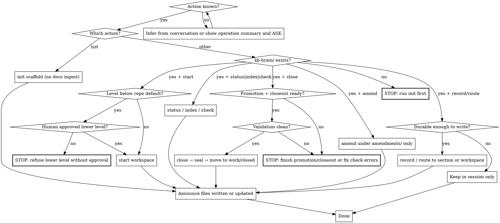

**On invocation:** announce "Running paad:kb-brain v1.24.1" before anything else.

# KB-Brain

Repository-native working knowledge for humans, lead agents, and sub-agents.
Stable architecture and accepted documentation stay in `docs/`. Mutable
context, in-flight decisions, gaps, debt, lessons, and focused task workspaces
live under `kb-brain/`.

This skill does **not** change the behaviour of `pushback`, `alignment`,
`agentic-review`, or any other existing PAAD skill. Invoke it explicitly (or
via repository `AGENTS.md` instructions).

Load details on demand from:

- `references/structure.md` — directory layout, workspace levels, file roles
- `references/routing.md` — when to write, where to put it, AGENTS.md snippet
- `references/lifecycle.md` — start, close, seal, amend, validation
- `references/templates.md` — atomic record templates and ID prefixes

Bundled templates live in this skill's `templates/` directory. Deterministic
tooling is `scripts/kb_brain.py` (copied into the target repo on `init`).

**Dispatch:**



## Global rules

1. **Human authority.** Agents may record observations, evidence, failures,
   questions, improvements, debt, handoffs, and working context. They must
   **not** silently promote inferred requirements, unapproved architecture,
   invented answers to open questions, improvements-as-roadmap, or candidate
   specs to accepted facts. Confirmed decisions need explicit human
   confirmation or unambiguous repository evidence — record owner and evidence.
2. **Notice broadly, work narrowly.** Out-of-scope gaps become atomic
   improvement or tech-debt records. Do not implement them unless the active
   task includes them.
3. **Index-first retrieval.** Read `kb-brain/work/ACTIVE.md`, then the
   workspace `TASK.md`, indexes, `CONTEXT.md`, assignment, then only linked
   records. Never load the whole KB by default.
4. **No unsolicited bulk ingress.** Do not dump `docs/` into `kb-brain/` on
   init or during ordinary work.
5. **Existing skills unchanged.** Do not wire automatic KBB reads/writes into
   other PAAD skills.

## Tooling

After `init`, the target repo has `scripts/kb_brain.py` and Make targets
(`kb-index`, `kb-new`, `kb-check`, plus `kb-start` / `kb-close` / `kb-amend`).
Prefer:

```bash
python3 scripts/kb_brain.py init standard
python3 scripts/kb_brain.py start <slug> [level]
python3 scripts/kb_brain.py new <section> "<title>" [--task <id>]
python3 scripts/kb_brain.py index
python3 scripts/kb_brain.py check
python3 scripts/kb_brain.py close <task-id>
python3 scripts/kb_brain.py amend <closed-task-id> <record-path> "<title>"
```

Until `init` has run in the target repo, invoke the bundled copy:

`python3 <path-to-this-skill>/scripts/kb_brain.py --root <repo> …`

If the target has no Makefile, `init` writes `kb-brain/Makefile.inc` instead
of replacing project build tooling.

## Operations

### init

Scaffold `kb-brain/` (see `references/structure.md`). Copy templates. Install
script + Make block. Default level is `standard` unless overridden. **Do not**
ingest existing documentation.

### start

Create `kb-brain/work/active/YYYY-MM-DD-<slug>/` with level-appropriate files.
Collision-safe IDs (`-2`, `-3`, …). Raise above repo default freely; lowering
requires explicit human approval. Regenerate `ACTIVE.md` and indexes.

### record / route

Apply the durability test in `references/routing.md`. Search indexes before
creating duplicates. Allocate the next ID by inspecting the target directory
(no shared counter file). Sub-agents may append findings, questions, failures,
conflicts, handoffs, improvements, and tech-debt. Only the lead or human task
owner may change scope, lifecycle, assignments, confirmed decisions, blockers,
conflict resolution, or close/seal.

### status / index / check

`status` summarizes active work from `ACTIVE.md` / `TASK.md`. `index`
regenerates indexes. `check` validates structure, frontmatter, IDs, seals, and
amendments — report **all** safe-to-collect errors in one run.

### close

Final cleanup → promote durable knowledge → `CLOSEOUT.md` → index → validate →
`SEAL.json` (SHA-256 of historical files, excluding seal, generated `INDEX.md`,
and `amendments/`) → move to `work/closed/`. Do not erase substantive failures
or disagreements to “clean up” history.

### amend

After closure, never edit sealed originals. Create
`work/closed/<task-id>/amendments/AM-…md` that names what it corrects.
Regenerated indexes must mark amended records.

## Conflict protocol

Record conflicting findings; never overwrite. When a conflict affects current
work, the lead sets `resolved`, `deferred`, or `blocked` (and adds blockers to
`TASK.md` so they appear in `ACTIVE.md`). Unrelated conflicts stay recorded
and do not block the current assignment. `ACTIVE.md` lists ownership and
blockers — **not** conflicts.

## Announce What You Wrote

Before any summary, list every path this run created or updated:

```
Files written or updated:
  new      kb-brain/work/active/2026-08-04-auth-migration/TASK.md
  updated  kb-brain/work/ACTIVE.md
```

Source and test files outside `kb-brain/` need only a count and a pointer to
the diff when there are many. Skills that write nothing are exempt; this skill
almost always writes.

## Common Mistakes

| Mistake | What to do instead |
|---------|-------------------|
| Dumping `docs/` into KBB on init | Init scaffolds empty sections only |
| Reading the whole KB every turn | Index-first retrieval order |
| Inventing answers in `open-questions/` | Add evidence; leave unanswered |
| Editing a sealed closed workspace | Write an amendment |
| Lowering workspace level silently | Get explicit human approval |
| Auto-wiring KBB into other PAAD skills | Leave those skills unchanged |
| Implementing every improvement you notice | Record it; stay in task scope |
