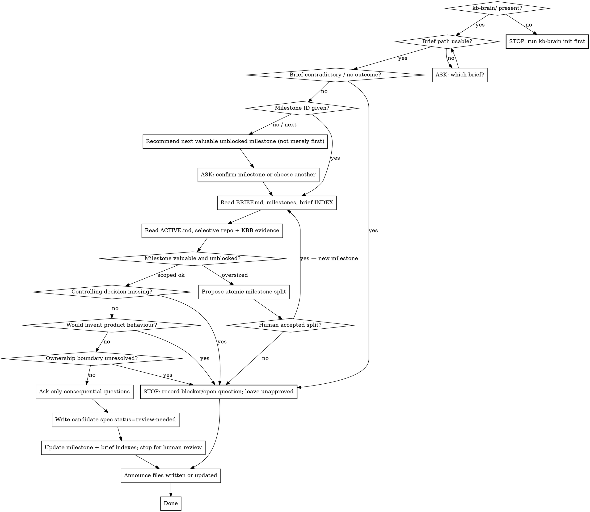

**On invocation:** announce "Running paad:brief-ruminate v1.24.1" before anything else.

# Brief Rumination

Expand one human-owned brief milestone into a **candidate** specification
grounded in the repository and KB-Brain. The human owns the brief. This skill
stops at `review-needed`. It does **not** approve specs, plan implementation,
or modify `pushback`, `alignment`, `agentic-review`, or any other PAAD skill.

Requires a KBB structure (`/paad:kb-brain init` if missing). Does not change
`kb-brain` skill logic.

Load on demand:

- `references/brief-format.md` — brief and milestone storage and templates
- `references/milestone-lifecycle.md` — states and human approval boundary
- `references/candidate-spec.md` — candidate spec shape and stop conditions

Templates: this skill's `templates/` (`BRIEF.md`, `MILESTONE.md`,
`MILESTONE-SPEC.md`). Optional helpers via `scripts/kb_brain.py brief-init`,
`brief-milestone`, and `brief-spec` (always write `review-needed`, never
`approved-spec`).

**Session flow:**



## Arguments

```
/paad:brief-ruminate <brief-path>
/paad:brief-ruminate <brief-path> <milestone-id>
/paad:brief-ruminate next <brief-path>
/paad:brief-ruminate status <brief-path>
```

Without a milestone ID (or with `next`), inspect the brief and milestone index,
then recommend the next milestone that is both valuable and sufficiently
unblocked. Do **not** select a milestone solely because it appears first.

`status` reports milestone states and linked candidate specs without writing a
new spec.

## Authority

- The human owns `BRIEF.md`. Suggest amendments; never silently rewrite intent,
  outcomes, constraints, or non-goals.
- This skill may advance a milestone as far as `review-needed`.
- **Only a human** may mark `approved-spec`.
- After approval, other PAAD skills may be invoked **separately** (`pushback` →
  planning → `alignment` → implementation → `agentic-review`). Do not auto-run
  them.

## Rumination steps (one milestone)

1. Read `BRIEF.md`, the milestone record, and the brief index.
2. Read `kb-brain/work/ACTIVE.md` for ownership or blockers relevant to the
   milestone.
3. Read relevant repository files, stable docs, and KBB indexes / decisions /
   questions / failures / gotchas — selectively, index-first.
4. Check whether previous decisions constrain the milestone.
5. Identify dependencies, conflicts, assumptions, compatibility, data, and
   operational concerns; respect non-goals.
6. Confirm the milestone is independently valuable and reasonably scoped.
7. If oversized, propose an atomic split without changing the human brief
   automatically.
8. Ask only consequential questions that materially change scope or behaviour.
9. Write a candidate milestone spec with status `review-needed` under
   `kb-brain/specs/<brief-slug>/`.
10. Link supporting and unresolved KBB records.
11. Update the milestone index and **stop** for human review.

Do not ruminate indefinitely or repeatedly rewrite a candidate without new
evidence or human direction.

## Announce What You Wrote

```
Files written or updated:
  new      kb-brain/specs/checkout/M-001-guest-cart-spec.md
  updated  kb-brain/briefs/checkout/milestones/M-001-guest-cart.md
  updated  kb-brain/briefs/checkout/INDEX.md
```

If the run only recorded a blocker/open question and wrote no spec, still list
those KBB paths.

## Common Mistakes

| Mistake | What to do instead |
|---------|-------------------|
| Marking a spec `approved-spec` | Leave `review-needed`; humans approve |
| Rewriting the brief's intent | Suggest amendments; wait for the human |
| Picking the first milestone blindly | Prefer valuable and unblocked |
| Inventing missing product behaviour | Record an open question / blocker and stop |
| Auto-running pushback or alignment | Stop after the candidate spec |
| Loading the entire KB | Index-first, selective reads |
| Changing other PAAD skill behaviour | Leave them untouched |
