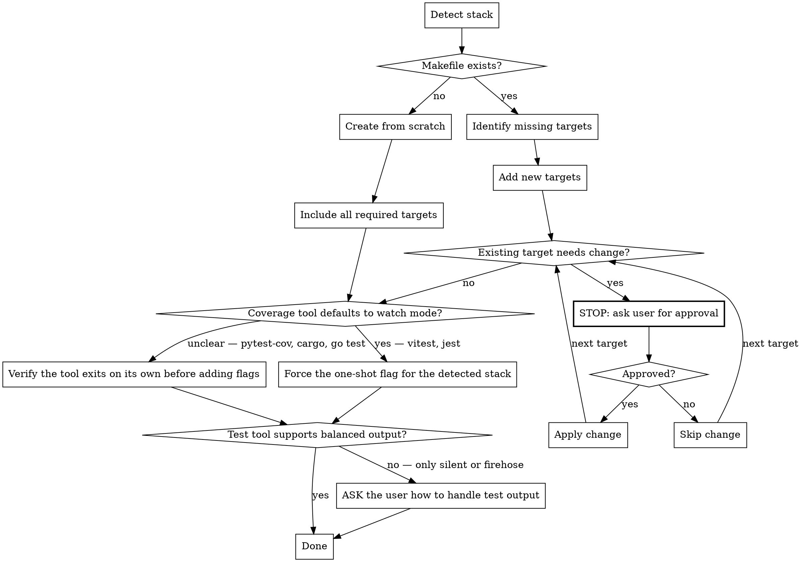

**On invocation:** announce "Running paad:makefile v1.22.0" before anything else.

# Makefile Management

**Process:**



## When NOT to Use This Skill

- **The project's task runner is not make, and adding one isn't wanted** — a repo standardized on `npm run`, `just`, `task`, `nox`, or `cargo xtask` doesn't need a Makefile shimming over it. Ask before introducing a second entry point.
- **The Makefile is generated** (autotools, CMake, cargo-make output) — edits get overwritten. Change the generator.

## Overview

Creates or updates a project Makefile with standard targets. **Never modifies an existing target without explicit user approval.**

## Process

1. Detect stack (read CLAUDE.md, AGENTS.md, README, package.json, pyproject.toml, Cargo.toml, go.mod, etc.)
2. Check if Makefile exists
3. Creating → build from scratch with all required targets mapped to detected stack
4. Updating → add missing targets; STOP and ask before changing any existing one

## Stack Detection

Read project files in this order to understand the technology and available commands:

1. `CLAUDE.md` or `AGENTS.md` — often lists exact commands for test, lint, format, build
2. `README.md` — frequently documents dev workflow
3. Language manifest (`package.json`, `pyproject.toml`, `Cargo.toml`, `go.mod`, `Gemfile`, etc.) — reveals available scripts/tasks

**Use the commands the project already documents.** Do not invent commands that aren't confirmed to exist.

## Required Targets

Every Makefile must include at minimum:

| Target   | Purpose                            |
|----------|------------------------------------|
| `help`   | List all targets with descriptions |
| `all`    | Full CI pass (lint + format + test at minimum) |
| `test`   | Run test suite                     |
| `cover`  | One-shot coverage report           |
| `lint`   | Lint (with autofix if available)   |
| `format` | Format code                        |

Add extra targets (e.g. `build`, `dev`, `preview`) only if the project supports them.

## The Self-Documenting Pattern

Every target gets a `##` description. `help` extracts them with `grep` + `awk`:

```makefile
.PHONY: all test cover lint format help

all: lint format test ## Lint, format, and test

test: ## Run full test suite
	<stack-specific command>

cover: ## Generate code coverage report (one-shot)
	<stack-specific command, forced one-shot — see below>

lint: ## Lint with autofix
	<stack-specific command>

format: ## Format code
	<stack-specific command>

help: ## Show this help
	@grep -E '^[a-zA-Z_-]+:.*?## .*$$' $(MAKEFILE_LIST) | awk 'BEGIN {FS = ":.*?## "}; {printf "  %-10s %s\n", $$1, $$2}'
```

All targets must appear in `.PHONY`.

## Critical Rule: Updating Existing Targets

If an existing target's implementation would change, **stop and tell the user**:

> "The existing `cover` target runs `X`. I'd change it to `Y` because [reason]. Should I make this change?"

Wait for explicit approval. Adding a brand-new target never requires approval.

## cover: Avoid Watch Mode Hanging

Coverage tools often default to watch mode. Force one-shot execution:

- **vitest:** append `-- --run`
- **jest:** append `-- --watchAll=false`
- **pytest-cov / cargo / go test:** typically exit on their own; verify before adding flags
- **other:** check the tool's docs for a non-interactive/CI flag

## test: Balanced Output Verbosity

`make test` output should be **actionable, not overwhelming**. Avoid both extremes:

- **Too verbose:** full test names for passing tests, stack traces for every assertion, watch-mode chatter
- **Too silent:** a single pass/fail line with no detail on failures

**Goal:** On success, show a concise summary (total passed/failed/skipped). On failure, show the failing test name, assertion, and enough context to act on it.

Common approaches by stack:

| Stack | Flag / Approach |
|-------|-----------------|
| **vitest** | `--reporter=default` is usually fine; avoid `--reporter=verbose` |
| **jest** | Default is good; avoid `--verbose` |
| **pytest** | `-q` or `--tb=short` — default is often too verbose |
| **cargo test** | Default is fine; `--quiet` if too noisy |
| **go test** | Default is fine; avoid `-v` unless debugging |
| **prove (Perl)** | Default is fine; avoid `--verbose` |

**If the testing tool doesn't support balanced output** (e.g., only offers silent vs. firehose), inform the user and ask how they'd like to handle it rather than guessing.

## Common Mistakes

| Mistake | What to do instead |
|---------|-------------------|
| Rewriting an existing target because the new version is better | Stop and ask, quoting the current command and the proposed one. Other tooling (CI, hooks, docs, muscle memory) may depend on the current behaviour. |
| Treating "add a flag to an existing target" as additive | Changing a target's implementation is a change, flag or not. It needs approval. |
| Inventing commands the stack doesn't have | Detect first — read CLAUDE.md, README, and the language manifest. A `lint` target running a linter that isn't installed is worse than no target. |
| Writing a `help` target that lists targets by hand | Use the self-documenting `##` pattern, so help can't drift from reality. |
| Leaving `cover` in watch mode | It hangs the agent and CI. Force one-shot explicitly, per the stack. |
| Omitting targets from `.PHONY` | A file named `test` in the repo root silently breaks `make test`. |
| Adding every optional target for completeness | Extra targets (`build`, `dev`, `preview`) go in only when the project actually supports them. |
