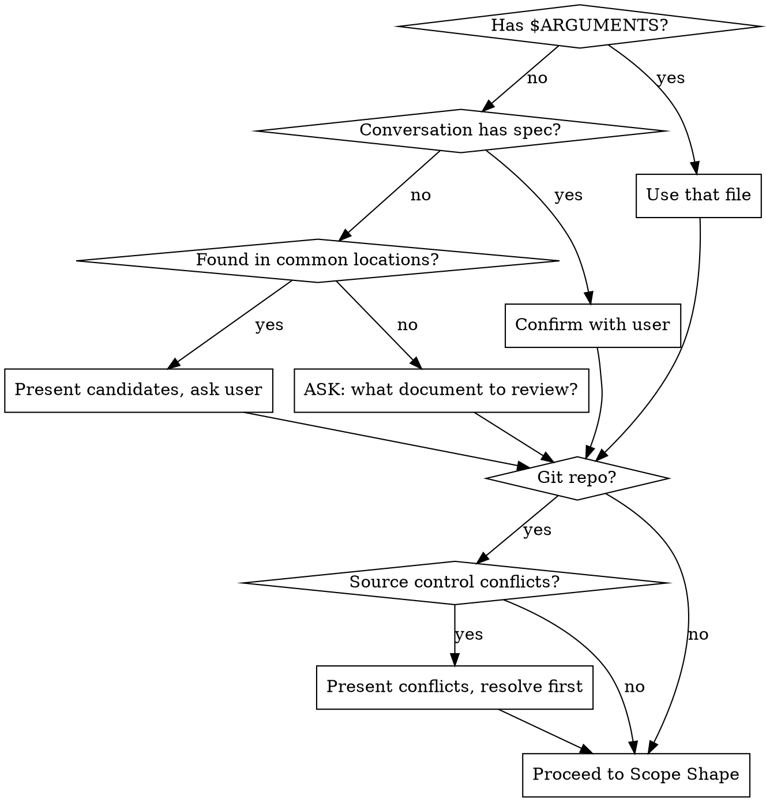
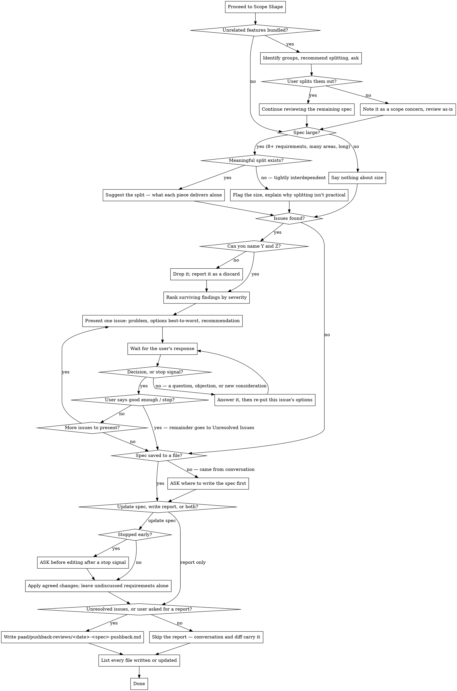

**On invocation:** announce "Running paad:pushback v1.31.0-preview" before anything else.

# Spec Pushback

Critically reviews a spec, PRD, requirements document, or design plan before work begins. Checks source control for conflicts with reality, then walks through issues one at a time in severity order so you can fix what matters most.

**This skill does NOT recommend a fresh session.** The conversation history may be the spec.

**Input resolution and reality check:**



**Scope shape, critique and resolution:**



## When NOT to Use This Skill

- **The user wants the spec implemented, not criticized** — say what you'd push back on in a line or two, then get on with the work. Don't run a full critique nobody asked for.

## Input Resolution

Resolve the document to review in this order:

1. **`$ARGUMENTS` contains a file path** → use that file
2. **Conversation history contains a spec/plan/design** (from brainstorming, plan writing, or the user describing what they want) → confirm with user: "I see the design we just discussed — should I review that?"
3. **Scan common locations** → look for recently modified files in:
   - `docs/plans/`, `docs/specs/`, and files named `requirements.md`, `PRD.md`, `spec.md`, or similar in the repo root
   - agent steering files: `CLAUDE.md`, `AGENTS.md`, `.cursorrules`, `.kiro/steering/`, `.github/copilot-instructions.md`
   - generated analysis: `paad/*-reviews/`, and equivalent report directories

   If one obvious candidate, confirm. If multiple, present the list and ask.
4. **Nothing found** → ask: "What document should I review? Give me a file path, or describe what you want to build and I'll push back on that."

## Phase 1: Reality Check (Source Control)

**Skip this phase if the project is not a git repository.**

Before analyzing the spec itself, check whether recent codebase changes conflict with what the spec assumes:

1. Run `git log --oneline -50`. Two weeks is the usual span of interest, but the limit is 50 commits, not a date — a document written eight months ago was invalidated by commits from eight months ago, and a date window would report it clean. Widen further if the document predates what 50 commits covers.
2. Read commit messages and, for relevant-looking commits, check the actual diffs
3. Compare against the spec's assumptions — does the spec reference code, tables, APIs, infrastructure, or patterns that have recently been changed, removed, or replaced?
4. **If conflicts found:** present them upfront before any other analysis. For each conflict:
   - What the spec assumes
   - What actually changed (commit SHA, date, summary)
   - Why this matters
   - Ask: "How do you want to handle this?" with options
5. **If no conflicts found:** say "No conflicts with recent changes" and move on

This phase surfaces showstoppers early. A spec that assumes deleted infrastructure is wrong before the analysis even starts.

## Phase 1.5: Scope Shape

Before digging into individual requirements, check whether the spec has structural problems that should be addressed first.

### Check 1: Feature Cohesion

Do the features in this spec serve different user goals or business objectives? If the spec bundles unrelated features — things that would naturally be separate PRs — flag it.

For each group of unrelated features:
- Identify the groups and what makes them unrelated (different user goals, different business objectives, different system concerns)
- Recommend splitting into separate specs
- Ask: "Do you want to split these out before I continue, or review as-is?"

If the user splits, continue reviewing the remaining spec. If they choose to review as-is, proceed — but note it as a scope concern.

### Check 2: Spec Size

Use heuristic signals to assess whether the spec is too large to implement safely:
- Multiple unrelated system areas affected
- Very long document
- Estimated implementation would touch many modules across the codebase

Requirement count is not a signal — estimate the diff instead. A spec can list
a dozen requirements that are all facets of one small change.

**If large AND a meaningful split exists** where each piece delivers independent value: suggest the split with a brief explanation of what each piece delivers on its own.

**If large BUT the features are tightly interdependent:** flag the size and explain why splitting isn't practical — describe the interdependencies that make the features inseparable. The author knows it's big but also knows the bigness is inherent, not accidental.

**If not large:** say nothing and move on to Phase 2.

### Ordering

Run cohesion before size. If unrelated features are found and the user agrees to split, the size problem may resolve itself.

## Phase 2: Spec Critique

Analyze the spec against these categories:

| Category | What to look for |
|----------|-----------------|
| **Contradictions** | Requirements that conflict with each other, or with the current codebase state |
| **Feasibility** | Requirements that are technically difficult or impossible given the codebase as it exists today — missing infrastructure, incompatible architecture, dependencies that don't support the requirement |
| **Scope imbalance** | Requirements wildly disproportionate in effort relative to the rest — one bullet point that's a 2-week project next to others that are 2-hour tasks |
| **Omissions** | Missing requirements that are implied or necessary given context — error handling, edge cases, migration paths, rollback plans, monitoring, permissions |
| **Ambiguity** | Requirements that could be interpreted multiple ways — vague success criteria, undefined terms, unclear scope boundaries |
| **Security concerns** | Requirements that introduce or ignore security risks — auth gaps, data exposure, injection surfaces, missing rate limits, privilege escalation |

### Every finding must be a claim you can defend

Before presenting an issue, state it to yourself in this form:

> If the spec ships as written, **Y** happens, because **Z**.

- **Y** is a concrete consequence — a wrong result, a crash, a rewrite, data
  loss, or a decision made by whoever types first.
- **Z** is the mechanism, and you must be able to name what it rests on: a file
  and line, a command and its output, a commit, or a specific step an
  implementer would take and why the spec leaves it open.

If you cannot fill both, drop the finding. "This could be clearer" with no Y is
an observation. A Y with no Z is a guess. Neither is pushback, and a review made
of them is why spec review gets called a rubber stamp.

Writing Z is not a formatting step — you cannot fill it without going to the
code, and going to the code is what kills the findings that don't survive.

**An omission is a legitimate finding when Z is a divergence you can name** —
"the spec permits both A and B, they produce different <concrete thing>, and
nothing in the document selects between them." That is defensible even though
the code does not exist yet. "The spec should mention error handling" is not,
unless you can say what breaks without it.

**A defect outside the spec is a finding only if it makes the spec's own
deliverable unreachable.** If the requirements describe a command, endpoint, or
path that does not exist and this spec does not create it, the document cannot
be implemented as written — that is pushback. A defect that merely coexists with
the spec may be a real bug, but it belongs in a one-line mention at the end, not
in the severity ranking.

**Missing test coverage is a finding only when you can name what ships broken.**
"Requirement X has no test" is a risk. "This work edits `_render`, no test
executes `cli.py`, so a spacing change ships green" is a finding — it names the
path the work touches and what passes review anyway.

**Name what would change your mind.** Almost every finding's severity turns
partly on something not in the repository — a roadmap item, a deadline, who
consumes this API, what operators actually want. When a specific off-disk fact
would move a finding's severity or dissolve it, say so in the same breath: name
the fact, and say what the finding becomes if it goes the other way. Name it
concretely enough to act on — "it depends on your priorities" is not one. If
nothing off-disk would move it, say the finding is unconditional and stand
behind it.

Say how many candidates you dropped and why. A review that reports two findings
and five discards is visibly not a rubber stamp; one that reports two findings
and says nothing about the rest looks like it stopped early.

### Presentation order

1. Rank all findings by severity (most impactful first)
2. Present **one issue at a time**
3. For each issue:
   - State the problem clearly
   - Present specific options from best to worst, with your recommendation and a short explanation for each
   - Wait for the user's decision before presenting the next issue
4. The user can say "good enough" or "stop" at any point to end the review

**A response is not a decision.** An issue stays open until the user picks an
option, explicitly defers it, or stops the review. A question, an objection, a
counter-example, or a new consideration is the user thinking about *this*
issue — answer it, then put the same options back, revised if your answer
changed them. If their input dissolves the issue or reshapes it into a
different one, say so and re-put it; that is still not the next issue.

Presenting the next issue is what tells the user the current one is closed, so
never advance intending to chase the answer later. "Still need your call on
[2]" appended after presenting [3] is this failure, not a mitigation for it —
it splits their attention across two open issues and buries the one they were
actually working on.

### Analysis guidance

- **Read the codebase.** Don't just review the spec in isolation — check whether what it describes is feasible given actual code, actual schemas, actual infrastructure.
- **Be concrete.** "This is ambiguous" is unhelpful. "This says 'fast response times' — do you mean <200ms p99? <1s? This determines whether you need caching." is useful.
- **Don't nitpick wording.** Focus on issues that would cause real problems during implementation or after launch.
- **Respect scope.** The spec author chose what to include and exclude. Flag genuine omissions, not "nice to haves." If something is intentionally out of scope, don't push back on it unless it creates a real gap.
- **Consider the audience.** A rough spec from a brainstorming session deserves different treatment than a formal PRD about to be handed to a team.

## Phase 3: Resolution

After all issues are addressed (or user says "good enough" / "stop"):

**If the spec came from conversation history and was never saved to a file, settle that first.** Ask "The spec isn't saved to a file yet. Where should I write it?" and suggest a path that fits the project (`docs/plans/`, `docs/specs/`). The question below assumes there is a file to update.

Then ask: **"Would you like me to update the spec directly, write a separate pushback report, or both?"**

**Default to no report.** If every issue was resolved and the spec was updated,
the conversation and the spec diff already carry the outcome — a report restates
what the user just watched happen. Write one when the user asks for it, or when
issues went undiscussed. Findings the user stopped before reaching exist nowhere
else once the session ends; that is what the file is for.

### If updating the spec

- Apply agreed-upon changes to the original file
- Add/modify requirements based on the user's responses
- Don't touch requirements that weren't discussed
- **After a stop signal, ask before editing.** "Good enough" ends the review,
  not just the current issue. Applying changes the user already agreed to is
  fine — confirm first. Editing a spec the author has stopped reading is how a
  change lands that nobody reviewed.

### If writing a report

Write to `paad/pushback-reviews/<YYYY-MM-DD>-<spec-name>-pushback.md`.

Create the `paad/pushback-reviews/` directory if it doesn't exist.

**Report template:**

```markdown
# Pushback Review: <spec name or filename>

**Date:** YYYY-MM-DD
**Spec:** <file path or "conversation history">
**Commit:** <current HEAD sha, or "N/A">

## Source Control Conflicts

<conflicts found, or "None — no conflicts with recent changes.">

## Issues Reviewed

### [1] <title>
- **Category:** <contradictions / feasibility / scope imbalance / omissions / ambiguity / security>
- **Severity:** <critical / serious / moderate / minor>
- **Issue:** <what's wrong>
- **Resolution:** <what the user decided>

(Repeat for each issue discussed.)

## Unresolved Issues

Issues not yet discussed (user stopped early). Listed for future reference.

### [N] <title>
- **Category:** ...
- **Severity:** ...
- **Issue:** ...
- **Suggested options:** ...

(Omit section if all issues were addressed.)

## Summary

- **Issues found:** N (plus K candidates dropped for lacking a defensible consequence)
- **Unresolved:** N - M   <!-- omit this line entirely when nothing is unresolved -->
- **Status:** <one or two sentences: what has to happen before implementation
  starts, and what can ride along. Not a verdict word.>
```

### List every file you wrote or updated

End the session with the file list, always — this skill edits the developer's own spec, and an edit nobody notices is worse than no edit. One line per path, each marked new or updated, covering the spec if it was updated and the report if one was written:

```
Files written or updated:
  updated  docs/specs/checkout-prd.md
  new      paad/pushback-reviews/2026-08-01-checkout-pushback.md
```

Say it even when only one file changed, and even when the user watched you change it.

## Common Mistakes

These patterns produce pushback that reads well and changes nothing. Avoid them:

| Mistake | What to do instead |
|---------|-------------------|
| Critiquing the spec without checking the codebase | Phase 1 is first for a reason. "This contradicts what already shipped" outranks every stylistic concern. |
| Listing every issue at once | One at a time, most impactful first. A wall of twenty findings gets skimmed and dismissed. |
| Treating any reply as an answer | A question is not a decision. Answer it, re-put the same options, stay on the issue. Advancing and adding "still need your call on [2]" is the failure, not a fix for it. |
| Raising a problem without options | Every issue needs concrete options, best to worst, with a recommendation. "This is ambiguous" is an observation, not pushback. |
| Raising an issue you can't state as "Y happens, because Z" | Drop it and count it as a discard. A finding you can't defend costs the user more to read than it costs you to cut. |
| Filing a bug in the surrounding code as a spec finding | One line at the end. It gets a ranked slot only when it makes the spec's own deliverable unreachable. |
| Writing a report nobody asked for after resolving everything | The conversation and the spec diff already say it. Reports exist to carry what the user never saw. |
| Editing the spec after "good enough" | The stop signal ends the review. Confirm before you touch their file. |
| Suggesting a split because the spec is long | Length isn't the test — independent value is. Split only when each piece ships something useful on its own. |
| Mistaking sequenced work for bundled features | Phases of one coherent feature belong together. Cohesion is about whether they'd be separate PRs, not whether they're separate steps. |
| Softening findings to seem agreeable | The skill's whole value is saying what a reviewer would say before the code exists. Hedged criticism is worse than none. |
| Manufacturing issues to fill all six categories | Not every spec has security concerns or contradictions. Say a category is clean and move on. |
| Continuing past "good enough" | That's the stop signal. Keep going and the user stops reading. |
| Rewriting the spec instead of critiquing it | Present issues and let the user decide. Silent rewrites replace their judgment with yours. |
